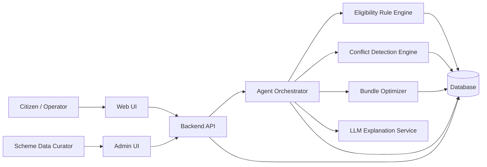
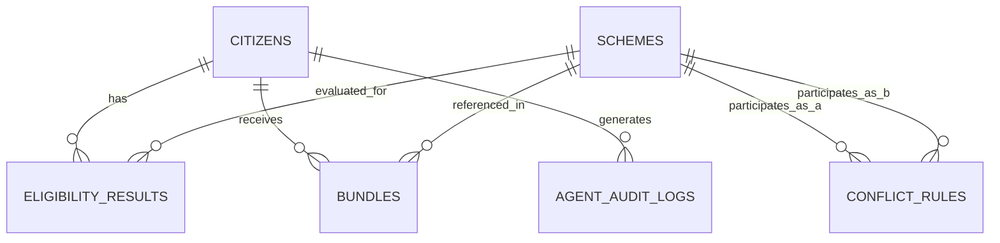

# plan.md — Autonomous Scheme-Bundle Optimizer for Citizens

---

## 1. Project Overview

- **Project Name:** Autonomous Scheme-Bundle Optimizer for Citizens (ASBO)
- **One-line description:** An agentic assistant that takes a citizen's profile and produces an explained, conflict-free, optimized bundle of government schemes with an application checklist.
- **Detailed description:** ASBO ingests a citizen's demographic, economic, and social profile, evaluates it against a structured knowledge base of government scheme eligibility rules, identifies every scheme the citizen potentially qualifies for, detects mutually exclusive or conflicting schemes among the eligible set, selects the combination ("bundle") that maximizes total benefit to the citizen under those constraints, explains why that bundle was chosen, flags documents the citizen is missing for each scheme in the bundle, and produces a consolidated application checklist.
- **Primary purpose:** Reduce the cognitive and administrative burden on citizens (and intermediaries such as Common Service Centre operators or NGO caseworkers) trying to manually determine which of many overlapping/conflicting government schemes to apply for.
- **Target users:** Individual citizens (self-service), and assisted-service operators (CSC agents, NGO/welfare-office caseworkers) entering data on behalf of citizens.
- **Expected outcome:** A working end-to-end prototype: profile entry → eligible scheme list → conflict report → optimized bundle with explanation → missing-document report → application checklist, demonstrable on at least one sample citizen profile.

---

## 2. Problem Analysis

- **Problem statement (restated):** Citizens may be eligible for multiple government schemes simultaneously, but schemes can overlap, conflict, or be mutually exclusive, and citizens have no practical way to determine the eligible set, the conflicts within it, or the best combination to apply for.
- **Existing situation:** Scheme information is scattered across department websites/PDFs/circulars, written in legal/administrative language, with eligibility criteria that vary by income, category, location, land holding, occupation, age, disability status, etc. Citizens either miss schemes they qualify for, apply for mutually exclusive schemes and get rejected after investing effort, or under-utilize available support.
- **Root problems:**
  1. Eligibility logic is not centralized or machine-readable anywhere the citizen can query.
  2. No system evaluates *combinations* of schemes — only single-scheme eligibility (where it exists at all).
  3. Conflicts/mutual exclusivity between schemes are not surfaced to the citizen before they invest time applying.
  4. Document requirements differ per scheme and are not reconciled against what the citizen already has.
- **Pain points:** Manual research burden, risk of wasted applications, no personalized guidance, no explanation of *why* a scheme was or wasn't recommended, no single checklist to act on.
- **Limitations of existing approaches:** Government portals typically list schemes per-department, not per-citizen; they do not reason across schemes, do not optimize a bundle, and do not detect missing documents proactively.
- **Why the proposed system is needed:** A rule-driven reasoning + optimization layer over a structured scheme knowledge base directly closes the gap between "schemes exist" and "this citizen knows the best schemes to apply for and what to bring."

---

## 3. Goals and Objectives

### Primary Goals
- G-01: Accept a structured citizen profile as input.
- G-02: Evaluate the profile against a scheme knowledge base and return the eligible scheme set with reasons.
- G-03: Detect conflicts/incompatibilities among eligible schemes.
- G-04: Compute an optimized, conflict-free bundle that maximizes benefit to the citizen.
- G-05: Explain the recommendation in plain language.
- G-06: Detect missing documents required by the schemes in the bundle.
- G-07: Produce a consolidated application checklist.

### Secondary Goals
- G-08: Allow the scheme knowledge base to be extended/edited without code changes (data-driven rules).
- G-09: Provide an audit trail of the agent's reasoning steps for transparency/trust.
- G-10: Support assisted-service data entry (operator enters profile on behalf of citizen).

### Non-Goals
- Submitting applications to actual government portals on the citizen's behalf.
- Verifying document authenticity (e.g., OCR/fraud detection on uploaded documents).
- Real-time integration with live government scheme databases/APIs.
- Multi-language localization (beyond English) in the current version.
- Payment or disbursement processing.

---

## 4. Scope

### In Scope
- Citizen profile capture (manual form entry).
- A structured, file/database-backed scheme knowledge base with eligibility rules, benefit metadata, required documents, and conflict metadata, seeded with a representative sample set of schemes (not an exhaustive national catalogue).
- Deterministic rule-based eligibility evaluation engine.
- Deterministic conflict detection based on declared conflict relationships between schemes.
- Bundle optimization algorithm that selects the best non-conflicting subset of eligible schemes.
- Natural-language explanation generation for the recommended bundle.
- Missing-document detection by comparing scheme requirements to citizen-declared document holdings.
- Application checklist generation from the optimized bundle.
- An agent orchestration layer that sequences the above steps end-to-end for a given citizen.
- A demo-ready UI covering profile entry → results → checklist.

### Out of Scope
- Legal-grade eligibility guarantees (system output is advisory, not a binding determination).
- Automated document upload verification/OCR.
- Direct submission to government e-filing systems.
- Large-scale multi-tenant deployment, load balancing, or high-availability infrastructure.
- Full RBAC/enterprise identity management (see [[Open Questions]] Q-002).

---

## 5. Stakeholders and Actors

| Actor | Type | Role | Goals | Responsibilities | Permissions | Interaction |
|---|---|---|---|---|---|---|
| Citizen | Human | End user seeking benefits | Find the best schemes to apply for with least effort | Provide accurate profile data; review recommendations | Create/view own profile and results | Uses UI directly |
| Assisted-Service Operator (CSC/NGO caseworker) | Human | Enters data on behalf of citizens who lack access/literacy | Help citizens get correct recommendations | Enter citizen profile accurately; explain results to citizen | Create/view profiles they entered | Uses UI on citizen's behalf |
| Scheme Data Curator (Admin) | Human | Maintains scheme knowledge base | Keep scheme rules accurate and current | Add/update/deactivate schemes, rules, conflicts, required documents | Full CRUD on scheme KB | Uses admin interface / edits KB source files |
| Eligibility Reasoning Agent | AI/System component | Orchestrates the evaluation pipeline | Produce correct, explained, optimized output | Sequence rule engine → conflict detector → optimizer → explanation → checklist | System-internal only | Invoked by backend per request |
| Rule Engine | System component | Deterministically evaluates eligibility rules | Correct eligibility for given profile+scheme | Parse scheme rule JSON, evaluate against profile | System-internal only | Called by Reasoning Agent |
| Conflict Detection Engine | System component | Flags incompatible scheme pairs/groups | Correct conflict list for eligible set | Evaluate declared conflict relationships | System-internal only | Called by Reasoning Agent |
| Bundle Optimizer | System component | Selects best non-conflicting subset | Maximize total benefit value under constraints | Solve constrained selection problem | System-internal only | Called by Reasoning Agent |
| LLM Explanation Service | External AI service (e.g., Anthropic Claude API) | Generates natural-language explanation text | Fluent, accurate explanation of a already-computed result | Convert structured reasoning trace into readable text | Read-only access to structured results (no eligibility authority) | Called by Reasoning Agent via API |

**Note on AI role boundary:** The LLM never determines eligibility, conflicts, or optimization outcomes. It only converts already-computed, deterministic results into natural language. This prevents hallucinated eligibility determinations. See [[Section 16]].

---

## 6. Functional Requirements

**FR-001 — Create Citizen Profile**
- Actor: Citizen / Operator
- Preconditions: None
- Inputs: Name, DOB/age, gender, annual household income, occupation, state, district, social category, disability status, land holding, family size, marital status, BPL status, education level, employment status, list of documents already held
- Expected behavior: Validate required fields, persist profile
- Outputs: Citizen ID, confirmation
- Postconditions: Profile stored and retrievable
- Business rules: BR-001 (see Section 12)
- Failure/exception cases: Missing required field → validation error; invalid data type/range → validation error

**FR-002 — Retrieve/Update Citizen Profile**
- Actor: Citizen / Operator
- Preconditions: Profile exists
- Inputs: Citizen ID, updated fields
- Expected behavior: Fetch or update stored profile
- Outputs: Current profile state
- Postconditions: Profile updated if applicable
- Failure/exception cases: Citizen ID not found → 404-equivalent error

**FR-003 — List Available Schemes**
- Actor: Citizen / Operator / Admin
- Preconditions: Scheme KB populated
- Inputs: Optional filters (category, state)
- Expected behavior: Return active schemes with metadata
- Outputs: List of schemes
- Failure/exception cases: None (empty list is valid)

**FR-004 — Evaluate Eligibility**
- Actor: Eligibility Reasoning Agent (triggered by Citizen/Operator action)
- Preconditions: Citizen profile exists; scheme KB populated
- Inputs: Citizen ID
- Expected behavior: Evaluate every active scheme's rule set against the citizen profile
- Outputs: Per-scheme eligibility result (`eligible` / `not eligible`) with matched/failed rule reasons
- Postconditions: Eligibility results persisted for traceability
- Business rules: BR-002, BR-003
- Failure/exception cases: Profile incomplete for a given rule field → that scheme marked `indeterminate` with reason, not silently excluded or silently included

**FR-005 — Detect Conflicts**
- Actor: Conflict Detection Engine
- Preconditions: Eligible scheme set computed (FR-004)
- Inputs: Set of eligible scheme IDs
- Expected behavior: Compare each pair/group against declared conflict rules
- Outputs: List of conflicting scheme pairs/groups with conflict type and reason
- Business rules: BR-004, BR-005
- Failure/exception cases: No conflicts found → empty list is a valid, expected output

**FR-006 — Optimize Bundle**
- Actor: Bundle Optimizer
- Preconditions: Eligible set and conflict list computed
- Inputs: Eligible schemes with benefit values, conflict list
- Expected behavior: Select the subset of eligible schemes with no internal conflicts that maximizes total estimated benefit value
- Outputs: Optimized bundle (scheme IDs), total benefit value, list of eligible-but-excluded schemes with the reason they were excluded (i.e., which conflict caused exclusion)
- Postconditions: Bundle persisted, linked to citizen
- Business rules: BR-006, BR-007
- Failure/exception cases: No eligible schemes → empty bundle with explanatory message, not an error

**FR-007 — Generate Recommendation Explanation**
- Actor: Eligibility Reasoning Agent + LLM Explanation Service
- Preconditions: Bundle computed (FR-006)
- Inputs: Bundle, eligibility reasons, conflict reasons, excluded schemes
- Expected behavior: Produce a plain-language explanation of why each bundle scheme was included, why excluded schemes were left out, and how conflicts were resolved
- Outputs: Explanation text attached to the bundle
- Failure/exception cases: LLM service unavailable → fall back to a template-based explanation built from structured data (never block on LLM; see [[Section 16]])

**FR-008 — Detect Missing Documents**
- Actor: Eligibility Reasoning Agent
- Preconditions: Bundle computed
- Inputs: Required-documents list per scheme in bundle; citizen's declared held documents
- Expected behavior: Compute, per scheme, the set difference between required and held documents
- Outputs: Per-scheme missing-document list
- Business rules: BR-008
- Failure/exception cases: Citizen declared no documents → all required documents reported missing (valid case)

**FR-009 — Generate Application Checklist**
- Actor: Eligibility Reasoning Agent
- Preconditions: Bundle and missing-document results computed
- Inputs: Bundle, missing documents, scheme application steps (if defined in KB)
- Expected behavior: Aggregate, per scheme, the documents needed and application steps into one ordered checklist
- Outputs: Consolidated checklist (per scheme, and de-duplicated across schemes where a document is shared)
- Postconditions: Checklist persisted, linked to bundle
- Business rules: BR-009

**FR-010 — View Agent Reasoning Trace**
- Actor: Citizen / Operator
- Preconditions: Evaluation pipeline has run at least once for the citizen
- Inputs: Citizen ID
- Expected behavior: Return the step-by-step record of what the agent computed at each stage (eligibility → conflicts → optimization → explanation → checklist)
- Outputs: Ordered trace of pipeline steps and their outputs
- Failure/exception cases: No trace exists yet → empty/informative response

**FR-011 — Manage Scheme Knowledge Base (Admin)**
- Actor: Scheme Data Curator
- Preconditions: Admin access
- Inputs: Scheme metadata, eligibility rules, conflict declarations, required documents, benefit value
- Expected behavior: Create/update/deactivate scheme entries
- Outputs: Updated KB
- Postconditions: Subsequent evaluations use updated rules
- Failure/exception cases: Invalid rule syntax → validation error, entry rejected

---

## 7. Non-Functional Requirements

| ID | Category | Requirement |
|---|---|---|
| NFR-001 | Performance | End-to-end pipeline (profile → checklist) for one citizen against a scheme KB of up to a few hundred schemes should complete within a few seconds under normal load, excluding external LLM latency. |
| NFR-002 | Scalability | Architecture must support growing the scheme KB and adding new rule types without redesign; horizontal scaling is not required for the prototype's expected demo load. |
| NFR-003 | Reliability | Core eligibility/conflict/optimization results must never depend on an external service being available (LLM is explanation-only, with a fallback). |
| NFR-004 | Security/Privacy | Citizen profile data (PII: income, category, disability status) must be stored with access limited to the owning citizen/operator and admins; no data exposed via unauthenticated endpoints beyond what is explicitly public (the scheme catalogue). |
| NFR-005 | Maintainability | Scheme eligibility rules, conflict relationships, and document requirements must be data-driven (external JSON/DB records), not hardcoded in application logic. |
| NFR-006 | Usability | A citizen with no domain knowledge of government scheme terminology must be able to complete profile entry and understand the recommendation without external help. |
| NFR-007 | Explainability | Every eligibility decision, conflict, and exclusion must have a traceable, human-readable reason — no unexplained "black box" outputs. |
| NFR-008 | Observability | Every agent pipeline run must be logged (inputs/outputs per step) to support debugging and the reasoning-trace feature (FR-010). |
| NFR-009 | Accessibility | UI should follow basic accessibility practices (semantic HTML, labeled form fields, sufficient color contrast) given citizen-facing usage. |
| NFR-010 | Compatibility | Web UI must work on evergreen desktop and mobile browsers (Chrome, Edge, Firefox, Safari) without requiring app installation. |

---

## 8. Actors → Use Cases

**UC-01 — Create Citizen Profile**
- Primary actor: Citizen/Operator
- Goal: Register a citizen's profile for evaluation
- Preconditions: None
- Main flow: Actor opens intake form → enters demographic/economic/social data → submits → system validates → system stores profile → system returns citizen ID
- Alternative flows: Operator saves a partially complete profile as draft (if allowed, see Q-003)
- Exception flows: Validation failure → form shows field-level errors, no data persisted
- Postconditions: Profile exists and is evaluable

**UC-02 — View Eligible Schemes**
- Primary actor: Citizen/Operator
- Supporting actors: Eligibility Reasoning Agent, Rule Engine
- Goal: See which schemes the citizen qualifies for and why
- Preconditions: Profile exists
- Main flow: Actor requests evaluation → Rule Engine evaluates each active scheme → results returned with reasons
- Exception flows: Profile missing a field a rule needs → scheme marked indeterminate with explanation
- Postconditions: Eligibility results persisted

**UC-03 — View Scheme Conflicts**
- Primary actor: Citizen/Operator
- Supporting actors: Conflict Detection Engine
- Goal: Understand which eligible schemes cannot be combined
- Preconditions: Eligibility evaluated
- Main flow: System compares eligible schemes against conflict rules → returns conflict pairs/groups with reasons
- Postconditions: Conflict list available to Optimizer

**UC-04 — Generate Optimized Bundle**
- Primary actor: Citizen/Operator
- Supporting actors: Bundle Optimizer
- Goal: Get the best non-conflicting combination of schemes
- Preconditions: Eligibility and conflicts computed
- Main flow: Optimizer selects max-benefit conflict-free subset → returns bundle + excluded schemes with reasons
- Exception flows: No eligible schemes → empty bundle with explanatory message
- Postconditions: Bundle persisted

**UC-05 — View Recommendation Explanation**
- Primary actor: Citizen/Operator
- Supporting actors: LLM Explanation Service
- Goal: Understand, in plain language, why the bundle was chosen
- Preconditions: Bundle exists
- Main flow: Agent sends structured trace to LLM → LLM returns explanation text → displayed to actor
- Exception flows: LLM unavailable → template-based explanation shown instead
- Postconditions: Explanation attached to bundle

**UC-06 — View Missing Documents**
- Primary actor: Citizen/Operator
- Goal: Know what documents are still needed
- Preconditions: Bundle exists
- Main flow: System diffs required vs. held documents per scheme → returns missing list
- Postconditions: Missing-document list available to checklist generation

**UC-07 — View Application Checklist**
- Primary actor: Citizen/Operator
- Goal: Get one actionable list to complete applications
- Preconditions: Bundle and missing documents computed
- Main flow: System aggregates per-scheme steps/documents into one ordered, de-duplicated checklist
- Postconditions: Checklist persisted and viewable/exportable

**UC-08 — Manage Scheme Knowledge Base**
- Primary actor: Scheme Data Curator
- Goal: Keep scheme data accurate
- Preconditions: Admin access
- Main flow: Curator adds/edits a scheme's metadata, rules, conflicts, documents → system validates rule syntax → saves
- Exception flows: Invalid rule → rejected with error detail
- Postconditions: KB updated for future evaluations

---

## 9. Complete User Workflows

**Primary workflow — End-to-end citizen journey (the demo path):**

```text
Citizen/Operator
 ↓
Profile Intake Form (UI)
 ↓
Validation (required fields, types, ranges)
 ↓
POST /api/citizens → Citizen persisted
 ↓
POST /api/eligibility/evaluate
 ↓
Rule Engine evaluates each active scheme vs. profile
 ↓
Eligible Scheme Set (+ reasons) persisted
 ↓
POST /api/conflicts/detect
 ↓
Conflict Detection Engine compares eligible set vs. conflict rules
 ↓
Conflict List persisted
 ↓
POST /api/bundle/optimize
 ↓
Bundle Optimizer selects max-benefit conflict-free subset
 ↓
Optimized Bundle (+ excluded schemes & reasons) persisted
 ↓
Agent Orchestrator sends structured trace → LLM Explanation Service
 ↓
Explanation text generated (or template fallback)
 ↓
POST /api/checklist/generate
 ↓
Missing-document diff computed per bundle scheme
 ↓
Consolidated Application Checklist persisted
 ↓
UI displays: Eligible Schemes → Conflicts → Optimized Bundle + Explanation → Missing Documents → Checklist
```

**Secondary workflow — Admin scheme maintenance:**

```text
Scheme Data Curator
 ↓
Admin UI: Add/Edit Scheme
 ↓
Enter metadata, eligibility rules, conflict declarations, required documents
 ↓
Validation (rule syntax, referenced fields exist)
 ↓
POST/PUT /api/schemes
 ↓
Scheme KB updated
 ↓
Available to next evaluation run
```

---

## 10. System Architecture

- **Architecture style:** Modular monolith. A microservices split is not justified at this scale (single demo dataset, no independent scaling needs) — modules are logically separated (Rule Engine, Conflict Engine, Optimizer, Agent Orchestrator) but deployed as one backend service for simplicity and reduced operational overhead within the project timeline.
- **Frontend:** Single-page web app (form-driven intake + results dashboard).
- **Backend:** Single API service exposing REST endpoints, internally composed of the modules in [[Section 11]].
- **Database:** Single MongoDB database holding citizens, schemes, conflict rules, eligibility results, bundles, and audit logs as documents/collections (see [[Section 13]] for embedding vs. referencing decisions).
- **Authentication:** Minimal — see [[Q-002]]; for the prototype, citizens/operators are identified by a generated Citizen ID without a full login system, and an admin-only route is protected by a simple credential (justified: this is a hackathon prototype, not a production citizen-data system).
- **Authorization:** Two roles — Citizen/Operator (own-profile access) and Admin (KB management).
- **Storage:** MongoDB only; no file/blob storage required since document *verification* (uploads) is out of scope — only document *names/types held* are recorded.
- **External services:** One external AI service (LLM) for explanation generation only.
- **AI/ML services:** See [[Section 16]].
- **Background workers:** Not required at this scale — the pipeline runs synchronously per request.
- **Queues/events:** Not required — no asynchronous or long-running processing exists in current scope.
- **Caching:** Not required initially — scheme KB is small; can be added later if KB grows (see [[Section 23]]).
- **Monitoring/logging:** Application-level structured logging of each pipeline step (supports NFR-008 and FR-010); no dedicated monitoring stack required for a prototype.



---

## 11. Module Breakdown

**Module: Profile Management**
- Purpose: Capture and store citizen profiles.
- Responsibilities: Validate and persist profile data; provide retrieval/update.
- Inputs: Profile form data.
- Outputs: Citizen record.
- Dependencies: Database.
- Main operations: create, get, update citizen.
- Related requirements: FR-001, FR-002.
- Related actors: Citizen, Operator.

**Module: Scheme Knowledge Base**
- Purpose: Store scheme metadata, eligibility rules, conflict declarations, required documents.
- Responsibilities: CRUD for schemes; validate rule structure on write.
- Inputs: Admin-entered scheme data.
- Outputs: Queryable scheme catalogue.
- Dependencies: Database.
- Main operations: create/update/deactivate scheme, list schemes.
- Related requirements: FR-003, FR-011.
- Related actors: Scheme Data Curator, Citizen (read-only).

**Module: Eligibility Rule Engine**
- Purpose: Deterministically evaluate a citizen profile against a scheme's rule set.
- Responsibilities: Parse rule expressions; evaluate; produce pass/fail/indeterminate with reasons.
- Inputs: Citizen profile, scheme rules.
- Outputs: Per-scheme eligibility result + reasons.
- Dependencies: Profile Management, Scheme Knowledge Base.
- Related requirements: FR-004.
- Related actors: Eligibility Reasoning Agent.

**Module: Conflict Detection Engine**
- Purpose: Identify incompatible scheme combinations within the eligible set.
- Responsibilities: Compare eligible schemes against declared conflict rules.
- Inputs: Eligible scheme set, conflict rules.
- Outputs: Conflict list with type and reason.
- Dependencies: Scheme Knowledge Base.
- Related requirements: FR-005.

**Module: Bundle Optimizer**
- Purpose: Select the highest-value, conflict-free subset of eligible schemes.
- Responsibilities: Model schemes as a constrained selection problem; solve; report excluded schemes with reasons.
- Inputs: Eligible schemes (with benefit values), conflict list.
- Outputs: Optimized bundle, total value, excluded schemes + reasons.
- Dependencies: Eligibility Rule Engine output, Conflict Detection Engine output.
- Related requirements: FR-006.

**Module: Agent Orchestrator**
- Purpose: Sequence the pipeline end-to-end and produce/persist the reasoning trace.
- Responsibilities: Call Rule Engine → Conflict Engine → Optimizer → Explanation Service → Checklist Generator in order; log each step.
- Inputs: Citizen ID.
- Outputs: Final combined result; step-by-step trace.
- Dependencies: All other backend modules.
- Related requirements: FR-007, FR-010.

**Module: Explanation Generator**
- Purpose: Convert structured results into a plain-language recommendation explanation.
- Responsibilities: Build LLM prompt from structured trace; call LLM; fall back to template if LLM fails.
- Inputs: Bundle, eligibility reasons, conflicts, exclusions.
- Outputs: Explanation text.
- Dependencies: LLM Explanation Service (external), Bundle Optimizer output.
- Related requirements: FR-007.

**Module: Document & Checklist Manager**
- Purpose: Detect missing documents and produce the consolidated application checklist.
- Responsibilities: Diff required vs. held documents; aggregate steps/documents across bundle schemes.
- Inputs: Bundle, scheme required-document lists, citizen held-document list.
- Outputs: Missing-document report, consolidated checklist.
- Dependencies: Bundle Optimizer output, Scheme Knowledge Base.
- Related requirements: FR-008, FR-009.

---

## 12. Business Logic and Rules

**BR-001 — Required profile fields**
```text
IF a profile is submitted without all fields required by at least one active scheme's rules
THEN persist the profile but mark evaluation as "indeterminate" for schemes needing the missing field
ELSE proceed with full evaluation
```

**BR-002 — Eligibility determination**
```text
IF all rule conditions for a scheme evaluate true against the citizen profile
THEN the citizen is "eligible" for that scheme
ELSE IF any required field for a rule is missing from the profile
THEN the result is "indeterminate" with the missing field named
ELSE the citizen is "not eligible", with the first failing condition named as the reason
```

**BR-003 — Inactive schemes excluded**
```text
IF a scheme is marked inactive in the knowledge base
THEN it is excluded from evaluation entirely (not shown as eligible, not eligible, or indeterminate)
```

**BR-004 — Direct conflict declaration**
```text
IF two eligible schemes are declared as mutually exclusive in the knowledge base (conflict_type = "mutually_exclusive")
THEN they cannot both appear in the final bundle
```

**BR-005 — Conflict group declaration**
```text
IF eligible schemes belong to the same declared "conflict_group" (e.g., only one housing subsidy per household)
THEN at most one scheme from that group may appear in the final bundle
```

**BR-006 — Bundle optimization objective**
```text
THE Bundle Optimizer SHALL select the subset of eligible schemes that:
  1. Contains no pair violating BR-004, and
  2. Contains at most one scheme per group under BR-005, and
  3. Maximizes the sum of each scheme's estimated benefit value
```

**BR-007 — Tie-breaking**
```text
IF two or more candidate bundles achieve the same maximum total benefit value
THEN prefer the bundle covering the greater number of distinct schemes
ELSE IF still tied, prefer the bundle whose schemes were added to the knowledge base most recently (deterministic, reproducible tie-break)
```

**BR-008 — Missing document detection**
```text
FOR each scheme in the optimized bundle
  FOR each document required by that scheme
    IF the document is not present in the citizen's declared held-documents list
    THEN mark it as "missing" for that scheme
```

**BR-009 — Checklist consolidation**
```text
IF the same document type is required by more than one scheme in the bundle
THEN list it once in the consolidated checklist, annotated with all schemes that require it
```

**BR-010 — Explanation fallback**
```text
IF the LLM Explanation Service call fails or times out
THEN generate the explanation from a deterministic template using the structured eligibility/conflict/optimization data
AND never block the pipeline on LLM availability
```

**BR-011 — Indeterminate schemes and the bundle**
```text
IF a scheme's eligibility is "indeterminate" due to missing profile data
THEN it SHALL NOT be included in the optimized bundle
AND it SHALL be listed separately as "needs more information" with the missing field(s) named
```

**BR-012 — Audit trace persistence**
```text
FOR every pipeline run
  THE Agent Orchestrator SHALL persist the input and output of each stage (eligibility, conflicts, optimization, explanation, checklist)
  SO THAT the trace can be retrieved later via FR-010
```

---

## 13. Data Model

Database is MongoDB (document store). Modeling approach: entities that are always read/written together with their parent and never queried independently are **embedded** as sub-documents/arrays; entities that are queried independently, referenced from more than one place, or link two different collections are kept as **separate collections** with an ObjectId reference. Each collection uses Mongo's own `_id` as primary key.

**Collection: citizens**
- Purpose: Represents the person whose profile is evaluated.
- Fields: `_id`, name, date_of_birth, gender, annual_income, occupation, state, district, social_category, disability_status, land_holding_acres, family_size, marital_status, bpl_status, education_level, employment_status, `documents` (embedded array, see CitizenDocument below), created_at, updated_at
- Required: name, date_of_birth, state, district
- Optional: land_holding_acres, disability_status (absent field is treated as missing input, so scheme rule evaluation reports "indeterminate" for rules needing it)

**Embedded sub-document: CitizenDocument** (array field `documents` on the citizen document)
- Purpose: Records documents the citizen already holds.
- Fields: document_type, held (boolean)
- Required: document_type, held
- Rationale for embedding: always read/written as part of the citizen record; never queried independently across citizens.

**Collection: schemes**
- Purpose: A government scheme available for evaluation.
- Fields: `_id`, name, description, issuing_authority, category, benefit_type, benefit_value_estimate, conflict_group (nullable), is_active (boolean), source_reference, `rules` (embedded array, see SchemeRule below), `document_requirements` (embedded array, see SchemeDocumentRequirement below), created_at, updated_at
- Required: name, category, benefit_type, benefit_value_estimate, is_active

**Embedded sub-document: SchemeRule** (array field `rules` on the scheme document)
- Purpose: One eligibility condition belonging to a scheme.
- Fields: field_name, operator (e.g., "=", "<", "<=", ">", ">=", "in"), value, logical_group (for AND/OR grouping)
- Required: field_name, operator, value
- Rationale for embedding: rules have no existence or query need outside their owning scheme; the whole rule set is always loaded together to evaluate one scheme.

**Embedded sub-document: SchemeDocumentRequirement** (array field `document_requirements` on the scheme document)
- Purpose: A document required to apply for a scheme.
- Fields: document_type, is_mandatory (boolean)
- Required: document_type
- Rationale for embedding: same as SchemeRule — always loaded with the owning scheme.

**Collection: conflict_rules**
- Purpose: Declares two schemes (or a group, via `schemes.conflict_group`) as incompatible.
- Fields: `_id`, scheme_a_id (ref → schemes), scheme_b_id (ref → schemes), conflict_type, reason
- Required: scheme_a_id, scheme_b_id, conflict_type
- Rationale for a separate collection: a conflict rule links two independent scheme documents (many-to-many relationship), so it cannot be embedded in either side without duplication/inconsistency risk.

**Collection: eligibility_results**
- Purpose: Persisted outcome of evaluating one scheme for one citizen.
- Fields: `_id`, citizen_id (ref → citizens), scheme_id (ref → schemes), status ("eligible"/"not_eligible"/"indeterminate"), reasons (structured sub-document/array), evaluated_at
- Required: citizen_id, scheme_id, status
- Rationale for a separate collection: results accumulate per evaluation run and are queried independently (e.g., for FR-010's trace and for re-evaluation history) rather than always being loaded with the citizen.
- Indexing: compound index on `{citizen_id, scheme_id}` for lookup, and `{citizen_id, evaluated_at}` for trace ordering.

**Collection: bundles**
- Purpose: The optimized set of schemes recommended to a citizen.
- Fields: `_id`, citizen_id (ref → citizens), scheme_ids (array of refs → schemes), total_benefit_value, excluded_schemes (array of sub-documents with reasons), explanation_text, `checklist_items` (embedded array, see ChecklistItem below), generated_at
- Required: citizen_id, scheme_ids, total_benefit_value

**Embedded sub-document: ChecklistItem** (array field `checklist_items` on the bundle document)
- Purpose: One actionable item in the consolidated application checklist.
- Fields: document_type, related_scheme_ids (array of refs → schemes), status ("missing"/"held")
- Required: document_type, status
- Rationale for embedding: a checklist item only ever exists in the context of the bundle that generated it (1:1 ownership, always read together via `GET /api/checklist/:bundleId`).

**Collection: agent_audit_logs**
- Purpose: Records each pipeline stage's input/output for traceability (FR-010, BR-012).
- Fields: `_id`, citizen_id (ref → citizens), step_name, input_snapshot (sub-document), output_snapshot (sub-document), created_at
- Required: citizen_id, step_name, input_snapshot, output_snapshot
- Indexing: compound index on `{citizen_id, created_at}` to serve the ordered trace efficiently.


*(`citizens.documents`, `schemes.rules`, `schemes.document_requirements`, and `bundles.checklist_items` are embedded sub-documents, not separate collections, so they are omitted from this relationship diagram.)*

---

## 14. Data Flow

**Flow: Profile → Eligible Schemes**
```text
Input: Citizen profile form data
 ↓
Validation: required fields present, types/ranges correct
 ↓
Processing: Rule Engine evaluates each active Scheme's SchemeRules against the profile
 ↓
Business Logic: BR-001, BR-002, BR-003
 ↓
Storage: EligibilityResult rows persisted
 ↓
Output: Eligible / not-eligible / indeterminate list with reasons
```

**Flow: Eligible Schemes → Optimized Bundle**
```text
Input: EligibilityResult set (status = eligible)
 ↓
Processing: Conflict Detection Engine builds conflict graph from ConflictRule + conflict_group
 ↓
Processing: Bundle Optimizer computes max-benefit conflict-free subset
 ↓
Business Logic: BR-004, BR-005, BR-006, BR-007
 ↓
Storage: Bundle row persisted (scheme_ids, total_benefit_value, excluded_schemes)
 ↓
Output: Bundle + excluded-with-reasons
```

**Flow: Bundle → Explanation**
```text
Input: Bundle + EligibilityResult reasons + conflict reasons
 ↓
Processing: Explanation Generator builds structured prompt → calls LLM
 ↓
Business Logic: BR-010 (fallback template if LLM fails)
 ↓
Storage: explanation_text written to Bundle row
 ↓
Output: Plain-language explanation
```

**Flow: Bundle → Checklist**
```text
Input: Bundle scheme_ids + SchemeDocumentRequirement + CitizenDocument
 ↓
Processing: Document & Checklist Manager diffs required vs. held per scheme
 ↓
Business Logic: BR-008, BR-009
 ↓
Storage: ChecklistItem rows persisted, linked to Bundle
 ↓
Output: Consolidated application checklist
```

---

## 15. API Design

| Method | Endpoint | Purpose | Auth | Authorization |
|---|---|---|---|---|
| POST | /api/citizens | Create citizen profile | None/basic (see Q-002) | Owner-create |
| GET | /api/citizens/:id | Retrieve a citizen profile | Basic | Owner or Admin |
| PUT | /api/citizens/:id | Update a citizen profile | Basic | Owner or Admin |
| POST | /api/citizens/:id/documents | Declare held documents | Basic | Owner or Admin |
| GET | /api/schemes | List active schemes | None | Public read |
| GET | /api/schemes/:id | Get one scheme's detail | None | Public read |
| POST | /api/schemes | Create a scheme (admin) | Admin credential | Admin only |
| PUT | /api/schemes/:id | Update/deactivate a scheme | Admin credential | Admin only |
| POST | /api/eligibility/evaluate | Run eligibility evaluation for a citizen | Basic | Owner or Admin |
| POST | /api/conflicts/detect | Run conflict detection for a citizen's eligible set | Basic | Owner or Admin |
| POST | /api/bundle/optimize | Compute optimized bundle for a citizen | Basic | Owner or Admin |
| GET | /api/bundle/:id | Retrieve a computed bundle | Basic | Owner or Admin |
| POST | /api/checklist/generate | Generate checklist for a bundle | Basic | Owner or Admin |
| GET | /api/checklist/:bundleId | Retrieve a checklist | Basic | Owner or Admin |
| GET | /api/agent/trace/:citizenId | Retrieve reasoning trace | Basic | Owner or Admin |

**Example — POST /api/eligibility/evaluate**
- Request: `{ "citizen_id": "c-123" }`
- Response (200): `{ "results": [ { "scheme_id": "s-1", "status": "eligible", "reasons": [...] }, ... ] }`
- Validation: citizen_id must exist
- Error cases: 404 citizen not found; 409 if profile is missing fields required for *all* schemes (nothing evaluable)

**Example — POST /api/bundle/optimize**
- Request: `{ "citizen_id": "c-123" }`
- Response (200): `{ "bundle_id": "b-1", "scheme_ids": ["s-1","s-3"], "total_benefit_value": 42000, "excluded": [ { "scheme_id": "s-2", "reason": "conflicts with s-1 (mutually_exclusive)" } ] }`
- Error cases: 404 citizen not found; 422 if eligibility has not been evaluated yet (must run FR-004 first)

---

## 16. AI / ML / Intelligent Components

**Component: Recommendation Explanation Generator**
- Purpose: Turn the deterministic reasoning trace (eligibility reasons, conflicts, optimizer choices, exclusions) into fluent, citizen-readable text.
- Input: Structured JSON — eligible schemes with pass/fail reasons, conflict list, chosen bundle, excluded schemes with exclusion reasons.
- Processing: Prompt template that instructs the model to *only* rephrase/summarize the given structured facts, not to introduce new eligibility claims.
- Model/service: An external LLM API (e.g., Anthropic Claude); treated as a pluggable, swappable service.
- Output: Natural-language explanation paragraph(s) attached to the Bundle.
- Confidence/quality measurement: Not a numeric score in this scope; quality is bounded by construction since the model only rephrases already-verified structured facts (see fallback below).
- Failure handling: On API error/timeout, use BR-010's deterministic template fallback (e.g., "You are eligible for X because Y. Z was excluded because it conflicts with X.").
- Fallback behavior: Template-based explanation, always available, no external dependency.
- Human verification: Not required for the prototype since the model cannot alter eligibility/conflict/optimization facts, only phrase them — but flagged in [[Section 29]] as a risk to monitor if the prompt is changed carelessly.
- Data requirements: No training data required; this is inference-only against structured input, not a trained/fine-tuned model.

**Component: Agent Orchestrator (agentic pipeline)**
- Purpose: Demonstrates the "agentic" requirement — a controller that sequences tool calls (Rule Engine → Conflict Engine → Optimizer → Explanation → Checklist) rather than a single hardcoded function, and persists a trace of its decisions (FR-010).
- Note: This orchestration can be implemented either as plain deterministic code calling each module in order, or as an LLM-driven agent using function/tool calling where the LLM chooses to invoke each tool in sequence. Recommendation: implement as deterministic orchestration code for reliability, with the LLM used only inside the Explanation step — this satisfies the "agentic planning" demonstration (visible multi-step pipeline with a persisted trace) while keeping eligibility/optimization fully deterministic and auditable. See [[Q-004]] for the alternative.

**Explicit boundary statement:** Eligibility determination, conflict detection, and bundle optimization are NOT delegated to the LLM anywhere in this design, to avoid hallucinated eligibility outcomes on legally/financially consequential decisions. AI is used exclusively for natural-language explanation generation. This is a deliberate, justified scope decision, not an oversight.

---

## 17. Frontend / UX Requirements

**Screen: Profile Intake Form**
- Purpose: Capture citizen profile data.
- Actor: Citizen/Operator.
- Required information: All FR-001 fields.
- User actions: Fill form, submit.
- Validation: Inline field-level validation (required, type, range).
- Success state: Redirect to Eligible Schemes screen with new citizen ID.
- Error state: Field-level error messages, form retains entered data.
- Loading state: Submit button shows a spinner while POST /api/citizens is in flight.
- Empty state: N/A (form starts empty).
- Navigation: Entry point of the app.

**Screen: Eligible Schemes**
- Purpose: Show evaluation results.
- Actor: Citizen/Operator.
- Required information: Per-scheme status (eligible/not eligible/indeterminate) and reasons.
- User actions: Proceed to conflicts/bundle view.
- Validation: N/A (read-only).
- Success state: List renders with clear status badges.
- Error state: Message if evaluation failed to run.
- Loading state: Skeleton/spinner while POST /api/eligibility/evaluate runs.
- Empty state: "No schemes matched — consider updating your profile" if eligible set is empty.
- Navigation: From Profile Intake; leads to Bundle & Explanation screen.

**Screen: Optimized Bundle & Explanation**
- Purpose: Show the recommended bundle, excluded schemes, and plain-language explanation.
- Actor: Citizen/Operator.
- Required information: Bundle scheme list, total benefit value, excluded schemes with reasons, explanation text.
- User actions: Proceed to checklist.
- Success state: Bundle and explanation rendered together.
- Error state: If explanation generation failed even with fallback (should not normally happen), show structured data only.
- Loading state: Spinner while optimize/explain calls run.
- Empty state: "No viable bundle" message when eligible set was empty.
- Navigation: From Eligible Schemes; leads to Checklist screen.

**Screen: Missing Documents & Application Checklist**
- Purpose: Show what's missing and the consolidated action list.
- Actor: Citizen/Operator.
- Required information: Per-scheme missing documents, consolidated checklist items.
- User actions: Mark items reviewed (optional), print/export.
- Success state: Checklist rendered, grouped by document then by scheme.
- Error state: Message if checklist generation failed.
- Loading state: Spinner while POST /api/checklist/generate runs.
- Empty state: "No documents missing" if citizen already holds everything required.
- Navigation: Final screen of the citizen journey.

**Screen: Agent Reasoning Trace (supporting/transparency view)**
- Purpose: Show the step-by-step pipeline trace for trust/demo purposes.
- Actor: Citizen/Operator.
- Required information: Ordered list of pipeline steps with inputs/outputs.
- User actions: Expand/collapse steps.
- Empty state: "No evaluation run yet."

**Screen: Admin — Scheme Knowledge Base Management**
- Purpose: CRUD for schemes, rules, conflicts, document requirements.
- Actor: Scheme Data Curator.
- Required information: Scheme form fields, rule builder, conflict declaration, document requirement list.
- User actions: Create/edit/deactivate a scheme.
- Validation: Rule syntax validated before save.
- Error state: Rule validation errors shown per field.

---

## 18. Technology Stack

| Layer | Choice | Reason |
|---|---|---|
| Frontend | React (Vite) + a component library (e.g., a lightweight CSS framework) | Fast to build a multi-screen form + dashboard UI within the time budget; large ecosystem, team-friendly |
| Backend | Python (FastAPI) | Strong fit for rule evaluation and optimization logic, async-friendly, easy OpenAPI docs generation for testing the API surface quickly |
| Database | MongoDB (local `mongod`/Docker for dev, MongoDB Atlas for hosted demo) | Document model maps naturally onto per-scheme rule sets and citizen profiles with variable/optional fields; zero-schema-migration setup fits the time budget; scales to a managed cluster later without a database rewrite (see Q-005, now resolved) |
| Rule representation | JSON-shaped rule documents embedded in each scheme document (SchemeRule) | Data-driven per NFR-005; avoids hardcoding eligibility logic in application code; natively a JSON document in MongoDB, no ORM mapping layer needed |
| Optimization | Custom constrained-selection algorithm in Python (exact for small N via DP/backtracking over the conflict graph; falls back to greedy for larger N) | Problem size (dozens–hundreds of schemes per citizen) is small enough for an exact or near-exact solution without a heavyweight solver dependency |
| AI/ML | Google Gemini API — explanation generation only (originally scoped as Anthropic Claude API "or equivalent"; Gemini selected during implementation, Section 16's pluggable-service design applies unchanged) | Matches the "agentic"/AI requirement without placing eligibility logic in a non-deterministic component |
| Authentication | Minimal token/credential scheme for Admin; citizen identified by generated ID for prototype | Matches actual scope; see Q-002 for production auth |
| Testing | Pytest (backend unit/integration), Playwright or Cypress (UI E2E) | Standard, well-supported tools with fast setup |
| Deployment | Single-container deployment (e.g., one backend container + static frontend build) to a simple host | No justification for multi-service infra at this scale |

---

## 19. Repository / Project Structure

```text
Kurukshetra_2.0/
├── frontend/
│   ├── src/
│   │   ├── pages/          # ProfileIntake, EligibleSchemes, Bundle, Checklist, Trace, Admin
│   │   ├── components/
│   │   ├── api/            # API client wrappers
│   │   └── App.tsx
│   └── package.json
├── backend/
│   ├── app/
│   │   ├── api/             # FastAPI route modules
│   │   ├── modules/
│   │   │   ├── profile/
│   │   │   ├── scheme_kb/
│   │   │   ├── rule_engine/
│   │   │   ├── conflict_engine/
│   │   │   ├── optimizer/
│   │   │   ├── explanation/
│   │   │   ├── checklist/
│   │   │   └── orchestrator/
│   │   ├── models/          # ORM entities
│   │   └── main.py
│   └── requirements.txt
├── database/
│   ├── init_indexes.js      # index creation script (compound indexes per Section 13)
│   └── seed_schemes.json    # sample scheme knowledge base, loaded into MongoDB on startup
├── tests/
│   ├── backend/
│   └── frontend/
├── docs/
├── .env.example
├── README.md
└── plan.md
```

---

## 20. Security Plan

- **Authentication:** Prototype uses a lightweight scheme (citizen ID token issued on profile creation; separate admin credential). See Q-002 for production-grade requirements.
- **Authorization:** Enforce owner-or-admin checks on all citizen-scoped endpoints (GET/PUT /api/citizens/:id, evaluate, optimize, checklist).
- **Input validation:** Server-side validation on every write endpoint (types, ranges, required fields) in addition to UI-side validation.
- **API security:** All endpoints served over HTTPS in any hosted deployment; admin endpoints require the admin credential header/token.
- **Data protection:** Citizen PII (income, category, disability status) stored in the database only; not logged in plaintext in audit logs beyond what's needed for the reasoning trace, and audit logs are access-controlled the same as the citizen record.
- **Secrets management:** LLM API key and admin credential stored via environment variables (`.env`, excluded from version control) — never hardcoded.
- **Rate limiting:** Basic per-IP rate limiting on public/write endpoints to prevent abuse (justified even for a prototype since /api/citizens is a public write endpoint).
- **File upload security:** Not applicable — current scope records document *names/types held* only, no file uploads.
- **Injection prevention:** Use the MongoDB driver/ODM's parameterized query builders exclusively (e.g., Motor/PyMongo with typed filter dicts); never build query documents from unsanitized user input (guards against NoSQL/operator injection, e.g., a request field containing `$where` or `$gt`), and never string-concatenate into queries, including for the rule sub-documents.
- **XSS:** Frontend must escape all rendered user-supplied and LLM-generated text (never render explanation text as raw HTML).
- **CSRF:** Applicable only if session-cookie auth is used; if a bearer-token scheme is used instead, CSRF risk is reduced — confirm with chosen auth approach (Q-002).
- **Logging/auditing:** AgentAuditLog captures every pipeline run's inputs/outputs for traceability (NFR-008); admin KB changes should also be logged with curator identity and timestamp.
- **RBAC:** Two roles for prototype scope — Citizen/Operator and Admin — enforced at the API layer.

---

## 21. Error Handling

| Scenario | System Behavior | User-Facing Response |
|---|---|---|
| Validation error (bad/missing profile field) | Reject write, no partial persistence | Field-level error message |
| Citizen ID not found | Return not-found error | "Profile not found" |
| Evaluation requested with incomplete profile | Mark affected schemes indeterminate (BR-001) | Schemes shown as "needs more information" with missing field named |
| Optimize called before eligibility evaluated | Reject with guidance | "Run eligibility evaluation first" |
| No eligible schemes | Return empty bundle, not an error | "No eligible schemes found for this profile" |
| Database failure | Return generic server error, log full detail server-side | "Something went wrong, please try again" |
| LLM Explanation Service failure/timeout | Use template fallback (BR-010) | Explanation still shown, generated from template |
| Admin submits invalid rule syntax | Reject write, return specific validation error | Rule-field-level error in Admin UI |
| Unauthorized access to another citizen's profile | Return forbidden error | "You do not have access to this profile" |
| Network failure (frontend ↔ backend) | Frontend shows retry option | "Connection lost, please retry" |

---

## 22. Testing Strategy

- **Unit tests:** Rule Engine (each operator type, missing-field/indeterminate handling), Conflict Detection Engine (pairwise + group conflicts), Bundle Optimizer (optimality on known small inputs, tie-breaking per BR-007).
- **Integration tests:** Full pipeline from citizen creation through checklist generation using an isolated test MongoDB (e.g., `mongomock`, or a disposable Dockerized instance/dedicated test database) and a seeded sample scheme set.
- **API tests:** Every endpoint in [[Section 15]] — happy path + documented error cases.
- **UI tests:** Form validation, results rendering, empty/error/loading states per [[Section 17]].
- **End-to-end tests:** The full demo journey (profile → eligible → conflicts → bundle → explanation → checklist) against a seeded sample citizen and sample scheme set.
- **Security tests:** Authorization checks (citizen A cannot read citizen B's profile), input validation/injection attempts on rule fields.
- **AI/ML evaluation:** Explanation Generator tested for (a) fallback correctness when LLM is unreachable (mocked failure), (b) that explanation text never asserts an eligibility/conflict fact contradicting the structured input (spot-check assertions on generated text against source facts).

**Traceability:**
```text
FR-001 → TC-001 (valid profile creation), TC-002 (missing required field rejected)
FR-002 → TC-003 (get profile), TC-004 (update profile), TC-005 (not-found case)
FR-003 → TC-006 (list active schemes only)
FR-004 → TC-007 (eligible case), TC-008 (not-eligible case), TC-009 (indeterminate case)
FR-005 → TC-010 (pairwise conflict detected), TC-011 (group conflict detected), TC-012 (no conflicts case)
FR-006 → TC-013 (optimal bundle on known input), TC-014 (tie-break per BR-007), TC-015 (empty eligible set)
FR-007 → TC-016 (LLM success path), TC-017 (LLM failure → fallback template)
FR-008 → TC-018 (missing documents computed correctly), TC-019 (no missing documents case)
FR-009 → TC-020 (checklist de-duplicates shared documents per BR-009)
FR-010 → TC-021 (trace retrievable and ordered)
FR-011 → TC-022 (valid scheme creation), TC-023 (invalid rule syntax rejected)
```

---

## 23. Performance and Scalability

- **Expected users:** Single-digit to low-double-digit concurrent users for a demo/prototype context (hackathon judging, pilot use by a CSC/NGO office) — not a national-scale rollout.
- **Concurrent users:** Low; no load-balancing infrastructure required at this stage.
- **Data volume:** Scheme KB expected in the tens-to-low-hundreds range for the prototype; citizen profiles in the hundreds at most during a pilot.
- **Request volume:** Low; synchronous request/response handling is sufficient.
- **Heavy operations:** Bundle optimization is the most compute-intensive step; for the expected KB size (hundreds of schemes, and typically far fewer eligible per citizen), an exact algorithm over the conflict graph is tractable without special infrastructure.
- **Potential bottlenecks:** LLM API latency for explanation generation — mitigated by the deterministic fallback (BR-010), which also bounds worst-case response time.
- **Recommended techniques (only what's justified at this scale):**
  - Create MongoDB indexes on `citizen_id` and `scheme_id` reference fields used in lookups (see compound indexes noted in [[Section 13]]).
  - Paginate the scheme list endpoint once the KB grows beyond a page of natural display size.
  - No caching, queues, or CDN are justified yet; revisit if the scheme KB or user base grows by an order of magnitude (explicitly deferred, not silently omitted).

---

## 24. Deployment Architecture

```text
Development (local: MongoDB via Docker or local mongod, local frontend dev server)
    ↓
Testing (Pytest/API tests/E2E run in CI on each push, against an isolated test MongoDB)
    ↓
Build (frontend production build; backend packaged/containerized)
    ↓
CI/CD (run tests → build → deploy on merge to main)
    ↓
Staging (single-instance deployment with seeded sample scheme KB, used for demo rehearsal)
    ↓
Production/Demo (single-instance deployment, MongoDB Atlas or a self-hosted MongoDB instance)
```

- **Hosting:** Single small hosted instance (e.g., one container/VM) is sufficient for the prototype's expected load.
- **Database deployment:** Local `mongod`/Docker container for dev; MongoDB Atlas (managed, free/shared tier is sufficient at this scale) or a single self-hosted MongoDB instance for anything beyond local demo.
- **Environment variables:** LLM API key, admin credential, database connection string — via `.env` (excluded from version control; `.env.example` documents required keys).
- **CI/CD:** Run test suite on every push; build and deploy only on merge to main.
- **SSL:** Required for any publicly hosted deployment (terminated at the hosting platform/reverse proxy).
- **Backups:** Periodic `mongodump`/Atlas automated backup if used beyond the demo (not required for a same-day hackathon prototype, but noted for continuity).
- **Monitoring:** Application logs reviewed manually at this scale; no dedicated monitoring stack justified yet.
- **Rollback strategy:** Redeploy the previous known-good build/container image if a deployment introduces a regression.

---

## 25. Development Phases

**Phase 0 — Foundations**
- Objective: Stand up the skeleton so every later phase has something to attach to.
- Tasks: Repo structure, backend skeleton (FastAPI app boots), frontend skeleton (React app boots), database schema created, sample scheme KB seed file drafted.
- Dependencies: None.
- Expected output: Empty-but-running app end-to-end (frontend can call a health-check backend endpoint).
- Completion criteria: `GET /health` returns 200; frontend renders a placeholder page.

**Phase 1 — Profile & Scheme KB**
- Objective: Data foundation.
- Tasks: Citizen entity + FR-001/FR-002 endpoints; Scheme/SchemeRule/ConflictRule/SchemeDocumentRequirement entities + FR-003 endpoint; seed a sample set of schemes with real-looking rules and at least one deliberate conflict pair.
- Dependencies: Phase 0.
- Expected output: Profiles can be created/retrieved; schemes can be listed.
- Completion criteria: FR-001, FR-002, FR-003 pass their test cases.

**Phase 2 — Eligibility Rule Engine**
- Objective: Core reasoning capability.
- Tasks: Implement rule evaluation (operators, missing-field handling per BR-001/BR-002), FR-004 endpoint, EligibilityResult persistence.
- Dependencies: Phase 1.
- Expected output: Given a seeded citizen, correct eligible/not-eligible/indeterminate results returned.
- Completion criteria: FR-004 test cases (TC-007–009) pass.

**Phase 3 — Conflict Detection & Bundle Optimization**
- Objective: The combinatorial reasoning core of the system.
- Tasks: Implement Conflict Detection Engine (FR-005), implement Bundle Optimizer (FR-006, BR-006/BR-007), persist Bundle with excluded-schemes reasons.
- Dependencies: Phase 2.
- Expected output: Given a citizen with eligible-but-conflicting schemes, correct optimal bundle returned.
- Completion criteria: FR-005, FR-006 test cases pass, including the tie-break case.

**Phase 4 — Explanation, Documents & Checklist**
- Objective: Make the output citizen-consumable and actionable.
- Tasks: Implement Explanation Generator with LLM call + template fallback (FR-007, BR-010); implement Document & Checklist Manager (FR-008, FR-009, BR-008/BR-009).
- Dependencies: Phase 3.
- Expected output: Full pipeline produces explanation + checklist for a seeded citizen.
- Completion criteria: FR-007, FR-008, FR-009 test cases pass; fallback path verified with LLM mocked as unavailable.

**Phase 5 — Agent Orchestration & Trace**
- Objective: Tie the pipeline together and expose the reasoning trace (the "agentic" demonstration).
- Tasks: Implement Agent Orchestrator sequencing all prior steps in one call; implement AgentAuditLog persistence and FR-010 endpoint.
- Dependencies: Phase 4.
- Expected output: One request per citizen drives the entire journey; trace is retrievable.
- Completion criteria: FR-010 test case passes; end-to-end pipeline runnable in a single orchestrated call.

**Phase 6 — Frontend UI**
- Objective: Demo-ready interface.
- Tasks: Build all screens in [[Section 17]] wired to the API.
- Dependencies: Phases 1–5 (APIs must exist).
- Expected output: Clickable end-to-end demo.
- Completion criteria: A user can go from empty state to viewing a checklist entirely through the UI.

**Phase 7 — Admin KB Management (if time permits)**
- Objective: Let the scheme KB be edited without redeploying code.
- Tasks: Admin UI + FR-011 endpoints + rule-syntax validation.
- Dependencies: Phase 1 (Scheme entities).
- Expected output: Curator can add a new scheme through the UI and see it affect subsequent evaluations.
- Completion criteria: FR-011 test cases pass.
- Note: If time is short, this phase is the first candidate to descope — the seed JSON file can serve as the KB for the demo instead (see [[Section 29]] risk mitigation).

**Phase 8 — Demo Hardening**
- Objective: Ensure a reliable live demonstration.
- Tasks: Prepare 2–3 sample citizen profiles covering eligible+conflict+missing-document scenarios; rehearse the full journey; fix any rough edges in empty/error states.
- Dependencies: Phase 6 (and Phase 7 if included).
- Expected output: Repeatable, reliable demo script.
- Completion criteria: Full demo journey runs without manual intervention.

---

## 26. Detailed Task Breakdown

**Foundations**
- [ ] Initialize backend project (FastAPI) with health-check endpoint
- [ ] Initialize frontend project (React/Vite) with a placeholder route
- [ ] Set up database schema/migrations for all entities in Section 13
- [ ] Draft `seed_schemes.json` with at least 6–8 sample schemes, including one deliberate conflict pair and one shared-document-requirement case

**Profile & Scheme KB**
- [ ] Implement `POST /api/citizens` with field validation
- [ ] Implement `GET /api/citizens/:id`
- [ ] Implement `PUT /api/citizens/:id`
- [ ] Implement `POST /api/citizens/:id/documents`
- [ ] Implement `GET /api/schemes` and `GET /api/schemes/:id`
- [ ] Load seed scheme data into the database on startup (dev/demo mode)

**Eligibility Rule Engine**
- [ ] Implement rule operator evaluation (=, <, <=, >, >=, in)
- [ ] Implement missing-field → indeterminate handling (BR-001)
- [ ] Implement `POST /api/eligibility/evaluate`
- [ ] Persist `EligibilityResult` rows with reasons
- [ ] Unit tests for rule engine (TC-007–009)

**Conflict Detection & Optimization**
- [ ] Implement conflict-pair evaluation from `ConflictRule` (BR-004)
- [ ] Implement conflict-group evaluation from `Scheme.conflict_group` (BR-005)
- [ ] Implement `POST /api/conflicts/detect`
- [ ] Implement bundle optimization algorithm (max-weight independent set over conflict graph) (BR-006)
- [ ] Implement deterministic tie-break (BR-007)
- [ ] Implement `POST /api/bundle/optimize`, persist `Bundle`
- [ ] Unit tests for optimizer (TC-013–015)

**Explanation, Documents & Checklist**
- [ ] Build structured-to-prompt template for the Explanation Generator
- [ ] Integrate LLM API call with timeout handling
- [ ] Implement deterministic fallback template (BR-010)
- [ ] Implement missing-document diff logic (BR-008)
- [ ] Implement `POST /api/checklist/generate` with de-duplication (BR-009)
- [ ] Tests: LLM success path, LLM-failure fallback path, checklist de-duplication

**Agent Orchestration & Trace**
- [ ] Implement Agent Orchestrator sequencing eligibility → conflicts → optimize → explanation → checklist
- [ ] Implement `AgentAuditLog` persistence at each stage
- [ ] Implement `GET /api/agent/trace/:citizenId`
- [ ] Integration test: full pipeline via orchestrator on seeded citizen

**Frontend**
- [ ] Profile Intake screen + validation + API wiring
- [ ] Eligible Schemes screen (loading/empty/error states)
- [ ] Optimized Bundle & Explanation screen
- [ ] Missing Documents & Checklist screen
- [ ] Agent Reasoning Trace screen
- [ ] Basic Admin scheme management screen (if Phase 7 included)

**Demo Hardening**
- [ ] Prepare 2–3 sample citizen profiles demonstrating eligibility, conflict resolution, and missing documents
- [ ] Full dry-run of the demo script
- [ ] Fix any broken empty/error/loading states surfaced during dry-run

---

## 27. Dependency Graph

```text
Database Schema
   ↓
Scheme Knowledge Base (seed data + CRUD)
   ↓
Citizen Profile Management
   ↓
Eligibility Rule Engine
   ↓
Conflict Detection Engine
   ↓
Bundle Optimizer
   ↓
Explanation Generator  ──requires──> Bundle Optimizer output
   ↓
Document & Checklist Manager  ──requires──> Bundle Optimizer output
   ↓
Agent Orchestrator (wraps all of the above + audit log)
   ↓
Frontend UI (wraps all API endpoints)
   ↓
Admin KB Management (parallel branch, depends only on Scheme KB layer)
```

---

## 28. Definition of Done

A feature (functional requirement) is done when:
```text
[ ] Requirement implemented per its FR specification
[ ] UI implemented (if the requirement has a user-facing component)
[ ] API implemented per Section 15
[ ] Database changes completed per Section 13
[ ] Validation implemented (server-side, not just UI-side)
[ ] Authorization implemented (owner/admin checks where applicable)
[ ] Error handling implemented per Section 21
[ ] Unit/integration tests written per Section 22
[ ] Tests passing
[ ] No hardcoded eligibility/conflict/optimization logic bypassing the data-driven rule model (NFR-005)
[ ] Documentation (this plan.md and/or README) updated if behavior diverged from the plan
```

The overall project is done for the hackathon demo when:
```text
[ ] All Phase 0–6 tasks complete (Phase 7 optional per time budget)
[ ] The end-to-end demo workflow (Section 9, primary workflow) runs successfully on at least one seeded sample citizen
[ ] At least one conflict scenario and one missing-document scenario are demonstrable
[ ] The reasoning trace (FR-010) is viewable for the demo citizen
```

---

## 29. Risks and Mitigation

| Risk | Impact | Probability | Mitigation |
|---|---|---|---|
| Time budget (single working session) too short for full scope | High — core demo journey incomplete | Medium | Phases ordered so Phase 0–6 (core journey) are prioritized; Phase 7 (Admin UI) is explicitly the first descope candidate |
| Scheme rule complexity underestimated (real eligibility rules can be intricate) | Medium — rule engine may need more operators than planned | Medium | Keep the sample scheme KB deliberately simple/representative rather than exhaustive; operator set (Section 26) covers common comparison cases |
| LLM API unavailable or rate-limited during demo | Medium — explanation step could fail live | Low–Medium | BR-010 deterministic fallback template guarantees the pipeline never blocks on the LLM |
| Bundle optimization becomes computationally expensive if scheme count grows unexpectedly | Low at prototype scale | Low | Algorithm choice (Section 18) is exact for small N with a documented fallback to greedy; scheme KB kept small and representative for the demo |
| Ambiguous/incomplete citizen profile data leads to confusing "indeterminate" results | Medium — could look like a bug in a live demo | Medium | BR-001/BR-011 make indeterminate handling explicit and visible in the UI rather than hidden, with the missing field named |
| No real authentication in prototype could be seen as a security gap if scaled | Medium for production, low for demo | High (accepted for prototype) | Clearly scoped as prototype-only in Section 20 and flagged in Q-002 for any production follow-on |
| Data-driven rule engine (JSON rules) is too rigid for some real-world eligibility logic (e.g., nested OR/AND) | Medium — some real schemes may not be expressible | Medium | `logical_group` field on SchemeRule supports basic AND/OR grouping; sample KB chosen to fit the supported rule shape |
| Explanation text could be misread as an independent eligibility determination if the AI-boundary isn't visually clear in the UI | Medium — user trust/misunderstanding | Low–Medium | UI clearly separates structured eligibility/conflict/bundle data from the explanation paragraph, and explanation is generated only from that data (Section 16) |

---

## 30. Assumptions

```text
A-001: The scheme knowledge base for the demo is a representative sample set (not an exhaustive real national catalogue), since the problem statement does not specify a mandatory data source.
A-002: "Benefit value" for optimization purposes is an estimated numeric value stored per scheme in the KB (e.g., annual monetary value or a curator-assigned utility score), since the problem statement requires "most useful support" but does not define the metric.
A-003: Document requirements are tracked as declared document *types* held by the citizen (self-reported), not verified file uploads, since verification/OCR is not requested by the problem statement.
A-004: The system's output is advisory (a recommendation), not a binding eligibility determination, since no integration with an authoritative government eligibility system is specified.
A-005: A citizen has at most one profile per Citizen ID for the current scope; multi-household or multi-member household modeling is not required unless specified otherwise.
A-006: The LLM Explanation Service is used strictly for text generation from already-computed structured facts, never as the source of eligibility/conflict/optimization truth, based on the problem statement's emphasis on "rule reasoning" and "optimization" as first-class capabilities.
A-007: Conflicts are explicitly declared in the knowledge base (either as scheme-pair rules or conflict groups) rather than inferred by the system, since the problem statement says "detects conflicts" but does not specify a general inference mechanism, and explicit declarations are the only reliably correct approach without a legal-rules ontology.
```

---

## 31. Open Questions / Pending Decisions

```text
Q-001: What is the actual source and scope of the scheme knowledge base for the demo — should the team curate real scheme data (e.g., a handful of well-known central/state schemes) or is a fictional/simplified sample set acceptable? (Affects Section 13 seed data and demo credibility.)

Q-002: Is any authentication required at all for the hackathon demo, or is the minimal citizen-ID/admin-credential approach in Section 20 sufficient? A production deployment would need real citizen identity verification (e.g., government ID integration), which is explicitly out of scope here.

Q-003: Should partially-complete citizen profiles be saveable as drafts, or must a profile be fully valid before it is persisted? Section 8 (UC-01) assumes drafts are not required unless stated otherwise.

Q-004: Should the Agent Orchestrator be implemented as deterministic code calling each module in sequence (recommended, Section 16), or should it be an LLM-driven agent that itself chooses which tool to call next via function calling? This affects how strongly the system demonstrates "agentic planning" for judging criteria versus reliability.

Q-005 (resolved): Database is MongoDB (see Section 18/24). Remaining open sub-question: local `mongod`/Docker for the whole demo, or provision a MongoDB Atlas cluster ahead of time for the hosted/staging deployment? Affects Section 24 deployment prep time.

Q-006: Should benefit value (A-002) be a simple monetary estimate, or should it incorporate other utility factors (urgency, coverage duration, one-time vs. recurring)? This directly affects what "optimized" means in Section 12 BR-006.
```

---

## 32. Requirement Traceability Matrix

| Requirement | Use Case | Module | API | Data Entity | Test Case |
|---|---|---|---|---|---|
| FR-001 | UC-01 | Profile Management | POST /api/citizens | Citizen | TC-001, TC-002 |
| FR-002 | UC-01 | Profile Management | GET/PUT /api/citizens/:id | Citizen | TC-003, TC-004, TC-005 |
| FR-003 | UC-02 | Scheme Knowledge Base | GET /api/schemes | Scheme | TC-006 |
| FR-004 | UC-02 | Eligibility Rule Engine | POST /api/eligibility/evaluate | EligibilityResult | TC-007, TC-008, TC-009 |
| FR-005 | UC-03 | Conflict Detection Engine | POST /api/conflicts/detect | ConflictRule | TC-010, TC-011, TC-012 |
| FR-006 | UC-04 | Bundle Optimizer | POST /api/bundle/optimize | Bundle | TC-013, TC-014, TC-015 |
| FR-007 | UC-05 | Explanation Generator | (embedded in bundle/optimize response) | Bundle.explanation_text | TC-016, TC-017 |
| FR-008 | UC-06 | Document & Checklist Manager | POST /api/checklist/generate | CitizenDocument, SchemeDocumentRequirement | TC-018, TC-019 |
| FR-009 | UC-07 | Document & Checklist Manager | GET /api/checklist/:bundleId | ChecklistItem | TC-020 |
| FR-010 | — (transparency feature) | Agent Orchestrator | GET /api/agent/trace/:citizenId | AgentAuditLog | TC-021 |
| FR-011 | UC-08 | Scheme Knowledge Base | POST/PUT /api/schemes | Scheme, SchemeRule, ConflictRule, SchemeDocumentRequirement | TC-022, TC-023 |

---

## 33. Implementation Status

```text
Overall Status: In Progress (Phases 0–7 complete)

Completed:
- plan.md drafted and reviewed against the problem statement
- Phase 0: Foundations — repo structure created; backend (FastAPI) boots with `GET /health`
  returning 200; frontend (React + Vite + react-router) boots and renders a placeholder page
  that calls the backend health check; `database/seed_schemes.json` drafted with 8 sample
  schemes (one `conflict_group` pair and one direct `conflict_rules` pair, per BR-004/BR-005;
  several shared document requirements, e.g. Aadhaar Card, Bank Passbook); `database/init_indexes.js`
  drafted per Section 13's compound indexes. LLM Explanation Service will use the Google Gemini
  API (equivalent swap for the Anthropic Claude API named in Section 18) with the BR-010 template
  fallback.

- Phase 1: Profile & Scheme KB — Citizen/Scheme/SchemeRule/SchemeDocumentRequirement/ConflictRule
  Pydantic models (Section 13); `POST/GET/PUT /api/citizens`, `POST /api/citizens/:id/documents`,
  `GET /api/schemes`, `GET /api/schemes/:id` implemented and wired into `main.py`; seed loader
  (`seed_schemes_if_empty`) loads `database/seed_schemes.json` on backend startup and resolves
  `seed_key` references into real Mongo `_id`s for `conflict_rules`. 14 tests passing (TC-001–006)
  against an isolated mongomock database; also smoke-tested against the real local MongoDB
  instance (create/get/update/declare-documents citizen flow, 8 schemes seeded, 404 on missing
  citizen). Auth: per Q-002/Section 20, prototype auth is intentionally minimal — possession of
  the citizen_id is treated as the credential (no separate owner check yet); `GET /api/schemes`
  is public read with no auth, matching Section 15. Admin-credential-gated scheme writes are
  Phase 7 (FR-011), not yet implemented.

- Phase 2: Eligibility Rule Engine — `evaluate_scheme` implements BR-002 with AND-within-
  `logical_group` / OR-across-groups semantics (Section 29), deriving `age` from `date_of_birth`
  as the one synthetic profile field currently needed by seed rules. Priority order per BR-002:
  eligible > indeterminate > not_eligible (a group with missing data can't be ruled out, so it
  outranks a different group that cleanly failed). `POST /api/eligibility/evaluate` implemented;
  results persisted to `eligibility_results` (one row per active scheme per run, append-only —
  matches Section 13's "accumulate per evaluation run" rationale for re-evaluation history);
  inactive schemes excluded entirely (BR-003); 409 returned when every active scheme comes back
  indeterminate (Section 15's documented error case), 404 when the citizen doesn't exist. 19 new
  tests (33 total) covering every operator, missing-field handling, AND/OR grouping, BR-003, and
  the 409/404 cases. Smoke-tested against real MongoDB — a farmer/BPL citizen came back eligible
  for both housing schemes simultaneously (`pmay_housing` and `state_housing_subsidy`, same
  `conflict_group`), which is exactly the case Phase 3's conflict detection needs to resolve.

- Phase 3: Conflict Detection & Bundle Optimization — Conflict Detection Engine
  (`detect_conflicts`) covers both BR-004 (declared pairwise `conflict_rules`) and BR-005
  (shared `conflict_group`, expanded to all pairs within the group), each pair reported once
  even if both mechanisms apply. Bundle Optimizer (`optimize_bundle`) models eligible schemes
  as a conflict graph and solves exact maximum-weight independent set per connected component
  (bitmask brute force, component size ≤20; greedy fallback above that per Section 18);
  BR-007 tie-break order is total benefit, then scheme count, then a scheme-id-based recency
  proxy (Mongo ObjectIds are monotonic with insertion time, so no separate `created_at` lookup
  is needed — useful since a whole seed batch shares one `created_at`), then a fully sorted-id
  tuple as a final deterministic tiebreaker so there is never an ambiguous winner.
  `POST /api/conflicts/detect`, `POST /api/bundle/optimize` (persists to `bundles`), and
  `GET /api/bundle/:id` implemented; 422 when eligibility hasn't been evaluated yet, 404 for an
  unknown citizen/bundle, empty bundle (200, not an error) when nothing is eligible. 22 new tests
  (55 total) including a path-graph case proving the optimizer finds a true max-weight
  independent set rather than naive pairwise exclusion. Live-tested against real MongoDB: the
  Phase 2 dual-eligible housing citizen now resolves to a single ₹130,000 PMAY bundle with the
  ₹100,000 state scheme correctly excluded and named as the reason.

- Phase 4: Explanation, Documents & Checklist — Explanation Generator (FR-007) implemented
  against `google-genai` (the `google-generativeai` package named in earlier phases turned out
  to be fully deprecated upstream — "all support has ended" per its own runtime warning — so it
  was swapped for the current SDK before any code depended on it; `.env`'s `GEMINI_API_KEY`/
  `GEMINI_MODEL` var names are unaffected). Per the traceability matrix's note that FR-007 is
  "embedded in bundle/optimize response", explanation generation is called from inside
  `optimize_bundle_for_citizen` itself (Phase 3's endpoint), not a separate call — Phase 5's
  orchestrator will still just sequence the same service functions. Uses the SDK's native async
  client (no thread-pool workaround needed); BR-010's fallback is a deterministic template,
  wrapped in a timeout + broad exception catch so a Gemini failure never blocks the pipeline;
  skips the LLM call entirely for the trivial empty-bundle case. Document & Checklist Manager
  (FR-008/FR-009) implements the required-vs-held diff (BR-008) and the cross-scheme
  de-duplicated checklist (BR-009); `POST /api/checklist/generate` persists `checklist_items`
  onto the `bundles` document, `GET /api/checklist/:bundleId` retrieves the persisted snapshot.
  18 new tests (73 total) including LLM-success/failure/timeout/no-key paths (mocked, no network
  calls in the suite) and checklist de-duplication. Live-tested against real MongoDB: explanation
  text correctly named both the winning and excluded housing scheme; checklist correctly flipped
  Aadhaar Card from missing to held after the citizen declared it.

- Phase 5: Agent Orchestration & Trace — Agent Orchestrator (`run_pipeline`) sequences the
  existing, already-tested stage services (evaluate_eligibility -> detect_conflicts_for_citizen
  -> optimize_bundle_for_citizen [explanation embedded per FR-007] -> generate_checklist)
  without reimplementing any of their logic (NFR-005). `POST /api/agent/run` is a new endpoint
  not explicitly named in Section 15's table, added because Phase 5's own completion criteria
  ("end-to-end pipeline runnable in a single orchestrated call") requires one — Section 15 only
  enumerates the per-stage endpoints built in Phases 2-4. `GET /api/agent/trace/:citizenId`
  (which Section 15 does name) retrieves the persisted trace. BR-012: every stage's input/output
  is written to `agent_audit_logs`, including on failure (the exception is logged with its
  status/detail, then re-raised so the HTTP contract of the underlying stage is unchanged) —
  verified with a citizen whose profile makes every scheme indeterminate: the run correctly
  surfaces the same 409 as calling /api/eligibility/evaluate directly, but the trace still shows
  the one attempted (and failed) "eligibility" stage rather than silently vanishing. 7 new tests
  (80 total). Live-tested against real MongoDB: one `/api/agent/run` call drove citizen through
  all 5 stages, and `/api/agent/trace/:id` showed them in strict chronological order.

- Phase 6: Frontend UI — all five Section 17 screens built and wired to the API: Profile Intake
  (dynamic document checklist sourced from `GET /api/schemes`, tri-state Yes/No/Not-specified
  selects for boolean fields so "not provided" stays distinguishable from `false`, per BR-001),
  Eligible Schemes, Optimized Bundle & Explanation (also surfaces the raw conflict list, not
  just the optimizer's post-hoc exclusion reasons — see below), Missing Documents & Checklist,
  and Agent Reasoning Trace. React Router ties them together by citizen_id/bundle_id in the URL;
  no client-side state library needed at this scope.

  Two real bugs surfaced and fixed during this phase, not just UI construction:
  1. Audit logging previously lived only in the Phase 5 orchestrator's `run_pipeline`. But the
     frontend (correctly, per Section 17's per-screen loading states) calls each stage's own
     endpoint directly rather than the one-shot orchestrator — which meant the Trace screen
     would have stayed empty through normal navigation. Fixed by moving `log_step` calls into
     each stage's own service function (`app/core/audit.py` holds the shared helper, avoiding a
     circular import back to the orchestrator); `run_pipeline` now just sequences those
     already-self-logging calls. Regression-tested directly (`test_trace_populates_from_individual_endpoint_calls_without_agent_run`).
  2. The per-screen flow never called `POST /api/conflicts/detect` at all (the Bundle screen
     only called `optimize`, which recomputes conflicts internally without logging that stage,
     to avoid double-logging when the orchestrator calls both explicitly) — so the "conflicts"
     stage never appeared in the trace, and the raw conflict list was never shown to the user.
     Fixed by having the Bundle screen also call `detectConflicts` and render a "Conflicts
     detected" section — a genuine UX improvement (surfaces UC-03), not just a logging patch.

  Also: `google-generativeai`'s successor `google-genai` needed CORS opened up for browser
  testing beyond the hardcoded dev-server origin — `CORS_ORIGINS` is now a configurable,
  comma-separated setting (`app/core/config.py`) instead of a single hardcoded string, covering
  both the Vite dev server (5173) and its production preview (4173) by default.

  Verified live in a real browser (Playwright, headless Chromium — `chromium-cli` wasn't
  available on this Windows machine): the full citizen journey renders and behaves correctly,
  confirmed against a farmer/BPL profile that's eligible for two conflicting housing schemes,
  screenshotted at every screen. Along the way, confirmed that duplicate audit-log entries seen
  during dev-server testing were React StrictMode's dev-only double-effect-invocation (proven by
  toggling StrictMode off and back on) — not a real bug — which is why the formal E2E suite
  (`tests/frontend/e2e.spec.js`, Section 22's Playwright requirement) targets the production
  preview build by default rather than the dev server.

- Phase 7: Admin KB Management — SchemeRule/SchemeDocumentRequirement gained pydantic
  validators (operator must be in the allowed set; value shape must match the operator, e.g.
  `in` requires a list; field_name/document_type must not be blank), so invalid rule syntax is
  rejected with 422 before any handler code runs (FR-011's stated failure case). `POST/PUT
  /api/schemes` added, gated by a new minimal `require_admin` dependency (X-Admin-Token header
  vs. `ADMIN_CREDENTIAL`, per Section 20/Q-002's intentionally minimal prototype auth).
  `GET /api/schemes` gained an `include_inactive` flag (still public/unauthenticated — scheme
  metadata isn't the PII Section 20 is protecting) so the admin UI can see and reactivate
  deactivated schemes. 12 new tests (93 total). A basic Admin screen (Section 17) was built:
  token entry, scheme list with deactivate/reactivate, and a create-scheme form with a dynamic
  rule builder and document-requirement builder.

  Building this surfaced two real, pre-existing frontend bugs, live-verified via Playwright and
  fixed: (1) `api/client.js`'s header merge order meant any call passing custom headers (i.e.
  every admin write — the first calls in the app to ever do so) silently dropped
  `Content-Type: application/json`, which made FastAPI receive the raw JSON string as an
  unparsed body value rather than parsing it — confirmed by intercepting the actual request/
  response over the wire, not guessed. (2) FastAPI's validation-error `detail` is a list of
  structured objects, not a string, and the error handling assumed the latter, rendering as
  `[object Object]`; now formatted into a readable message. Both fixed in `api/client.js` and
  re-verified via the Playwright suite (new `tests/frontend/admin.spec.js`, plus the existing
  citizen-journey spec re-passing) before being considered done.

In Progress:
- Phase 8: Demo Hardening — 3 sample citizen profiles designed and live-verified against the
  seed KB (`docs/demo_script.md`): Sunita Kadam (multiple eligible schemes + BR-005 group
  conflict, all documents missing), Arjun Verma (BR-004 direct pairwise conflict, partially-held
  documents), Rajesh Kumar (single clean eligible scheme, no conflict, all documents held) —
  together covering every eligibility status, both conflict mechanisms, and all three checklist
  document states. A background audit (parallel agents per screen against plan.md Section 17/21,
  each finding adversarially re-verified before being trusted) found 11 confirmed gaps between
  spec and implementation, all now fixed: no screen had a retry affordance for network failures
  (added a shared `onRetry` path through `ErrorMessage`); 404 "Profile not found" was shown
  wrapped in a generic prefix on two screens (now shown bare, matching Section 21 exactly);
  Profile Intake's backend validation errors rendered as one generic banner instead of
  field-level messages (now mapped from pydantic's structured `loc` back to the specific form
  field); and the Admin screen had three real gaps — no edit action for an existing scheme
  (only create/deactivate existed), rule validation errors shown as one combined string instead
  of per-field, and no way to declare a BR-004 conflict pair at all (only the scalar
  `conflict_group` field was editable) — the last of which needed new backend endpoints
  (`POST/GET /api/conflict-rules`) since Section 15 never defined any for the `conflict_rules`
  collection. 6 new backend tests (99 total); both Playwright suites re-pass against the
  production build with no regressions.

  Remaining for this phase: execute the full documented dry-run (all 3 profiles, screen by
  screen) as a final sign-off pass, per the "Full dry-run of the demo script" task.

Pending:

Blocked:
- None currently. Q-001 (KB scope) and Q-002 (auth) are resolved per A-001 and the Phase 1 auth
  note above. Q-005 was already resolved (Section 18/24). Q-003 (draft profiles), Q-004
  (orchestrator style), and Q-006 (benefit value definition) remain open but aren't blocking —
  they become relevant at Phase 5 (Q-004) and Phase 3 (Q-006) respectively; current defaults
  (no drafts; benefit_value_estimate is a plain number) apply unless redirected.
```
