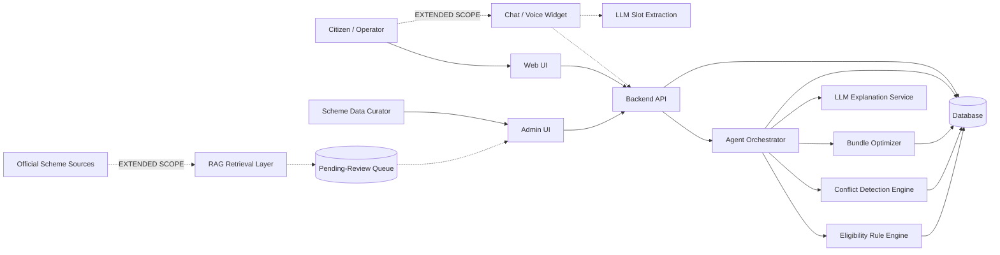
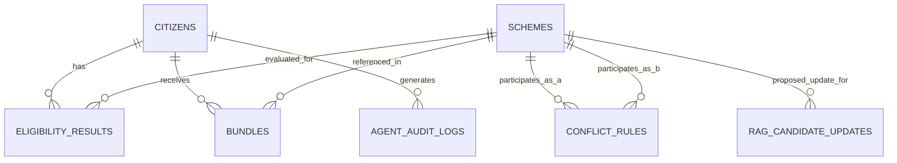

# plan.md — Autonomous Scheme-Bundle Optimizer for Citizens

---

## 1. Project Overview

- **Project Name:** Autonomous Scheme-Bundle Optimizer for Citizens (ASBO)
- **One-line description:** An agentic assistant that takes a citizen's profile and produces an explained, conflict-free, optimized bundle of government schemes with an application checklist.
- **Detailed description:** ASBO ingests a citizen's demographic, economic, and social profile — captured via a structured form, or via multilingual conversational/voice intake — evaluates it against a structured knowledge base of government scheme eligibility rules, identifies every scheme the citizen potentially qualifies for, detects mutually exclusive or conflicting schemes among the eligible set, selects the combination ("bundle") that maximizes total benefit to the citizen under those constraints, explains why that bundle was chosen, flags documents the citizen is missing for each scheme in the bundle, and produces a consolidated application checklist. A Retrieval-Augmented Generation (RAG) layer keeps the underlying scheme knowledge base current by retrieving real-time scheme details from official government sources, subject to curator approval before any change reaches the deterministic engine (see [[Section 16]]).
- **Primary purpose:** Reduce the cognitive and administrative burden on citizens (and intermediaries such as Common Service Centre operators or NGO caseworkers) trying to manually determine which of many overlapping/conflicting government schemes to apply for.
- **Target users:** Individual citizens (self-service), assisted-service operators (CSC agents, NGO/welfare-office caseworkers) entering data on behalf of citizens, and citizens checking eligibility on behalf of a friend or relative via the stateless Quick Checker (see FR-013).
- **Expected outcome:** A working end-to-end prototype: profile entry → eligible scheme list → conflict report → optimized bundle with explanation → missing-document report → application checklist, demonstrable on at least one sample citizen profile.
- **Scope note (added after initial Phases 0–8 build):** Sections marked **[EXTENDED SCOPE]** throughout this document — multilingual/voice conversational intake (FR-012), the stateless Quick Checker (FR-013), the searchable scheme catalog with form-filling guides (FR-014), and the RAG real-time freshness layer (FR-015) — were added to the specification after the core deterministic pipeline (Phases 0–8) was already implemented and tested. They are additive: none of them change or weaken the existing "AI never decides eligibility" boundary (Section 16), and none are implemented yet as of Section 33's last update. Treat them as the next build phases (Section 25, Phases 9–11), not as already-working features.

---

## 2. Problem Analysis

- **Problem statement (restated):** Citizens may be eligible for multiple government schemes simultaneously, but schemes can overlap, conflict, or be mutually exclusive, and citizens have no practical way to determine the eligible set, the conflicts within it, or the best combination to apply for.
- **Existing situation:** Scheme information is scattered across department websites/PDFs/circulars, written in legal/administrative language, with eligibility criteria that vary by income, category, location, land holding, occupation, age, disability status, etc. Citizens either miss schemes they qualify for, apply for mutually exclusive schemes and get rejected after investing effort, or under-utilize available support.
- **Root problems:**
  1. Eligibility logic is not centralized or machine-readable anywhere the citizen can query.
  2. No system evaluates *combinations* of schemes — only single-scheme eligibility (where it exists at all).
  3. Conflicts/mutual exclusivity between schemes are not surfaced to the citizen before they invest time applying.
  4. Document requirements differ per scheme and are not reconciled against what the citizen already has.
- **Pain points:** Manual research burden, risk of wasted applications, no personalized guidance, no explanation of *why* a scheme was or wasn't recommended, no single checklist to act on.
- **Limitations of existing approaches:** Government portals typically list schemes per-department, not per-citizen; they do not reason across schemes, do not optimize a bundle, and do not detect missing documents proactively.
- **Why the proposed system is needed:** A rule-driven reasoning + optimization layer over a structured scheme knowledge base directly closes the gap between "schemes exist" and "this citizen knows the best schemes to apply for and what to bring."

---

## 3. Goals and Objectives

### Primary Goals
- G-01: Accept a structured citizen profile as input.
- G-02: Evaluate the profile against a scheme knowledge base and return the eligible scheme set with reasons.
- G-03: Detect conflicts/incompatibilities among eligible schemes.
- G-04: Compute an optimized, conflict-free bundle that maximizes benefit to the citizen.
- G-05: Explain the recommendation in plain language.
- G-06: Detect missing documents required by the schemes in the bundle.
- G-07: Produce a consolidated application checklist.

### Secondary Goals
- G-08: Allow the scheme knowledge base to be extended/edited without code changes (data-driven rules).
- G-09: Provide an audit trail of the agent's reasoning steps for transparency/trust.
- G-10: Support assisted-service data entry (operator enters profile on behalf of citizen).
- G-11 **[EXTENDED SCOPE]**: Support multilingual (English/Hindi/Marathi) conversational and voice profile intake, so citizens uncomfortable with a formal English form can still use the system (FR-012).
- G-12 **[EXTENDED SCOPE]**: Let a citizen check a scheme's prerequisites on behalf of someone else with zero account/login friction (FR-013).
- G-13 **[EXTENDED SCOPE]**: Keep the scheme knowledge base's benefit amounts, criteria, and documents current via a curator-reviewed, RAG-assisted refresh pipeline, rather than relying solely on manual curation (FR-015).

### Non-Goals
- Submitting applications to actual government portals on the citizen's behalf.
- Verifying document authenticity (e.g., OCR/fraud detection on uploaded documents).
- Real-time integration with live government scheme databases/APIs (the RAG layer, G-13/FR-015, retrieves scheme *details* for curator review — it is explicitly not a live transactional integration with any government system).
- Payment or disbursement processing.
- Fully automated (no-human-review) knowledge-base updates — see BR-015: every RAG-proposed change requires curator approval before it takes effect.

**Revision note:** the prior version of this list included "Multi-language localization (beyond English) in the current version" as a non-goal. That has been superseded by G-11 **[EXTENDED SCOPE]** — multilingual intake (English/Hindi/Marathi) is now in scope, per the discussion that added Sections FR-012 through FR-015. It remains true that UI *chrome* (labels, static text) beyond English is not committed to in this version — only the *conversational intake* is multilingual; see FR-012's exact boundary.

---

## 4. Scope

### In Scope
- Citizen profile capture (manual form entry, **[EXTENDED SCOPE]** or multilingual conversational/voice entry — FR-012).
- A structured, file/database-backed scheme knowledge base with eligibility rules, benefit metadata, required documents, and conflict metadata, seeded with a representative sample set of schemes (not an exhaustive national catalogue).
- **[EXTENDED SCOPE]** A Maharashtra/MahaDBT-aligned representative scheme set (six named schemes — see Section 13a) as an additional, distinct seed set alongside the original eight-scheme demonstration catalogue (`database/seed_schemes.json`); the two sets are not required to merge into one file (see A-011).
- Deterministic rule-based eligibility evaluation engine.
- Deterministic conflict detection based on declared conflict relationships between schemes.
- Bundle optimization algorithm that selects the best non-conflicting subset of eligible schemes.
- Natural-language explanation generation for the recommended bundle.
- Missing-document detection by comparing scheme requirements to citizen-declared document holdings.
- Application checklist generation from the optimized bundle.
- An agent orchestration layer that sequences the above steps end-to-end for a given citizen.
- A demo-ready UI covering profile entry → results → checklist.
- **[EXTENDED SCOPE]** A stateless Quick Scheme Eligibility & Form-Filling Checker requiring no citizen account (FR-013).
- **[EXTENDED SCOPE]** A searchable scheme catalog with English/Marathi form-filling guides, a curated video walkthrough link, and the official portal link per scheme (FR-014).
- **[EXTENDED SCOPE]** A Retrieval-Augmented Generation (RAG) layer that retrieves scheme details from official sources and proposes knowledge-base updates for curator approval (FR-015).

### Out of Scope
- Legal-grade eligibility guarantees (system output is advisory, not a binding determination).
- Automated document upload verification/OCR.
- Direct submission to government e-filing systems.
- Large-scale multi-tenant deployment, load balancing, or high-availability infrastructure.
- Full RBAC/enterprise identity management (see [[Open Questions]] Q-002).
- Aadhaar-based identity verification, DigiLocker document verification, and API Setu integration — all explicitly deferred to Future Scope (Section 30a) and not implemented, claimed, or assumed anywhere in this document.
- Fully automated (unreviewed) commits of RAG-retrieved content to the knowledge base — see BR-015.
- Training or fine-tuning any model — all AI/NLP use in this document (slot extraction, explanation, RAG drafting) is inference-only against pretrained APIs; see Section 16.

---

## 5. Stakeholders and Actors

| Actor | Type | Role | Goals | Responsibilities | Permissions | Interaction |
|---|---|---|---|---|---|---|
| Citizen | Human | End user seeking benefits | Find the best schemes to apply for with least effort | Provide accurate profile data; review recommendations | Create/view own profile and results | Uses UI directly |
| Assisted-Service Operator (CSC/NGO caseworker) | Human | Enters data on behalf of citizens who lack access/literacy | Help citizens get correct recommendations | Enter citizen profile accurately; explain results to citizen | Create/view profiles they entered | Uses UI on citizen's behalf |
| Scheme Data Curator (Admin) | Human | Maintains scheme knowledge base | Keep scheme rules accurate and current | Add/update/deactivate schemes, rules, conflicts, required documents; **[EXTENDED SCOPE]** review and approve/reject RAG-proposed knowledge-base updates (FR-015, BR-015) | Full CRUD on scheme KB; sole approver of RAG-proposed changes | Uses admin interface / edits KB source files |
| Eligibility Reasoning Agent | AI/System component | Orchestrates the evaluation pipeline | Produce correct, explained, optimized output | Sequence rule engine → conflict detector → optimizer → explanation → checklist | System-internal only | Invoked by backend per request |
| Rule Engine | System component | Deterministically evaluates eligibility rules | Correct eligibility for given profile+scheme | Parse scheme rule JSON, evaluate against profile | System-internal only | Called by Reasoning Agent |
| Conflict Detection Engine | System component | Flags incompatible scheme pairs/groups | Correct conflict list for eligible set | Evaluate declared conflict relationships | System-internal only | Called by Reasoning Agent |
| Bundle Optimizer | System component | Selects best non-conflicting subset | Maximize total benefit value under constraints | Solve constrained selection problem | System-internal only | Called by Reasoning Agent |
| LLM Explanation Service | External AI service (Google Gemini API) | Generates natural-language explanation text | Fluent, accurate explanation of a already-computed result | Convert structured reasoning trace into readable text | Read-only access to structured results (no eligibility authority) | Called by Reasoning Agent via API |
| **[EXTENDED SCOPE]** Conversational/Voice Intake Assistant | AI/System component | Multilingual (English/Hindi/Marathi) natural-language + voice profile intake | Convert an informal citizen statement into structured profile slots | Slot/entity extraction via structured output (function calling); ask follow-up questions for missing mandatory slots | Write access only to a citizen's own in-progress profile draft; no eligibility authority | Invoked by frontend chat/voice widget (FR-012) |
| **[EXTENDED SCOPE]** RAG Retrieval Layer | AI/System component | Keeps the scheme knowledge base current | Propose accurate, source-grounded knowledge-base updates | Retrieve official scheme sources, draft candidate structured updates | Read access to indexed sources; **write access to a pending-review queue only** — never directly to the live knowledge base | Triggered on a schedule or by curator request (FR-015) |

**Note on AI role boundary:** The LLM — including the Conversational/Voice Intake Assistant and the RAG Retrieval Layer — never determines eligibility, conflicts, or optimization outcomes, and never writes directly to the live knowledge base. It only converts already-computed, deterministic results into natural language, extracts structured slots from a citizen's own statement, or drafts a candidate knowledge-base change for a human curator to approve. This prevents hallucinated eligibility determinations and hallucinated scheme facts alike. See [[Section 16]].

---

## 6. Functional Requirements

**FR-001 — Create Citizen Profile**
- Actor: Citizen / Operator
- Preconditions: None
- Inputs: Name, DOB/age, gender, annual household income, occupation, state, district, social category, disability status, land holding, family size, marital status, BPL status, education level, employment status, list of documents already held
- Expected behavior: Validate required fields, persist profile
- Outputs: Citizen ID, confirmation
- Postconditions: Profile stored and retrievable
- Business rules: BR-001 (see Section 12)
- Failure/exception cases: Missing required field → validation error; invalid data type/range → validation error

**FR-002 — Retrieve/Update Citizen Profile**
- Actor: Citizen / Operator
- Preconditions: Profile exists
- Inputs: Citizen ID, updated fields
- Expected behavior: Fetch or update stored profile
- Outputs: Current profile state
- Postconditions: Profile updated if applicable
- Failure/exception cases: Citizen ID not found → 404-equivalent error

**FR-003 — List Available Schemes**
- Actor: Citizen / Operator / Admin
- Preconditions: Scheme KB populated
- Inputs: Optional filters (category, state)
- Expected behavior: Return active schemes with metadata
- Outputs: List of schemes
- Failure/exception cases: None (empty list is valid)

**FR-004 — Evaluate Eligibility**
- Actor: Eligibility Reasoning Agent (triggered by Citizen/Operator action)
- Preconditions: Citizen profile exists; scheme KB populated
- Inputs: Citizen ID
- Expected behavior: Evaluate every active scheme's rule set against the citizen profile
- Outputs: Per-scheme eligibility result (`eligible` / `not eligible`) with matched/failed rule reasons
- Postconditions: Eligibility results persisted for traceability
- Business rules: BR-002, BR-003
- Failure/exception cases: Profile incomplete for a given rule field → that scheme marked `indeterminate` with reason, not silently excluded or silently included

**FR-005 — Detect Conflicts**
- Actor: Conflict Detection Engine
- Preconditions: Eligible scheme set computed (FR-004)
- Inputs: Set of eligible scheme IDs
- Expected behavior: Compare each pair/group against declared conflict rules
- Outputs: List of conflicting scheme pairs/groups with conflict type and reason
- Business rules: BR-004, BR-005
- Failure/exception cases: No conflicts found → empty list is a valid, expected output

**FR-006 — Optimize Bundle**
- Actor: Bundle Optimizer
- Preconditions: Eligible set and conflict list computed
- Inputs: Eligible schemes with benefit values, conflict list
- Expected behavior: Select the subset of eligible schemes with no internal conflicts that maximizes total estimated benefit value
- Outputs: Optimized bundle (scheme IDs), total benefit value, list of eligible-but-excluded schemes with the reason they were excluded (i.e., which conflict caused exclusion)
- Postconditions: Bundle persisted, linked to citizen
- Business rules: BR-006, BR-007
- Failure/exception cases: No eligible schemes → empty bundle with explanatory message, not an error

**FR-007 — Generate Recommendation Explanation**
- Actor: Eligibility Reasoning Agent + LLM Explanation Service
- Preconditions: Bundle computed (FR-006)
- Inputs: Bundle, eligibility reasons, conflict reasons, excluded schemes
- Expected behavior: Produce a plain-language explanation of why each bundle scheme was included, why excluded schemes were left out, and how conflicts were resolved
- Outputs: Explanation text attached to the bundle
- Failure/exception cases: LLM service unavailable → fall back to a template-based explanation built from structured data (never block on LLM; see [[Section 16]])

**FR-008 — Detect Missing Documents**
- Actor: Eligibility Reasoning Agent
- Preconditions: Bundle computed
- Inputs: Required-documents list per scheme in bundle; citizen's declared held documents
- Expected behavior: Compute, per scheme, the set difference between required and held documents
- Outputs: Per-scheme missing-document list
- Business rules: BR-008
- Failure/exception cases: Citizen declared no documents → all required documents reported missing (valid case)

**FR-009 — Generate Application Checklist**
- Actor: Eligibility Reasoning Agent
- Preconditions: Bundle and missing-document results computed
- Inputs: Bundle, missing documents, scheme application steps (if defined in KB)
- Expected behavior: Aggregate, per scheme, the documents needed and application steps into one ordered checklist
- Outputs: Consolidated checklist (per scheme, and de-duplicated across schemes where a document is shared)
- Postconditions: Checklist persisted, linked to bundle
- Business rules: BR-009

**FR-010 — View Agent Reasoning Trace**
- Actor: Citizen / Operator
- Preconditions: Evaluation pipeline has run at least once for the citizen
- Inputs: Citizen ID
- Expected behavior: Return the step-by-step record of what the agent computed at each stage (eligibility → conflicts → optimization → explanation → checklist)
- Outputs: Ordered trace of pipeline steps and their outputs
- Failure/exception cases: No trace exists yet → empty/informative response

**FR-011 — Manage Scheme Knowledge Base (Admin)**
- Actor: Scheme Data Curator
- Preconditions: Admin access
- Inputs: Scheme metadata, eligibility rules, conflict declarations, required documents, benefit value
- Expected behavior: Create/update/deactivate scheme entries
- Outputs: Updated KB
- Postconditions: Subsequent evaluations use updated rules
- Failure/exception cases: Invalid rule syntax → validation error, entry rejected

**FR-012 — Multilingual Conversational & Voice Profile Intake [EXTENDED SCOPE]**
- Actor: Citizen / Operator; supported by the Conversational/Voice Intake Assistant
- Preconditions: None (alternative entry path to FR-001's structured form)
- Inputs: Free-text or spoken citizen statement, in English, Hindi, or Marathi; the profile-slot state collected so far
- Expected behavior: Extract structured profile slots (age, income, occupation, land_acres, category, state, held_documents, and the FR-001 fields more broadly) from the statement via structured output (function calling), validated the same way as FR-001's form data; if mandatory slots are still missing, ask one targeted follow-up question in the citizen's chosen language
- Outputs: Updated structured profile (same shape as FR-001); once sufficiently complete, proceeds into FR-004 exactly as a form-submitted profile would
- Postconditions: Profile stored and evaluable, indistinguishable downstream from a form-entered profile
- Business rules: BR-013 (see Section 12)
- Failure/exception cases: Speech recognition failure/no browser support → fall back to text input, never block the citizen; extracted slot fails FR-001's validation → same field-level error handling as the form path; LLM/API unavailable → citizen is offered the structured form as a fallback, never left stuck

**FR-013 — Quick Scheme Eligibility & Form-Filling Checker [EXTENDED SCOPE]**
- Actor: Citizen or Operator, on behalf of themselves or a third party
- Preconditions: None — no citizen account or profile required
- Inputs: `{ scheme_id, criteria }` — a single scheme and just the fields its rules reference
- Expected behavior: Evaluate the given criteria against that one scheme's rules only (reusing the Rule Engine, not a separate implementation), stateless — nothing is persisted server-side beyond the request/response cycle
- Outputs: If eligible — status, form-filling guide (English/Marathi), curated video link, official portal link, required documents. If ineligible — status, reason, suggested alternative schemes from the same category
- Postconditions: None (stateless by design — see BR-014)
- Failure/exception cases: Unknown scheme_id → 404-equivalent error; missing criteria the scheme's rules need → indeterminate result, same semantics as BR-002, not silently treated as ineligible
- **Explicit disclaimer requirement:** every response must carry the notice that this is a preliminary self-assessment, not an official government eligibility determination (see NFR-011)

**FR-014 — Scheme Catalog Search with Form-Filling Guides [EXTENDED SCOPE]**
- Actor: Citizen / Operator / Admin
- Preconditions: Scheme KB populated
- Inputs: Optional search query and filters (category, state)
- Expected behavior: Extends FR-003's scheme listing with full-text/keyword search and richer per-scheme catalogue metadata
- Outputs: Matching schemes, each with: name, category, issuing authority, benefit summary, eligibility summary, required documents, English form-filling guide, Marathi form-filling guide, curated video walkthrough link, official portal link
- Failure/exception cases: No matches → empty list is valid, not an error

**FR-015 — RAG-Based Knowledge Base Freshness [EXTENDED SCOPE]**
- Actor: RAG Retrieval Layer (system-triggered or curator-triggered); Scheme Data Curator (approver)
- Preconditions: A target scheme (or the full catalogue) to refresh; indexed official sources available
- Inputs: Scheme identifier(s); the RAG layer's own index of official government scheme pages/notifications
- Expected behavior: Retrieve the passages most relevant to the target scheme(s); have the LLM draft a candidate structured update (benefit value, criteria text, documents, deadlines, portal link) grounded in that retrieved text; queue the candidate for curator review — **never auto-commit**
- Outputs: A pending-review candidate update, showing the proposed diff against the current live scheme record and citing the retrieved source passage(s)
- Postconditions: Knowledge base is unchanged until a curator explicitly approves the candidate (FR-011's update path is reused for the actual commit)
- Business rules: BR-015 (see Section 12)
- Failure/exception cases: Source unavailable/unreachable → no candidate produced, existing KB entry untouched, failure logged (never blocks FR-004/FR-005/FR-006, which depend only on the already-committed KB); retrieved content insufficient to draft a confident update → no candidate produced rather than a low-confidence guess

---

## 7. Non-Functional Requirements

| ID | Category | Requirement |
|---|---|---|
| NFR-001 | Performance | End-to-end pipeline (profile → checklist) for one citizen against a scheme KB of up to a few hundred schemes should complete within a few seconds under normal load, excluding external LLM latency. |
| NFR-002 | Scalability | Architecture must support growing the scheme KB and adding new rule types without redesign; horizontal scaling is not required for the prototype's expected demo load. |
| NFR-003 | Reliability | Core eligibility/conflict/optimization results must never depend on an external service being available (LLM is explanation-only, with a fallback). |
| NFR-004 | Security/Privacy | Citizen profile data (PII: income, category, disability status) must be stored with access limited to the owning citizen/operator and admins; no data exposed via unauthenticated endpoints beyond what is explicitly public (the scheme catalogue). |
| NFR-005 | Maintainability | Scheme eligibility rules, conflict relationships, and document requirements must be data-driven (external JSON/DB records), not hardcoded in application logic. |
| NFR-006 | Usability | A citizen with no domain knowledge of government scheme terminology must be able to complete profile entry and understand the recommendation without external help. |
| NFR-007 | Explainability | Every eligibility decision, conflict, and exclusion must have a traceable, human-readable reason — no unexplained "black box" outputs. |
| NFR-008 | Observability | Every agent pipeline run must be logged (inputs/outputs per step) to support debugging and the reasoning-trace feature (FR-010). |
| NFR-009 | Accessibility | UI should follow basic accessibility practices (semantic HTML, labeled form fields, sufficient color contrast) given citizen-facing usage. |
| NFR-010 | Compatibility | Web UI must work on evergreen desktop and mobile browsers (Chrome, Edge, Firefox, Safari) without requiring app installation. |
| NFR-011 **[EXTENDED SCOPE]** | Explainability / Trust | The Quick Checker (FR-013) must visibly disclose, on every response, that its result is a preliminary self-assessment and not an official government eligibility determination. |
| NFR-012 **[EXTENDED SCOPE]** | Accessibility | Conversational/voice intake (FR-012) must support English, Hindi, and Marathi for both text and speech input; speech recognition failure must degrade to text input, never block the citizen. |
| NFR-013 **[EXTENDED SCOPE]** | Data Integrity / Safety | No content retrieved by the RAG layer (FR-015) may reach the live scheme knowledge base without an explicit curator approval action — this is enforced at the data-write layer (a separate pending-review collection, not a flag on the live record), not only by UI convention. |
| NFR-014 **[EXTENDED SCOPE]** | Reliability | RAG refresh failures (source unreachable, retrieval inconclusive) must never block or degrade FR-004/FR-005/FR-006 — those depend only on the already-committed knowledge base, exactly as NFR-003 already requires for the LLM Explanation Service. |

---

## 8. Actors → Use Cases

**UC-01 — Create Citizen Profile**
- Primary actor: Citizen/Operator
- Goal: Register a citizen's profile for evaluation
- Preconditions: None
- Main flow: Actor opens intake form → enters demographic/economic/social data → submits → system validates → system stores profile → system returns citizen ID
- Alternative flows: Operator saves a partially complete profile as draft (if allowed, see Q-003)
- Exception flows: Validation failure → form shows field-level errors, no data persisted
- Postconditions: Profile exists and is evaluable

**UC-02 — View Eligible Schemes**
- Primary actor: Citizen/Operator
- Supporting actors: Eligibility Reasoning Agent, Rule Engine
- Goal: See which schemes the citizen qualifies for and why
- Preconditions: Profile exists
- Main flow: Actor requests evaluation → Rule Engine evaluates each active scheme → results returned with reasons
- Exception flows: Profile missing a field a rule needs → scheme marked indeterminate with explanation
- Postconditions: Eligibility results persisted

**UC-03 — View Scheme Conflicts**
- Primary actor: Citizen/Operator
- Supporting actors: Conflict Detection Engine
- Goal: Understand which eligible schemes cannot be combined
- Preconditions: Eligibility evaluated
- Main flow: System compares eligible schemes against conflict rules → returns conflict pairs/groups with reasons
- Postconditions: Conflict list available to Optimizer

**UC-04 — Generate Optimized Bundle**
- Primary actor: Citizen/Operator
- Supporting actors: Bundle Optimizer
- Goal: Get the best non-conflicting combination of schemes
- Preconditions: Eligibility and conflicts computed
- Main flow: Optimizer selects max-benefit conflict-free subset → returns bundle + excluded schemes with reasons
- Exception flows: No eligible schemes → empty bundle with explanatory message
- Postconditions: Bundle persisted

**UC-05 — View Recommendation Explanation**
- Primary actor: Citizen/Operator
- Supporting actors: LLM Explanation Service
- Goal: Understand, in plain language, why the bundle was chosen
- Preconditions: Bundle exists
- Main flow: Agent sends structured trace to LLM → LLM returns explanation text → displayed to actor
- Exception flows: LLM unavailable → template-based explanation shown instead
- Postconditions: Explanation attached to bundle

**UC-06 — View Missing Documents**
- Primary actor: Citizen/Operator
- Goal: Know what documents are still needed
- Preconditions: Bundle exists
- Main flow: System diffs required vs. held documents per scheme → returns missing list
- Postconditions: Missing-document list available to checklist generation

**UC-07 — View Application Checklist**
- Primary actor: Citizen/Operator
- Goal: Get one actionable list to complete applications
- Preconditions: Bundle and missing documents computed
- Main flow: System aggregates per-scheme steps/documents into one ordered, de-duplicated checklist
- Postconditions: Checklist persisted and viewable/exportable

**UC-08 — Manage Scheme Knowledge Base**
- Primary actor: Scheme Data Curator
- Goal: Keep scheme data accurate
- Preconditions: Admin access
- Main flow: Curator adds/edits a scheme's metadata, rules, conflicts, documents → system validates rule syntax → saves
- Exception flows: Invalid rule → rejected with error detail
- Postconditions: KB updated for future evaluations

**UC-09 — Conversational/Voice Profile Intake [EXTENDED SCOPE]**
- Primary actor: Citizen/Operator
- Supporting actor: Conversational/Voice Intake Assistant
- Goal: Build a structured profile by talking or typing informally, in English, Hindi, or Marathi
- Preconditions: None
- Main flow: Citizen speaks/types a statement → Assistant extracts structured slots → missing mandatory slots trigger a follow-up question in the same language → once complete, proceeds exactly as UC-01's structured-form path from here on
- Alternative flows: Citizen switches to the structured form at any point without losing already-extracted slots
- Exception flows: Speech recognition unavailable/fails → falls back to text input
- Postconditions: Same as UC-01 — profile exists and is evaluable

**UC-10 — Quick Scheme Eligibility Check [EXTENDED SCOPE]**
- Primary actor: Citizen or Operator (possibly checking on behalf of a third party)
- Goal: Get a fast eligible/ineligible read on one specific scheme, no account needed
- Preconditions: None
- Main flow: Actor selects a scheme, enters just the criteria that scheme's rules need → system evaluates statelessly → shows result with form guide/portal link (if eligible) or reason + alternatives (if not)
- Exception flows: Missing criteria a rule needs → indeterminate result, same as BR-002
- Postconditions: None persisted (stateless by design, BR-014)

**UC-11 — Browse Scheme Catalog [EXTENDED SCOPE]**
- Primary actor: Citizen/Operator
- Goal: Search/browse schemes directly, independent of a personal eligibility check
- Preconditions: Scheme KB populated
- Main flow: Actor searches/filters → views a scheme's full catalogue entry (benefit, eligibility summary, documents, English/Marathi form guides, video, portal link)
- Postconditions: None (read-only)

**UC-12 — Review RAG-Proposed Knowledge Base Update [EXTENDED SCOPE]**
- Primary actor: Scheme Data Curator
- Supporting actor: RAG Retrieval Layer
- Goal: Keep the knowledge base current without hand-authoring every change
- Preconditions: A RAG refresh has produced at least one pending candidate update
- Main flow: Curator opens the pending-review queue → sees the proposed diff and the source passage(s) it was grounded in → approves (commits via UC-08's existing update path) or rejects
- Exception flows: Curator rejects → candidate discarded, live KB unchanged, reason optionally logged
- Postconditions: KB updated only on explicit approval (BR-015)

---

## 9. Complete User Workflows

**Primary workflow — End-to-end citizen journey (the demo path):**

```text
Citizen/Operator
 ↓
Profile Intake Form (UI)
 ↓
Validation (required fields, types, ranges)
 ↓
POST /api/citizens → Citizen persisted
 ↓
POST /api/eligibility/evaluate
 ↓
Rule Engine evaluates each active scheme vs. profile
 ↓
Eligible Scheme Set (+ reasons) persisted
 ↓
POST /api/conflicts/detect
 ↓
Conflict Detection Engine compares eligible set vs. conflict rules
 ↓
Conflict List persisted
 ↓
POST /api/bundle/optimize
 ↓
Bundle Optimizer selects max-benefit conflict-free subset
 ↓
Optimized Bundle (+ excluded schemes & reasons) persisted
 ↓
Agent Orchestrator sends structured trace → LLM Explanation Service
 ↓
Explanation text generated (or template fallback)
 ↓
POST /api/checklist/generate
 ↓
Missing-document diff computed per bundle scheme
 ↓
Consolidated Application Checklist persisted
 ↓
UI displays: Eligible Schemes → Conflicts → Optimized Bundle + Explanation → Missing Documents → Checklist
```

**Secondary workflow — Admin scheme maintenance:**

```text
Scheme Data Curator
 ↓
Admin UI: Add/Edit Scheme
 ↓
Enter metadata, eligibility rules, conflict declarations, required documents
 ↓
Validation (rule syntax, referenced fields exist)
 ↓
POST/PUT /api/schemes
 ↓
Scheme KB updated
 ↓
Available to next evaluation run
```

**Tertiary workflow — Conversational/voice intake [EXTENDED SCOPE]:**

```text
Citizen (speaks or types, EN/HI/MR)
 ↓
POST /api/chat/assistant { message, current_slots }
 ↓
LLM extracts structured slots (function calling / structured output)
 ↓
Pydantic validates extracted slots
 ↓
All mandatory slots present? --No--> Assistant asks one follow-up question (same language) --> back to Citizen
 ↓ Yes
Structured profile complete
 ↓
Proceeds exactly as the Primary workflow's POST /api/citizens step onward
```

**Quaternary workflow — RAG knowledge-base refresh [EXTENDED SCOPE]:**

```text
Trigger: scheduled refresh, or curator-initiated via Admin UI
 ↓
RAG Retrieval Layer retrieves relevant passages from indexed official scheme sources
 ↓
LLM drafts a candidate structured update, grounded in retrieved text
 ↓
Candidate written to a pending-review queue (NOT the live knowledge base) — BR-015
 ↓
Scheme Data Curator reviews the diff + cited source passage(s) (UC-12)
 ↓
Approve --------------------------------------------> Reject
 ↓                                                        ↓
Committed via the existing POST/PUT /api/schemes path     Candidate discarded, live KB unchanged
 ↓
Available to next evaluation run (same as the Secondary workflow's final step)
```

---

## 10. System Architecture

- **Architecture style:** Modular monolith. A microservices split is not justified at this scale (single demo dataset, no independent scaling needs) — modules are logically separated (Rule Engine, Conflict Engine, Optimizer, Agent Orchestrator) but deployed as one backend service for simplicity and reduced operational overhead within the project timeline.
- **Frontend:** Single-page web app (form-driven intake + results dashboard).
- **Backend:** Single API service exposing REST endpoints, internally composed of the modules in [[Section 11]].
- **Database:** Single MongoDB database holding citizens, schemes, conflict rules, eligibility results, bundles, and audit logs as documents/collections (see [[Section 13]] for embedding vs. referencing decisions).
- **Authentication:** Minimal — see [[Q-002]]; for the prototype, citizens/operators are identified by a generated Citizen ID without a full login system, and an admin-only route is protected by a simple credential (justified: this is a hackathon prototype, not a production citizen-data system).
- **Authorization:** Two roles — Citizen/Operator (own-profile access) and Admin (KB management).
- **Storage:** MongoDB only; no file/blob storage required since document *verification* (uploads) is out of scope — only document *names/types held* are recorded.
- **External services:** One external AI service (LLM, Google Gemini) used for explanation generation, **[EXTENDED SCOPE]** conversational/voice slot extraction (FR-012), and **[EXTENDED SCOPE]** RAG-drafted knowledge-base update proposals (FR-015) — never for eligibility/conflict/optimization decisions in any of these uses.
- **AI/ML services:** See [[Section 16]].
- **[EXTENDED SCOPE]** **Retrieval/vector store:** An embedding index over official scheme sources (provider/vector-store choice: see Q-010) — read by the RAG Retrieval Layer only; never read by the Rule Engine, Conflict Detection Engine, or Bundle Optimizer directly.
- **Background workers:** Not required for the core pipeline (synchronous per request). **[EXTENDED SCOPE]** The RAG refresh (FR-015) is the one background/scheduled job in scope — it runs independently of any citizen request and only ever writes to the pending-review queue.
- **Queues/events:** Not required for the core pipeline. **[EXTENDED SCOPE]** The RAG pending-review queue (a MongoDB collection, not a message broker — see Section 13a) is the one queue-like structure in scope, sized for curator review, not high-throughput event processing.
- **Caching:** Not required initially — scheme KB is small; can be added later if KB grows (see [[Section 23]]).
- **Monitoring/logging:** Application-level structured logging of each pipeline step (supports NFR-008 and FR-010); no dedicated monitoring stack required for a prototype.


*(Dashed lines mark [[EXTENDED SCOPE]] additions — the conversational/voice path and the RAG freshness path — layered onto the original solid-line pipeline without changing it.)*

---

## 11. Module Breakdown

**Module: Profile Management**
- Purpose: Capture and store citizen profiles.
- Responsibilities: Validate and persist profile data; provide retrieval/update.
- Inputs: Profile form data.
- Outputs: Citizen record.
- Dependencies: Database.
- Main operations: create, get, update citizen.
- Related requirements: FR-001, FR-002.
- Related actors: Citizen, Operator.

**Module: Scheme Knowledge Base**
- Purpose: Store scheme metadata, eligibility rules, conflict declarations, required documents.
- Responsibilities: CRUD for schemes; validate rule structure on write.
- Inputs: Admin-entered scheme data.
- Outputs: Queryable scheme catalogue.
- Dependencies: Database.
- Main operations: create/update/deactivate scheme, list schemes.
- Related requirements: FR-003, FR-011.
- Related actors: Scheme Data Curator, Citizen (read-only).

**Module: Eligibility Rule Engine**
- Purpose: Deterministically evaluate a citizen profile against a scheme's rule set.
- Responsibilities: Parse rule expressions; evaluate; produce pass/fail/indeterminate with reasons.
- Inputs: Citizen profile, scheme rules.
- Outputs: Per-scheme eligibility result + reasons.
- Dependencies: Profile Management, Scheme Knowledge Base.
- Related requirements: FR-004.
- Related actors: Eligibility Reasoning Agent.

**Module: Conflict Detection Engine**
- Purpose: Identify incompatible scheme combinations within the eligible set.
- Responsibilities: Compare eligible schemes against declared conflict rules.
- Inputs: Eligible scheme set, conflict rules.
- Outputs: Conflict list with type and reason.
- Dependencies: Scheme Knowledge Base.
- Related requirements: FR-005.

**Module: Bundle Optimizer**
- Purpose: Select the highest-value, conflict-free subset of eligible schemes.
- Responsibilities: Model schemes as a constrained selection problem; solve; report excluded schemes with reasons.
- Inputs: Eligible schemes (with benefit values), conflict list.
- Outputs: Optimized bundle, total value, excluded schemes + reasons.
- Dependencies: Eligibility Rule Engine output, Conflict Detection Engine output.
- Related requirements: FR-006.

**Module: Agent Orchestrator**
- Purpose: Sequence the pipeline end-to-end and produce/persist the reasoning trace.
- Responsibilities: Call Rule Engine → Conflict Engine → Optimizer → Explanation Service → Checklist Generator in order; log each step.
- Inputs: Citizen ID.
- Outputs: Final combined result; step-by-step trace.
- Dependencies: All other backend modules.
- Related requirements: FR-007, FR-010.

**Module: Explanation Generator**
- Purpose: Convert structured results into a plain-language recommendation explanation.
- Responsibilities: Build LLM prompt from structured trace; call LLM; fall back to template if LLM fails.
- Inputs: Bundle, eligibility reasons, conflicts, exclusions.
- Outputs: Explanation text.
- Dependencies: LLM Explanation Service (external), Bundle Optimizer output.
- Related requirements: FR-007.

**Module: Document & Checklist Manager**
- Purpose: Detect missing documents and produce the consolidated application checklist.
- Responsibilities: Diff required vs. held documents; aggregate steps/documents across bundle schemes.
- Inputs: Bundle, scheme required-document lists, citizen held-document list.
- Outputs: Missing-document report, consolidated checklist.
- Dependencies: Bundle Optimizer output, Scheme Knowledge Base.
- Related requirements: FR-008, FR-009.

**Module: Conversational/Voice Intake [EXTENDED SCOPE]**
- Purpose: Convert an informal, multilingual citizen statement into structured profile slots.
- Responsibilities: Call the LLM with structured-output/function-calling constraints; validate the result the same way as a form submission; track partial-slot state across turns; ask one follow-up question at a time for missing mandatory slots, in the citizen's chosen language; hand off a complete profile to Profile Management exactly as FR-001 would receive one.
- Inputs: Free-text or transcribed-speech citizen statement; current partial-slot state.
- Outputs: Structured profile slots (validated); or a follow-up question.
- Dependencies: LLM (external), Profile Management (for the eventual handoff), browser Web Speech API (frontend-side, for voice).
- Related requirements: FR-012.
- Note: has no eligibility authority and no access to any other citizen's data — see the AI role boundary note in Section 5.

**Module: RAG Retrieval Layer [EXTENDED SCOPE]**
- Purpose: Keep the Scheme Knowledge Base's benefit amounts, criteria, documents, and links current.
- Responsibilities: Maintain an embedding index over official scheme sources; on refresh, retrieve the passages most relevant to a target scheme; have the LLM draft a structured candidate update grounded in that retrieved text; write the candidate — with its source citation — to a pending-review queue.
- Inputs: Scheme identifier(s) to refresh; the indexed source corpus.
- Outputs: Pending-review candidate update(s), each with a diff against the live record and a source citation.
- Dependencies: LLM (external), vector store/embedding index (external or self-hosted), Scheme Knowledge Base (read for the diff baseline; **never written directly** — see BR-015).
- Related requirements: FR-015.
- Rationale for a separate pending-review write path rather than a flag on the live scheme record: keeps "what the deterministic engine currently sees" structurally incapable of silently changing outside of Module: Scheme Knowledge Base's own, already-audited update path (FR-011).

**Module: Scheme Catalog & Quick Checker [EXTENDED SCOPE]**
- Purpose: Public-facing scheme search/browse, and a stateless one-scheme eligibility pre-check.
- Responsibilities: Extend Scheme Knowledge Base's listing with search/filter and richer catalogue fields (form guides, video link); evaluate a single scheme's rules against caller-supplied criteria without creating or touching any citizen record.
- Inputs: Search query/filters; for the Quick Checker, `{ scheme_id, criteria }`.
- Outputs: Catalogue entries; for the Quick Checker, an eligible/ineligible result with guide/portal links or alternatives.
- Dependencies: Scheme Knowledge Base; Eligibility Rule Engine (reused, not reimplemented, for the Quick Checker's evaluation).
- Related requirements: FR-013, FR-014.

---

## 12. Business Logic and Rules

**BR-001 — Required profile fields**
```text
IF a profile is submitted without all fields required by at least one active scheme's rules
THEN persist the profile but mark evaluation as "indeterminate" for schemes needing the missing field
ELSE proceed with full evaluation
```

**BR-002 — Eligibility determination**
```text
IF all rule conditions for a scheme evaluate true against the citizen profile
THEN the citizen is "eligible" for that scheme
ELSE IF any required field for a rule is missing from the profile
THEN the result is "indeterminate" with the missing field named
ELSE the citizen is "not eligible", with the first failing condition named as the reason
```

**BR-003 — Inactive schemes excluded**
```text
IF a scheme is marked inactive in the knowledge base
THEN it is excluded from evaluation entirely (not shown as eligible, not eligible, or indeterminate)
```

**BR-004 — Direct conflict declaration**
```text
IF two eligible schemes are declared as mutually exclusive in the knowledge base (conflict_type = "mutually_exclusive")
THEN they cannot both appear in the final bundle
```

**BR-005 — Conflict group declaration**
```text
IF eligible schemes belong to the same declared "conflict_group" (e.g., only one housing subsidy per household)
THEN at most one scheme from that group may appear in the final bundle
```

**BR-006 — Bundle optimization objective**
```text
THE Bundle Optimizer SHALL select the subset of eligible schemes that:
  1. Contains no pair violating BR-004, and
  2. Contains at most one scheme per group under BR-005, and
  3. Maximizes the sum of each scheme's estimated benefit value
```

**BR-007 — Tie-breaking**
```text
IF two or more candidate bundles achieve the same maximum total benefit value
THEN prefer the bundle covering the greater number of distinct schemes
ELSE IF still tied, prefer the bundle whose schemes were added to the knowledge base most recently (deterministic, reproducible tie-break)
```

**BR-008 — Missing document detection**
```text
FOR each scheme in the optimized bundle
  FOR each document required by that scheme
    IF the document is not present in the citizen's declared held-documents list
    THEN mark it as "missing" for that scheme
```

**BR-009 — Checklist consolidation**
```text
IF the same document type is required by more than one scheme in the bundle
THEN list it once in the consolidated checklist, annotated with all schemes that require it
```

**BR-010 — Explanation fallback**
```text
IF the LLM Explanation Service call fails or times out
THEN generate the explanation from a deterministic template using the structured eligibility/conflict/optimization data
AND never block the pipeline on LLM availability
```

**BR-011 — Indeterminate schemes and the bundle**
```text
IF a scheme's eligibility is "indeterminate" due to missing profile data
THEN it SHALL NOT be included in the optimized bundle
AND it SHALL be listed separately as "needs more information" with the missing field(s) named
```

**BR-012 — Audit trace persistence**
```text
FOR every pipeline run
  THE Agent Orchestrator SHALL persist the input and output of each stage (eligibility, conflicts, optimization, explanation, checklist)
  SO THAT the trace can be retrieved later via FR-010
```

**BR-013 — Conversational/voice intake has no separate validation path [EXTENDED SCOPE]**
```text
WHEN the Conversational/Voice Intake Assistant extracts a profile slot from a citizen statement
THE extracted value SHALL be validated by the same rules as the equivalent structured-form field (FR-001)
AND SHALL NOT be treated as trusted/pre-validated merely because it came from the LLM
```

**BR-014 — Quick Checker statelessness [EXTENDED SCOPE]**
```text
FOR every POST to the Quick Checker (FR-013)
THE system SHALL NOT create or update any Citizen record
AND SHALL NOT persist the submitted criteria beyond the request/response cycle
SO THAT a citizen may check eligibility on behalf of another person with no account and no residual data trail
```

**BR-015 — RAG output requires curator approval before it can affect any decision [EXTENDED SCOPE]**
```text
WHEN the RAG Retrieval Layer drafts a candidate scheme-knowledge-base update
THE candidate SHALL be written only to a pending-review queue, never to the live scheme record
AND THE Eligibility Rule Engine, Conflict Detection Engine, and Bundle Optimizer SHALL only ever read the live (curator-approved) scheme record
UNTIL a Scheme Data Curator explicitly approves the candidate via the existing FR-011 update path
SO THAT no citizen-facing eligibility decision can ever be influenced by unreviewed retrieved content
```

---

## 13. Data Model

Database is MongoDB (document store). Modeling approach: entities that are always read/written together with their parent and never queried independently are **embedded** as sub-documents/arrays; entities that are queried independently, referenced from more than one place, or link two different collections are kept as **separate collections** with an ObjectId reference. Each collection uses Mongo's own `_id` as primary key.

**Collection: citizens**
- Purpose: Represents the person whose profile is evaluated.
- Fields: `_id`, name, date_of_birth, gender, annual_income, occupation, state, district, social_category, disability_status, land_holding_acres, family_size, marital_status, bpl_status, education_level, employment_status, `documents` (embedded array, see CitizenDocument below), created_at, updated_at
- Required: name, date_of_birth, state, district
- Optional: land_holding_acres, disability_status (absent field is treated as missing input, so scheme rule evaluation reports "indeterminate" for rules needing it)

**Embedded sub-document: CitizenDocument** (array field `documents` on the citizen document)
- Purpose: Records documents the citizen already holds.
- Fields: document_type, held (boolean)
- Required: document_type, held
- Rationale for embedding: always read/written as part of the citizen record; never queried independently across citizens.

**Collection: schemes**
- Purpose: A government scheme available for evaluation.
- Fields: `_id`, name, description, issuing_authority, category, benefit_type, benefit_value_estimate, conflict_group (nullable), is_active (boolean), source_reference, `rules` (embedded array, see SchemeRule below), `document_requirements` (embedded array, see SchemeDocumentRequirement below), created_at, updated_at
- Required: name, category, benefit_type, benefit_value_estimate, is_active

**Embedded sub-document: SchemeRule** (array field `rules` on the scheme document)
- Purpose: One eligibility condition belonging to a scheme.
- Fields: field_name, operator (e.g., "=", "<", "<=", ">", ">=", "in"), value, logical_group (for AND/OR grouping)
- Required: field_name, operator, value
- Rationale for embedding: rules have no existence or query need outside their owning scheme; the whole rule set is always loaded together to evaluate one scheme.

**Embedded sub-document: SchemeDocumentRequirement** (array field `document_requirements` on the scheme document)
- Purpose: A document required to apply for a scheme.
- Fields: document_type, is_mandatory (boolean)
- Required: document_type
- Rationale for embedding: same as SchemeRule — always loaded with the owning scheme.

**Collection: conflict_rules**
- Purpose: Declares two schemes (or a group, via `schemes.conflict_group`) as incompatible.
- Fields: `_id`, scheme_a_id (ref → schemes), scheme_b_id (ref → schemes), conflict_type, reason
- Required: scheme_a_id, scheme_b_id, conflict_type
- Rationale for a separate collection: a conflict rule links two independent scheme documents (many-to-many relationship), so it cannot be embedded in either side without duplication/inconsistency risk.

**Collection: eligibility_results**
- Purpose: Persisted outcome of evaluating one scheme for one citizen.
- Fields: `_id`, citizen_id (ref → citizens), scheme_id (ref → schemes), status ("eligible"/"not_eligible"/"indeterminate"), reasons (structured sub-document/array), evaluated_at
- Required: citizen_id, scheme_id, status
- Rationale for a separate collection: results accumulate per evaluation run and are queried independently (e.g., for FR-010's trace and for re-evaluation history) rather than always being loaded with the citizen.
- Indexing: compound index on `{citizen_id, scheme_id}` for lookup, and `{citizen_id, evaluated_at}` for trace ordering.

**Collection: bundles**
- Purpose: The optimized set of schemes recommended to a citizen.
- Fields: `_id`, citizen_id (ref → citizens), scheme_ids (array of refs → schemes), total_benefit_value, excluded_schemes (array of sub-documents with reasons), explanation_text, `checklist_items` (embedded array, see ChecklistItem below), generated_at
- Required: citizen_id, scheme_ids, total_benefit_value

**Embedded sub-document: ChecklistItem** (array field `checklist_items` on the bundle document)
- Purpose: One actionable item in the consolidated application checklist.
- Fields: document_type, related_scheme_ids (array of refs → schemes), status ("missing"/"held")
- Required: document_type, status
- Rationale for embedding: a checklist item only ever exists in the context of the bundle that generated it (1:1 ownership, always read together via `GET /api/checklist/:bundleId`).

**Collection: agent_audit_logs**
- Purpose: Records each pipeline stage's input/output for traceability (FR-010, BR-012).
- Fields: `_id`, citizen_id (ref → citizens), step_name, input_snapshot (sub-document), output_snapshot (sub-document), created_at
- Required: citizen_id, step_name, input_snapshot, output_snapshot
- Indexing: compound index on `{citizen_id, created_at}` to serve the ordered trace efficiently.


*(`citizens.documents`, `schemes.rules`, `schemes.document_requirements`, and `bundles.checklist_items` are embedded sub-documents, not separate collections, so they are omitted from this relationship diagram.)*

### 13a. Extended-scope data model additions [EXTENDED SCOPE]

*(Referenced from Section 4 and Section 10. Not yet implemented — see Section 33.)*

**Collection: rag_candidate_updates**
- Purpose: Holds a RAG-drafted candidate change to a scheme's knowledge-base record (BR-015), pending curator review. This is the pending-review queue referenced from Section 10's Queues/events bullet.
- Fields: `_id`, scheme_id (ref → schemes, nullable — null means "propose a brand-new scheme"), proposed_diff (sub-document: field-by-field proposed values, in the same shape as the `schemes` fields they would update), source_citations (array of `{url, retrieved_at, excerpt}`), drafted_at, status ("pending"/"approved"/"rejected"), reviewed_by (ref → curator user, nullable), reviewed_at (nullable), rejection_reason (nullable)
- Required: proposed_diff, source_citations, drafted_at, status
- Rationale for a separate collection: candidates must never be embedded in or merged with the live `schemes` document — BR-015 requires that the Rule Engine, Conflict Detection Engine, and Bundle Optimizer have no code path that can read a candidate instead of (or blended with) the approved record. A separate collection makes "unapproved content is physically absent from `schemes`" a structural guarantee, not a convention.
- Indexing: `{status, drafted_at}` to serve the curator's review queue ordered oldest-first; `{scheme_id}` to look up prior candidates for a given scheme.
- Approval path: approving a candidate does not auto-write `schemes` — the curator reviews `proposed_diff` in the Admin UI and, if accepted, submits it through the existing FR-011 scheme-update endpoint (the normal curator write path), then marks the candidate `approved`. Rejection just sets `status = "rejected"` with `rejection_reason`; nothing downstream ever reads a rejected candidate.

**Maharashtra/MahaDBT representative seed set** (referenced from Section 4): the six named schemes (MahaDBT EBC Tuition Waiver, Punjabrao Deshmukh Hostel Allowance, Namo Shetkari, PM-KISAN, Sanjay Gandhi Niradhar Anudan, Ramai Awas Gharkul) live in their own seed file, distinct from `database/seed_schemes.json`'s eight generic schemes, and use the exact same `schemes`/`SchemeRule`/`SchemeDocumentRequirement` shape defined above — no schema changes are needed to support them. See A-011 for the rationale on keeping the two seed files separate.

---

## 14. Data Flow

**Flow: Profile → Eligible Schemes**
```text
Input: Citizen profile form data
 ↓
Validation: required fields present, types/ranges correct
 ↓
Processing: Rule Engine evaluates each active Scheme's SchemeRules against the profile
 ↓
Business Logic: BR-001, BR-002, BR-003
 ↓
Storage: EligibilityResult rows persisted
 ↓
Output: Eligible / not-eligible / indeterminate list with reasons
```

**Flow: Eligible Schemes → Optimized Bundle**
```text
Input: EligibilityResult set (status = eligible)
 ↓
Processing: Conflict Detection Engine builds conflict graph from ConflictRule + conflict_group
 ↓
Processing: Bundle Optimizer computes max-benefit conflict-free subset
 ↓
Business Logic: BR-004, BR-005, BR-006, BR-007
 ↓
Storage: Bundle row persisted (scheme_ids, total_benefit_value, excluded_schemes)
 ↓
Output: Bundle + excluded-with-reasons
```

**Flow: Bundle → Explanation**
```text
Input: Bundle + EligibilityResult reasons + conflict reasons
 ↓
Processing: Explanation Generator builds structured prompt → calls LLM
 ↓
Business Logic: BR-010 (fallback template if LLM fails)
 ↓
Storage: explanation_text written to Bundle row
 ↓
Output: Plain-language explanation
```

**Flow: Bundle → Checklist**
```text
Input: Bundle scheme_ids + SchemeDocumentRequirement + CitizenDocument
 ↓
Processing: Document & Checklist Manager diffs required vs. held per scheme
 ↓
Business Logic: BR-008, BR-009
 ↓
Storage: ChecklistItem rows persisted, linked to Bundle
 ↓
Output: Consolidated application checklist
```

---

## 15. API Design

| Method | Endpoint | Purpose | Auth | Authorization |
|---|---|---|---|---|
| POST | /api/citizens | Create citizen profile | None/basic (see Q-002) | Owner-create |
| GET | /api/citizens/:id | Retrieve a citizen profile | Basic | Owner or Admin |
| PUT | /api/citizens/:id | Update a citizen profile | Basic | Owner or Admin |
| POST | /api/citizens/:id/documents | Declare held documents | Basic | Owner or Admin |
| GET | /api/schemes | List active schemes | None | Public read |
| GET | /api/schemes/:id | Get one scheme's detail | None | Public read |
| POST | /api/schemes | Create a scheme (admin) | Admin credential | Admin only |
| PUT | /api/schemes/:id | Update/deactivate a scheme | Admin credential | Admin only |
| POST | /api/eligibility/evaluate | Run eligibility evaluation for a citizen | Basic | Owner or Admin |
| POST | /api/conflicts/detect | Run conflict detection for a citizen's eligible set | Basic | Owner or Admin |
| POST | /api/bundle/optimize | Compute optimized bundle for a citizen | Basic | Owner or Admin |
| GET | /api/bundle/:id | Retrieve a computed bundle | Basic | Owner or Admin |
| POST | /api/checklist/generate | Generate checklist for a bundle | Basic | Owner or Admin |
| GET | /api/checklist/:bundleId | Retrieve a checklist | Basic | Owner or Admin |
| GET | /api/agent/trace/:citizenId | Retrieve reasoning trace | Basic | Owner or Admin |
| POST | /api/intake/converse **[EXTENDED SCOPE]** | Submit one turn of conversational/voice intake (transcript + optional target language); returns extracted slot(s), an assistant follow-up prompt, and profile-completeness state (FR-012) | Basic | Owner or Admin |
| POST | /api/quick-check **[EXTENDED SCOPE]** | Stateless quick eligibility check against caller-supplied criteria; no citizen record created (FR-013, BR-014) | None | Public write (rate-limited, see Section 20) |
| GET | /api/catalog/schemes **[EXTENDED SCOPE]** | Browse/search the scheme catalog with form-filling guide metadata attached per scheme (FR-014) | None | Public read |
| GET | /api/catalog/schemes/:id/guide **[EXTENDED SCOPE]** | Retrieve the step-by-step form-filling guide for one scheme (FR-014) | None | Public read |
| GET | /api/admin/rag-candidates **[EXTENDED SCOPE]** | List pending RAG-drafted candidate scheme updates awaiting curator review (FR-015, BR-015) | Admin credential | Admin only |
| POST | /api/admin/rag-candidates/:id/approve **[EXTENDED SCOPE]** | Curator approves a candidate; does not itself write `schemes` — curator still submits the accepted diff via the existing FR-011 update path, then this marks the candidate `approved` (BR-015) | Admin credential | Admin only |
| POST | /api/admin/rag-candidates/:id/reject **[EXTENDED SCOPE]** | Curator rejects a candidate with a reason; candidate is never read by any downstream engine (BR-015) | Admin credential | Admin only |
| POST | /api/admin/rag/refresh **[EXTENDED SCOPE]** | Manually trigger a RAG retrieval pass for one scheme/source (background job; see Section 23) | Admin credential | Admin only |

**Example — POST /api/eligibility/evaluate**
- Request: `{ "citizen_id": "c-123" }`
- Response (200): `{ "results": [ { "scheme_id": "s-1", "status": "eligible", "reasons": [...] }, ... ] }`
- Validation: citizen_id must exist
- Error cases: 404 citizen not found; 409 if profile is missing fields required for *all* schemes (nothing evaluable)

**Example — POST /api/bundle/optimize**
- Request: `{ "citizen_id": "c-123" }`
- Response (200): `{ "bundle_id": "b-1", "scheme_ids": ["s-1","s-3"], "total_benefit_value": 42000, "excluded": [ { "scheme_id": "s-2", "reason": "conflicts with s-1 (mutually_exclusive)" } ] }`
- Error cases: 404 citizen not found; 422 if eligibility has not been evaluated yet (must run FR-004 first)

---

## 16. AI / ML / Intelligent Components

**Component: Recommendation Explanation Generator**
- Purpose: Turn the deterministic reasoning trace (eligibility reasons, conflicts, optimizer choices, exclusions) into fluent, citizen-readable text.
- Input: Structured JSON — eligible schemes with pass/fail reasons, conflict list, chosen bundle, excluded schemes with exclusion reasons.
- Processing: Prompt template that instructs the model to *only* rephrase/summarize the given structured facts, not to introduce new eligibility claims.
- Model/service: An external LLM API (e.g., Anthropic Claude); treated as a pluggable, swappable service.
- Output: Natural-language explanation paragraph(s) attached to the Bundle.
- Confidence/quality measurement: Not a numeric score in this scope; quality is bounded by construction since the model only rephrases already-verified structured facts (see fallback below).
- Failure handling: On API error/timeout, use BR-010's deterministic template fallback (e.g., "You are eligible for X because Y. Z was excluded because it conflicts with X.").
- Fallback behavior: Template-based explanation, always available, no external dependency.
- Human verification: Not required for the prototype since the model cannot alter eligibility/conflict/optimization facts, only phrase them — but flagged in [[Section 29]] as a risk to monitor if the prompt is changed carelessly.
- Data requirements: No training data required; this is inference-only against structured input, not a trained/fine-tuned model.

**Component: Agent Orchestrator (agentic pipeline)**
- Purpose: Demonstrates the "agentic" requirement — a controller that sequences tool calls (Rule Engine → Conflict Engine → Optimizer → Explanation → Checklist) rather than a single hardcoded function, and persists a trace of its decisions (FR-010).
- Note: This orchestration can be implemented either as plain deterministic code calling each module in order, or as an LLM-driven agent using function/tool calling where the LLM chooses to invoke each tool in sequence. Recommendation: implement as deterministic orchestration code for reliability, with the LLM used only inside the Explanation step — this satisfies the "agentic planning" demonstration (visible multi-step pipeline with a persisted trace) while keeping eligibility/optimization fully deterministic and auditable. See [[Q-004]] for the alternative.

**Explicit boundary statement:** Eligibility determination, conflict detection, and bundle optimization are NOT delegated to the LLM anywhere in this design, to avoid hallucinated eligibility outcomes on legally/financially consequential decisions. AI is used exclusively for natural-language explanation generation. This is a deliberate, justified scope decision, not an oversight.

**Component: Conversational/Voice Intake — NLP Slot Extraction [EXTENDED SCOPE]**
- Purpose: Let a citizen describe their situation in free-form text or speech (Marathi/Hindi/English) instead of filling structured form fields one at a time, per FR-012.
- Input: A citizen utterance/transcript (speech-to-text is a browser/client concern — Web Speech API or an equivalent STT service, see Section 18 — not the LLM's job) plus the profile fields already known so far in the conversation.
- Processing: A prompt template instructs the model to extract only the profile fields defined by FR-001's schema, in a structured (JSON/tool-call) output shape, and to ask a single clarifying follow-up question when a required field is still missing or ambiguous — never to state whether the citizen is eligible for anything.
- Model/service: Same pluggable LLM service as the Explanation Generator (Google Gemini API); reused, not a second vendor integration.
- Output: One or more `(field_name, value)` slot extractions plus, optionally, one follow-up question string.
- Confidence/quality measurement: Every extracted value is re-validated by the same Pydantic rules FR-001 already applies to structured-form input (BR-013) — the model's confidence is never trusted in place of that validation.
- Failure handling: On API error/timeout, or on a value that fails validation, fall back to asking the citizen the equivalent structured-form question directly (degrades to FR-001's plain form, never blocks intake).
- Human verification: Not required per-request (same reasoning as the Explanation Generator — the model only proposes values, validation is deterministic), but flagged in [[Section 29]] as a risk if the extraction prompt is changed carelessly.
- Data requirements: No training/fine-tuning data required; inference-only, same as the Explanation Generator.
- **Explicit boundary statement:** This component populates the *profile*, exactly like the structured form does. It never evaluates eligibility, never sees the Rule Engine's rule set, and has no code path into `eligibility_results`, `bundles`, or `agent_audit_logs` other than the identical path a structured-form submission already takes.

**Component: RAG Retrieval Layer — knowledge-base freshness [EXTENDED SCOPE]**
- Purpose: Keep the scheme knowledge base current with official scheme details (benefit amounts, deadlines, eligibility criteria as published by issuing authorities) without requiring a curator to manually re-research every scheme, per FR-015.
- Input: A configured list of official source URLs/portals per scheme (or per scheme category); an embedding index over their retrieved content (Section 13a's retrieval/vector store, provider choice: Q-010).
- Processing: (1) Retrieve the most relevant passages for a given scheme from the indexed sources; (2) an LLM drafts a structured candidate update (same shape as a `schemes` write) citing the specific passages it drew from; (3) the candidate, together with its source citations, is written only to `rag_candidate_updates` (Section 13a) — never to `schemes`.
- Model/service: Same pluggable LLM service, used for drafting only; retrieval/ranking may use a separate embedding model (Q-010).
- Output: A `rag_candidate_updates` document with `proposed_diff` and `source_citations`, status `pending`.
- Confidence/quality measurement: Not exposed as a numeric score; quality is bounded by requiring a human curator to read the cited sources before anything reaches `schemes` (BR-015) — this is the load-bearing safeguard, not a model-side confidence threshold.
- Failure handling: A failed/timed-out retrieval or drafting pass simply produces no new candidate that run; it never retries into a partial/corrupt `schemes` write and never blocks or slows the core eligibility/conflict/optimization pipeline (NFR-014), which never reads this collection at all.
- Human verification: **Mandatory, not optional** — this is the one AI-adjacent component in the whole system where a human sign-off gates something that can eventually reach `schemes`, precisely because it's the one path that could otherwise introduce unreviewed content into a decision-relevant record.
- Data requirements: No training data; retrieval is over live-fetched/indexed public scheme sources, refreshed periodically (background job, Section 23) or on-demand (`POST /api/admin/rag/refresh`).
- **Explicit boundary statement:** Restates BR-015 at the architecture level: the Rule Engine, Conflict Detection Engine, and Bundle Optimizer have no code path that reads `rag_candidate_updates`, directly or indirectly. The only way retrieved content can ever affect a citizen-facing decision is via a curator approving it through the ordinary FR-011 scheme-update endpoint — at which point it is no longer "RAG output," it is an ordinary curator-authored scheme record like any other.

---

## 17. Frontend / UX Requirements

**Screen: Profile Intake Form**
- Purpose: Capture citizen profile data.
- Actor: Citizen/Operator.
- Required information: All FR-001 fields.
- User actions: Fill form, submit.
- Validation: Inline field-level validation (required, type, range).
- Success state: Redirect to Eligible Schemes screen with new citizen ID.
- Error state: Field-level error messages, form retains entered data.
- Loading state: Submit button shows a spinner while POST /api/citizens is in flight.
- Empty state: N/A (form starts empty).
- Navigation: Entry point of the app.

**Screen: Eligible Schemes**
- Purpose: Show evaluation results.
- Actor: Citizen/Operator.
- Required information: Per-scheme status (eligible/not eligible/indeterminate) and reasons.
- User actions: Proceed to conflicts/bundle view.
- Validation: N/A (read-only).
- Success state: List renders with clear status badges.
- Error state: Message if evaluation failed to run.
- Loading state: Skeleton/spinner while POST /api/eligibility/evaluate runs.
- Empty state: "No schemes matched — consider updating your profile" if eligible set is empty.
- Navigation: From Profile Intake; leads to Bundle & Explanation screen.

**Screen: Optimized Bundle & Explanation**
- Purpose: Show the recommended bundle, excluded schemes, and plain-language explanation.
- Actor: Citizen/Operator.
- Required information: Bundle scheme list, total benefit value, excluded schemes with reasons, explanation text.
- User actions: Proceed to checklist.
- Success state: Bundle and explanation rendered together.
- Error state: If explanation generation failed even with fallback (should not normally happen), show structured data only.
- Loading state: Spinner while optimize/explain calls run.
- Empty state: "No viable bundle" message when eligible set was empty.
- Navigation: From Eligible Schemes; leads to Checklist screen.

**Screen: Missing Documents & Application Checklist**
- Purpose: Show what's missing and the consolidated action list.
- Actor: Citizen/Operator.
- Required information: Per-scheme missing documents, consolidated checklist items.
- User actions: Mark items reviewed (optional), print/export.
- Success state: Checklist rendered, grouped by document then by scheme.
- Error state: Message if checklist generation failed.
- Loading state: Spinner while POST /api/checklist/generate runs.
- Empty state: "No documents missing" if citizen already holds everything required.
- Navigation: Final screen of the citizen journey.

**Screen: Agent Reasoning Trace (supporting/transparency view)**
- Purpose: Show the step-by-step pipeline trace for trust/demo purposes.
- Actor: Citizen/Operator.
- Required information: Ordered list of pipeline steps with inputs/outputs.
- User actions: Expand/collapse steps.
- Empty state: "No evaluation run yet."

**Screen: Admin — Scheme Knowledge Base Management**
- Purpose: CRUD for schemes, rules, conflicts, document requirements.
- Actor: Scheme Data Curator.
- Required information: Scheme form fields, rule builder, conflict declaration, document requirement list.
- User actions: Create/edit/deactivate a scheme.
- Validation: Rule syntax validated before save.
- Error state: Rule validation errors shown per field.

**Screen: Conversational/Voice Profile Intake [EXTENDED SCOPE]**
- Purpose: Alternative to the structured Profile Intake form — capture the same FR-001 fields via typed or spoken free-form statements, in Marathi, Hindi, or English.
- Actor: Citizen/Operator.
- Required information: A text/voice input control; language selector (or auto-detect); a running transcript; a live "what we've understood so far" summary of extracted fields.
- User actions: Speak or type a statement; answer the assistant's follow-up question when a required field is still missing; switch to the plain structured form at any point without losing already-extracted fields.
- Validation: Every extracted field is validated by the same rules as the structured form (BR-013); a value that fails validation is treated exactly like a structured-form validation error — surfaced to the citizen, not silently dropped or silently accepted.
- Success state: Once all FR-001-required fields are present and valid, proceeds to Eligible Schemes exactly like the structured form does.
- Error state: STT/NLP service failure falls back to the structured form for the remaining fields (never a dead end).
- Loading state: Spinner/typing-indicator while a turn is sent to POST /api/intake/converse.
- Empty state: Assistant opens with a prompt inviting the citizen to describe their situation in their own words.
- Navigation: Alternative entry point to Profile Intake; converges to the same Eligible Schemes screen.

**Screen: Quick Scheme Eligibility Checker [EXTENDED SCOPE]**
- Purpose: A no-account, no-persistence way to check likely eligibility for a small set of criteria, per FR-013/BR-014.
- Actor: Citizen/Operator (including someone checking on behalf of another person).
- Required information: A short criteria form (a subset of profile fields, not the full FR-001 set).
- User actions: Submit criteria, see likely-eligible schemes, optionally continue into the full Profile Intake flow to get a real bundle/checklist.
- Validation: Same field-level validation as the structured form, scoped to the fields actually asked.
- Success state: A short list of likely-eligible schemes with a visible disclaimer that this is an indicative check, not a full eligibility run (NFR-011) — no bundle/conflict resolution is computed here.
- Error state: Standard error message on request failure.
- Loading state: Spinner while POST /api/quick-check runs.
- Empty state: "No schemes look likely to match these criteria."
- Navigation: Reachable from the landing page alongside Profile Intake; does not require and does not create a citizen record.

**Screen: Scheme Catalog [EXTENDED SCOPE]**
- Purpose: Let a citizen browse/search all schemes and read a form-filling guide, independent of any personal eligibility check, per FR-014.
- Actor: Citizen/Operator.
- Required information: Search/filter controls (category, issuing authority, keyword); scheme cards; a detail view with the step-by-step form-filling guide and document list.
- User actions: Search, filter, open a scheme's guide.
- Validation: N/A (read-only).
- Success state: Catalog list and guide detail render from GET /api/catalog/schemes and GET /api/catalog/schemes/:id/guide.
- Error state: Standard error message if the catalog fails to load.
- Loading state: Skeleton/spinner while the catalog loads.
- Empty state: "No schemes match your search."
- Navigation: Reachable from the landing page; independent of the citizen journey (no profile required).

**Screen: Admin — RAG Candidate Review Queue [EXTENDED SCOPE]**
- Purpose: Let a Scheme Data Curator review RAG-drafted candidate scheme updates before anything reaches the live knowledge base, per FR-015/BR-015.
- Actor: Scheme Data Curator.
- Required information: Per-candidate proposed diff (rendered as a before/after comparison against the live scheme, or "new scheme" if unmatched), source citations (each a clickable link + excerpt), drafted_at.
- User actions: Open a candidate, read its citations, approve (routes into the existing Admin scheme-edit form pre-filled with the proposed diff for a final curator edit before saving) or reject (with a reason).
- Validation: Approval still goes through the ordinary FR-011 rule-syntax validation — a RAG-drafted diff is not exempt from it.
- Success state: Queue count decreases; approved/rejected candidates move out of the pending list.
- Error state: Standard error message if the queue fails to load or an action fails.
- Loading state: Spinner while GET /api/admin/rag-candidates or an approve/reject call runs.
- Empty state: "No candidate updates pending review."
- Navigation: A tab within the existing Admin — Scheme Knowledge Base Management screen.

---

## 18. Technology Stack

| Layer | Choice | Reason |
|---|---|---|
| Frontend | React (Vite) + a component library (e.g., a lightweight CSS framework) | Fast to build a multi-screen form + dashboard UI within the time budget; large ecosystem, team-friendly |
| Backend | Python (FastAPI) | Strong fit for rule evaluation and optimization logic, async-friendly, easy OpenAPI docs generation for testing the API surface quickly |
| Database | MongoDB (local `mongod`/Docker for dev, MongoDB Atlas for hosted demo) | Document model maps naturally onto per-scheme rule sets and citizen profiles with variable/optional fields; zero-schema-migration setup fits the time budget; scales to a managed cluster later without a database rewrite (see Q-005, now resolved) |
| Rule representation | JSON-shaped rule documents embedded in each scheme document (SchemeRule) | Data-driven per NFR-005; avoids hardcoding eligibility logic in application code; natively a JSON document in MongoDB, no ORM mapping layer needed |
| Optimization | Custom constrained-selection algorithm in Python (exact for small N via DP/backtracking over the conflict graph; falls back to greedy for larger N) | Problem size (dozens–hundreds of schemes per citizen) is small enough for an exact or near-exact solution without a heavyweight solver dependency |
| AI/ML | Google Gemini API — explanation generation only (originally scoped as Anthropic Claude API "or equivalent"; Gemini selected during implementation, Section 16's pluggable-service design applies unchanged) | Matches the "agentic"/AI requirement without placing eligibility logic in a non-deterministic component |
| Authentication | Minimal token/credential scheme for Admin; citizen identified by generated ID for prototype | Matches actual scope; see Q-002 for production auth |
| Testing | Pytest (backend unit/integration), Playwright or Cypress (UI E2E) | Standard, well-supported tools with fast setup |
| Deployment | Single-container deployment (e.g., one backend container + static frontend build) to a simple host | No justification for multi-service infra at this scale |
| **[EXTENDED SCOPE]** Speech-to-text | Browser Web Speech API (client-side) for voice intake, falling back to typed text input | No server-side audio pipeline needed at this scale; keeps FR-012 client-only for capture, matching how the frontend already owns all other input capture |
| **[EXTENDED SCOPE]** Conversational NLP / slot extraction | Google Gemini API (same vendor/service as Section 16's Explanation Generator, reused) | Avoids a second LLM integration; structured/tool-call output mode gives the Pydantic-validated slots FR-012/BR-013 require |
| **[EXTENDED SCOPE]** Retrieval / vector store (RAG) | Embedding index over official scheme sources — exact provider (e.g., a managed vector DB vs. an in-process/library-based index) deferred, see Q-010 | Problem size (a handful of official sources per scheme, refreshed periodically) does not require a decision before Phase 9 planning; deferring keeps this plan.md revision from blocking on an implementation detail |
| **[EXTENDED SCOPE]** Multilingual UI strings | Static translation resource files (Marathi/Hindi/English) for the extended-scope screens; profile-field NLP extraction (not UI chrome) is the LLM's job per Section 16 | Keeps translated UI copy in version control and reviewable, rather than routing static strings through the LLM at request time |

---

## 19. Repository / Project Structure

```text
Kurukshetra_2.0/
├── frontend/
│   ├── src/
│   │   ├── pages/          # ProfileIntake, EligibleSchemes, Bundle, Checklist, Trace, Admin
│   │   │                  # [EXTENDED SCOPE] ConversationalIntake, QuickChecker, SchemeCatalog
│   │   ├── components/
│   │   ├── api/            # API client wrappers
│   │   └── App.tsx
│   └── package.json
├── backend/
│   ├── app/
│   │   ├── api/             # FastAPI route modules
│   │   ├── modules/
│   │   │   ├── profile/
│   │   │   ├── scheme_kb/
│   │   │   ├── rule_engine/
│   │   │   ├── conflict_engine/
│   │   │   ├── optimizer/
│   │   │   ├── explanation/
│   │   │   ├── checklist/
│   │   │   ├── orchestrator/
│   │   │   ├── voice_intake/       # [EXTENDED SCOPE] FR-012
│   │   │   ├── quick_checker/      # [EXTENDED SCOPE] FR-013
│   │   │   ├── scheme_catalog/     # [EXTENDED SCOPE] FR-014
│   │   │   └── rag/                # [EXTENDED SCOPE] FR-015
│   │   ├── models/          # ORM entities
│   │   └── main.py
│   └── requirements.txt
├── database/
│   ├── init_indexes.js      # index creation script (compound indexes per Section 13)
│   ├── seed_schemes.json    # sample scheme knowledge base, loaded into MongoDB on startup
│   └── seed_schemes_maharashtra.json  # [EXTENDED SCOPE] Maharashtra/MahaDBT representative
│                                       # scheme set (Section 13a, A-011) — additional, distinct
│                                       # from seed_schemes.json, not yet created
├── tests/
│   ├── backend/
│   └── frontend/
├── docs/
├── .env.example
├── README.md
└── plan.md
```

---

## 20. Security Plan

- **Authentication:** Prototype uses a lightweight scheme (citizen ID token issued on profile creation; separate admin credential). See Q-002 for production-grade requirements.
- **Authorization:** Enforce owner-or-admin checks on all citizen-scoped endpoints (GET/PUT /api/citizens/:id, evaluate, optimize, checklist).
- **Input validation:** Server-side validation on every write endpoint (types, ranges, required fields) in addition to UI-side validation.
- **API security:** All endpoints served over HTTPS in any hosted deployment; admin endpoints require the admin credential header/token.
- **Data protection:** Citizen PII (income, category, disability status) stored in the database only; not logged in plaintext in audit logs beyond what's needed for the reasoning trace, and audit logs are access-controlled the same as the citizen record.
- **Secrets management:** LLM API key and admin credential stored via environment variables (`.env`, excluded from version control) — never hardcoded.
- **Rate limiting:** Basic per-IP rate limiting on public/write endpoints to prevent abuse (justified even for a prototype since /api/citizens is a public write endpoint).
- **File upload security:** Not applicable — current scope records document *names/types held* only, no file uploads.
- **Injection prevention:** Use the MongoDB driver/ODM's parameterized query builders exclusively (e.g., Motor/PyMongo with typed filter dicts); never build query documents from unsanitized user input (guards against NoSQL/operator injection, e.g., a request field containing `$where` or `$gt`), and never string-concatenate into queries, including for the rule sub-documents.
- **XSS:** Frontend must escape all rendered user-supplied and LLM-generated text (never render explanation text as raw HTML).
- **CSRF:** Applicable only if session-cookie auth is used; if a bearer-token scheme is used instead, CSRF risk is reduced — confirm with chosen auth approach (Q-002).
- **Logging/auditing:** AgentAuditLog captures every pipeline run's inputs/outputs for traceability (NFR-008); admin KB changes should also be logged with curator identity and timestamp.
- **RBAC:** Two roles for prototype scope — Citizen/Operator and Admin — enforced at the API layer.
- **[EXTENDED SCOPE] Quick Checker abuse prevention:** `/api/quick-check` is public and unauthenticated by design (BR-014), so it needs its own rate limit distinct from the general public-write limit above — it is the single highest-risk endpoint for scraping/enumeration since it requires no citizen record at all.
- **[EXTENDED SCOPE] RAG source-fetching (SSRF) boundary:** The RAG Retrieval Layer only fetches from a curator-configured allowlist of official source URLs/domains (Section 13a) — it never fetches an arbitrary URL supplied at request time, which would otherwise make `/api/admin/rag/refresh` an SSRF vector even behind admin auth.
- **[EXTENDED SCOPE] RAG output isolation:** Enforced at the data-access layer, not just by convention — the Rule Engine, Conflict Detection Engine, and Bundle Optimizer's database access code has no query path that reads `rag_candidate_updates` (BR-015); this is a structural guarantee, verified by Section 22's testing strategy, not a runtime permission check.
- **[EXTENDED SCOPE] Conversational/voice intake has no elevated trust:** Slot values extracted via FR-012 pass through the identical server-side validation as structured-form submissions (BR-013) — the intake channel is never treated as a signal of trustworthiness.

---

## 21. Error Handling

| Scenario | System Behavior | User-Facing Response |
|---|---|---|
| Validation error (bad/missing profile field) | Reject write, no partial persistence | Field-level error message |
| Citizen ID not found | Return not-found error | "Profile not found" |
| Evaluation requested with incomplete profile | Mark affected schemes indeterminate (BR-001) | Schemes shown as "needs more information" with missing field named |
| Optimize called before eligibility evaluated | Reject with guidance | "Run eligibility evaluation first" |
| No eligible schemes | Return empty bundle, not an error | "No eligible schemes found for this profile" |
| Database failure | Return generic server error, log full detail server-side | "Something went wrong, please try again" |
| LLM Explanation Service failure/timeout | Use template fallback (BR-010) | Explanation still shown, generated from template |
| Admin submits invalid rule syntax | Reject write, return specific validation error | Rule-field-level error in Admin UI |
| Unauthorized access to another citizen's profile | Return forbidden error | "You do not have access to this profile" |
| Network failure (frontend ↔ backend) | Frontend shows retry option | "Connection lost, please retry" |
| **[EXTENDED SCOPE]** NLP slot extraction fails/times out (FR-012) | Fall back to the equivalent structured-form question for that field | "Let's try that field as a quick question instead" |
| **[EXTENDED SCOPE]** Extracted slot value fails validation (FR-012) | Reject the value exactly as a structured-form field would (BR-013); do not persist | Same field-level error message as the structured form would show |
| **[EXTENDED SCOPE]** Quick Checker submitted with invalid/missing criteria (FR-013) | Reject, no record created or persisted (BR-014) | Field-level error message |
| **[EXTENDED SCOPE]** RAG source unreachable / retrieval pass fails (FR-015) | Skip that source for this run; no candidate written; never affects the live pipeline (NFR-014) | Not citizen-facing; surfaced only in Admin RAG queue as "no new candidate this cycle" |
| **[EXTENDED SCOPE]** Curator attempts to approve a RAG candidate with invalid rule syntax | Reject exactly as FR-011 already rejects invalid rule syntax | Rule-field-level error in the Admin approval form |

---

## 22. Testing Strategy

- **Unit tests:** Rule Engine (each operator type, missing-field/indeterminate handling), Conflict Detection Engine (pairwise + group conflicts), Bundle Optimizer (optimality on known small inputs, tie-breaking per BR-007).
- **Integration tests:** Full pipeline from citizen creation through checklist generation using an isolated test MongoDB (e.g., `mongomock`, or a disposable Dockerized instance/dedicated test database) and a seeded sample scheme set.
- **API tests:** Every endpoint in [[Section 15]] — happy path + documented error cases.
- **UI tests:** Form validation, results rendering, empty/error/loading states per [[Section 17]].
- **End-to-end tests:** The full demo journey (profile → eligible → conflicts → bundle → explanation → checklist) against a seeded sample citizen and sample scheme set.
- **Security tests:** Authorization checks (citizen A cannot read citizen B's profile), input validation/injection attempts on rule fields.
- **AI/ML evaluation:** Explanation Generator tested for (a) fallback correctness when LLM is unreachable (mocked failure), (b) that explanation text never asserts an eligibility/conflict fact contradicting the structured input (spot-check assertions on generated text against source facts).
- **[EXTENDED SCOPE] Conversational/voice intake tests:** slot extraction on mocked LLM responses (success + malformed-output cases), validation rejection of an extracted-but-invalid value (BR-013), fallback-to-structured-question path when the LLM is unreachable.
- **[EXTENDED SCOPE] Quick Checker tests:** correct likely-eligible list on known criteria, no `citizens` document created or `eligibility_results`/`bundles` row written for any call (BR-014), validation rejection on bad criteria.
- **[EXTENDED SCOPE] Scheme catalog tests:** search/filter correctness, guide retrieval for a known scheme, 404 for an unknown scheme id.
- **[EXTENDED SCOPE] RAG tests:** candidate correctly written to `rag_candidate_updates` (never to `schemes`) on a mocked retrieval+draft pass; approve/reject transitions update `status` correctly; **structural test that the Rule Engine, Conflict Detection Engine, and Bundle Optimizer's query code paths never reference the `rag_candidate_updates` collection** (BR-015 — this is the single most important test in the extended scope, since it verifies the architectural boundary itself, not just a feature); unreachable-source case produces no candidate and does not raise into the core pipeline (NFR-014).

**Traceability:**
```text
FR-001 → TC-001 (valid profile creation), TC-002 (missing required field rejected)
FR-002 → TC-003 (get profile), TC-004 (update profile), TC-005 (not-found case)
FR-003 → TC-006 (list active schemes only)
FR-004 → TC-007 (eligible case), TC-008 (not-eligible case), TC-009 (indeterminate case)
FR-005 → TC-010 (pairwise conflict detected), TC-011 (group conflict detected), TC-012 (no conflicts case)
FR-006 → TC-013 (optimal bundle on known input), TC-014 (tie-break per BR-007), TC-015 (empty eligible set)
FR-007 → TC-016 (LLM success path), TC-017 (LLM failure → fallback template)
FR-008 → TC-018 (missing documents computed correctly), TC-019 (no missing documents case)
FR-009 → TC-020 (checklist de-duplicates shared documents per BR-009)
FR-010 → TC-021 (trace retrievable and ordered)
FR-011 → TC-022 (valid scheme creation), TC-023 (invalid rule syntax rejected)
FR-012 [EXTENDED SCOPE] → TC-024 (slot extracted and validated), TC-025 (invalid extracted value rejected per BR-013), TC-026 (LLM failure falls back to structured question)
FR-013 [EXTENDED SCOPE] → TC-027 (likely-eligible list on known criteria), TC-028 (no citizen/eligibility/bundle record created per BR-014), TC-029 (invalid criteria rejected)
FR-014 [EXTENDED SCOPE] → TC-030 (catalog search/filter), TC-031 (guide retrieval), TC-032 (unknown scheme 404)
FR-015 [EXTENDED SCOPE] → TC-033 (candidate written to rag_candidate_updates only, per BR-015), TC-034 (approve/reject status transitions), TC-035 (structural test: no core-engine code path reads rag_candidate_updates), TC-036 (unreachable source produces no candidate and does not affect the core pipeline, per NFR-014)
```

---

## 23. Performance and Scalability

- **Expected users:** Single-digit to low-double-digit concurrent users for a demo/prototype context (hackathon judging, pilot use by a CSC/NGO office) — not a national-scale rollout.
- **Concurrent users:** Low; no load-balancing infrastructure required at this stage.
- **Data volume:** Scheme KB expected in the tens-to-low-hundreds range for the prototype; citizen profiles in the hundreds at most during a pilot.
- **Request volume:** Low; synchronous request/response handling is sufficient.
- **Heavy operations:** Bundle optimization is the most compute-intensive step; for the expected KB size (hundreds of schemes, and typically far fewer eligible per citizen), an exact algorithm over the conflict graph is tractable without special infrastructure.
- **Potential bottlenecks:** LLM API latency for explanation generation — mitigated by the deterministic fallback (BR-010), which also bounds worst-case response time.
- **Recommended techniques (only what's justified at this scale):**
  - Create MongoDB indexes on `citizen_id` and `scheme_id` reference fields used in lookups (see compound indexes noted in [[Section 13]]).
  - Paginate the scheme list endpoint once the KB grows beyond a page of natural display size.
  - No caching, queues, or CDN are justified yet; revisit if the scheme KB or user base grows by an order of magnitude (explicitly deferred, not silently omitted).
- **[EXTENDED SCOPE] RAG refresh job:** Runs as a periodic/on-demand background job (Section 15's `POST /api/admin/rag/refresh`, or a scheduled task), never inline with a citizen-facing request — so retrieval/embedding latency (typically the slowest operation in the whole system) can never add to a citizen's request time, matching NFR-014.
- **[EXTENDED SCOPE] Quick Checker load:** Being unauthenticated and public (BR-014), it is the most exposed endpoint to burst/scripted traffic; the rate limit in Section 20 is the primary control, not additional compute-side scaling.

---

## 24. Deployment Architecture

```text
Development (local: MongoDB via Docker or local mongod, local frontend dev server)
    ↓
Testing (Pytest/API tests/E2E run in CI on each push, against an isolated test MongoDB)
    ↓
Build (frontend production build; backend packaged/containerized)
    ↓
CI/CD (run tests → build → deploy on merge to main)
    ↓
Staging (single-instance deployment with seeded sample scheme KB, used for demo rehearsal)
    ↓
Production/Demo (single-instance deployment, MongoDB Atlas or a self-hosted MongoDB instance)
```

- **Hosting:** Single small hosted instance (e.g., one container/VM) is sufficient for the prototype's expected load.
- **Database deployment:** Local `mongod`/Docker container for dev; MongoDB Atlas (managed, free/shared tier is sufficient at this scale) or a single self-hosted MongoDB instance for anything beyond local demo.
- **Environment variables:** LLM API key, admin credential, database connection string — via `.env` (excluded from version control; `.env.example` documents required keys).
- **CI/CD:** Run test suite on every push; build and deploy only on merge to main.
- **SSL:** Required for any publicly hosted deployment (terminated at the hosting platform/reverse proxy).
- **Backups:** Periodic `mongodump`/Atlas automated backup if used beyond the demo (not required for a same-day hackathon prototype, but noted for continuity).
- **Monitoring:** Application logs reviewed manually at this scale; no dedicated monitoring stack justified yet.
- **Rollback strategy:** Redeploy the previous known-good build/container image if a deployment introduces a regression.

---

## 25. Development Phases

**Phase 0 — Foundations**
- Objective: Stand up the skeleton so every later phase has something to attach to.
- Tasks: Repo structure, backend skeleton (FastAPI app boots), frontend skeleton (React app boots), database schema created, sample scheme KB seed file drafted.
- Dependencies: None.
- Expected output: Empty-but-running app end-to-end (frontend can call a health-check backend endpoint).
- Completion criteria: `GET /health` returns 200; frontend renders a placeholder page.

**Phase 1 — Profile & Scheme KB**
- Objective: Data foundation.
- Tasks: Citizen entity + FR-001/FR-002 endpoints; Scheme/SchemeRule/ConflictRule/SchemeDocumentRequirement entities + FR-003 endpoint; seed a sample set of schemes with real-looking rules and at least one deliberate conflict pair.
- Dependencies: Phase 0.
- Expected output: Profiles can be created/retrieved; schemes can be listed.
- Completion criteria: FR-001, FR-002, FR-003 pass their test cases.

**Phase 2 — Eligibility Rule Engine**
- Objective: Core reasoning capability.
- Tasks: Implement rule evaluation (operators, missing-field handling per BR-001/BR-002), FR-004 endpoint, EligibilityResult persistence.
- Dependencies: Phase 1.
- Expected output: Given a seeded citizen, correct eligible/not-eligible/indeterminate results returned.
- Completion criteria: FR-004 test cases (TC-007–009) pass.

**Phase 3 — Conflict Detection & Bundle Optimization**
- Objective: The combinatorial reasoning core of the system.
- Tasks: Implement Conflict Detection Engine (FR-005), implement Bundle Optimizer (FR-006, BR-006/BR-007), persist Bundle with excluded-schemes reasons.
- Dependencies: Phase 2.
- Expected output: Given a citizen with eligible-but-conflicting schemes, correct optimal bundle returned.
- Completion criteria: FR-005, FR-006 test cases pass, including the tie-break case.

**Phase 4 — Explanation, Documents & Checklist**
- Objective: Make the output citizen-consumable and actionable.
- Tasks: Implement Explanation Generator with LLM call + template fallback (FR-007, BR-010); implement Document & Checklist Manager (FR-008, FR-009, BR-008/BR-009).
- Dependencies: Phase 3.
- Expected output: Full pipeline produces explanation + checklist for a seeded citizen.
- Completion criteria: FR-007, FR-008, FR-009 test cases pass; fallback path verified with LLM mocked as unavailable.

**Phase 5 — Agent Orchestration & Trace**
- Objective: Tie the pipeline together and expose the reasoning trace (the "agentic" demonstration).
- Tasks: Implement Agent Orchestrator sequencing all prior steps in one call; implement AgentAuditLog persistence and FR-010 endpoint.
- Dependencies: Phase 4.
- Expected output: One request per citizen drives the entire journey; trace is retrievable.
- Completion criteria: FR-010 test case passes; end-to-end pipeline runnable in a single orchestrated call.

**Phase 6 — Frontend UI**
- Objective: Demo-ready interface.
- Tasks: Build all screens in [[Section 17]] wired to the API.
- Dependencies: Phases 1–5 (APIs must exist).
- Expected output: Clickable end-to-end demo.
- Completion criteria: A user can go from empty state to viewing a checklist entirely through the UI.

**Phase 7 — Admin KB Management (if time permits)**
- Objective: Let the scheme KB be edited without redeploying code.
- Tasks: Admin UI + FR-011 endpoints + rule-syntax validation.
- Dependencies: Phase 1 (Scheme entities).
- Expected output: Curator can add a new scheme through the UI and see it affect subsequent evaluations.
- Completion criteria: FR-011 test cases pass.
- Note: If time is short, this phase is the first candidate to descope — the seed JSON file can serve as the KB for the demo instead (see [[Section 29]] risk mitigation).

**Phase 8 — Demo Hardening**
- Objective: Ensure a reliable live demonstration.
- Tasks: Prepare 2–3 sample citizen profiles covering eligible+conflict+missing-document scenarios; rehearse the full journey; fix any rough edges in empty/error states.
- Dependencies: Phase 6 (and Phase 7 if included).
- Expected output: Repeatable, reliable demo script.
- Completion criteria: Full demo journey runs without manual intervention.

**Phase 9 — Quick Checker & Scheme Catalog [EXTENDED SCOPE]**
- Objective: Add the two lowest-dependency extended-scope features first — neither requires touching the core pipeline's data model.
- Tasks: Implement `POST /api/quick-check` (FR-013, BR-014) reusing the existing Rule Engine's evaluation logic in a stateless call path; implement `GET /api/catalog/schemes` / `GET /api/catalog/schemes/:id/guide` (FR-014); author form-filling guide content for the seeded schemes; build the Quick Checker and Scheme Catalog frontend screens (Section 17).
- Dependencies: Phase 2 (Eligibility Rule Engine, reused read-only), Phase 3 (Scheme KB).
- Expected output: A citizen can quick-check eligibility or browse the catalog with no profile/account.
- Completion criteria: FR-013, FR-014 test cases (TC-027–032) pass; structural check confirms no `citizens`/`eligibility_results`/`bundles` write occurs from either feature's code path.
- Status: Not started (see Section 33).

**Phase 10 — Conversational/Voice Profile Intake [EXTENDED SCOPE]**
- Objective: Add the multilingual conversational/voice alternative to the structured Profile Intake form.
- Tasks: Implement `POST /api/intake/converse` (FR-012) with structured slot-extraction prompting against the existing FR-001 Pydantic schema (BR-013); wire client-side Web Speech API capture; build the Conversational/Voice Intake frontend screen (Section 17), converging into the existing Eligible Schemes screen.
- Dependencies: Phase 1 (Citizen/Profile model), Section 16's Explanation Generator LLM integration (reused service, not a new vendor).
- Expected output: A citizen can complete profile intake by speaking or typing free-form statements in Marathi, Hindi, or English.
- Completion criteria: FR-012 test cases (TC-024–026) pass; every extracted value provably passes through the same validation as the structured form (BR-013).
- Status: Not started (see Section 33).

**Phase 11 — RAG Knowledge-Base Freshness [EXTENDED SCOPE]**
- Objective: Add the RAG retrieval/curation layer last, since it is the highest-risk extended-scope feature (it is the only one that can eventually write to `schemes`) and benefits from the rest of the extended scope already being stable.
- Tasks: Stand up the `rag_candidate_updates` collection (Section 13a); implement the retrieval/embedding pass over a curator-configured source allowlist (Q-010); implement the LLM drafting step with source citations; implement `GET/POST /api/admin/rag-candidates...` (Section 15); build the Admin RAG Candidate Review Queue screen (Section 17); write the structural test (TC-035) proving no core-engine code path reads the collection.
- Dependencies: Phase 7 (Admin KB Management — RAG approval routes through the existing FR-011 update path); Phase 1 (Scheme model).
- Expected output: A curator can review RAG-drafted candidate scheme updates and, on approval, have them become ordinary curator-authored scheme records via the existing update path.
- Completion criteria: FR-015 test cases (TC-033–036) pass, especially the structural isolation test; BR-015 verified end-to-end (a rejected/pending candidate demonstrably has zero effect on eligibility/conflict/bundle results for any citizen).
- Status: Not started (see Section 33). This phase is the first candidate to descope further if time is short, for the same reason it's sequenced last — it is additive to, not required by, the core demo journey (Phases 0–8).

---

## 26. Detailed Task Breakdown

**Foundations**
- [ ] Initialize backend project (FastAPI) with health-check endpoint
- [ ] Initialize frontend project (React/Vite) with a placeholder route
- [ ] Set up database schema/migrations for all entities in Section 13
- [ ] Draft `seed_schemes.json` with at least 6–8 sample schemes, including one deliberate conflict pair and one shared-document-requirement case

**Profile & Scheme KB**
- [ ] Implement `POST /api/citizens` with field validation
- [ ] Implement `GET /api/citizens/:id`
- [ ] Implement `PUT /api/citizens/:id`
- [ ] Implement `POST /api/citizens/:id/documents`
- [ ] Implement `GET /api/schemes` and `GET /api/schemes/:id`
- [ ] Load seed scheme data into the database on startup (dev/demo mode)

**Eligibility Rule Engine**
- [ ] Implement rule operator evaluation (=, <, <=, >, >=, in)
- [ ] Implement missing-field → indeterminate handling (BR-001)
- [ ] Implement `POST /api/eligibility/evaluate`
- [ ] Persist `EligibilityResult` rows with reasons
- [ ] Unit tests for rule engine (TC-007–009)

**Conflict Detection & Optimization**
- [ ] Implement conflict-pair evaluation from `ConflictRule` (BR-004)
- [ ] Implement conflict-group evaluation from `Scheme.conflict_group` (BR-005)
- [ ] Implement `POST /api/conflicts/detect`
- [ ] Implement bundle optimization algorithm (max-weight independent set over conflict graph) (BR-006)
- [ ] Implement deterministic tie-break (BR-007)
- [ ] Implement `POST /api/bundle/optimize`, persist `Bundle`
- [ ] Unit tests for optimizer (TC-013–015)

**Explanation, Documents & Checklist**
- [ ] Build structured-to-prompt template for the Explanation Generator
- [ ] Integrate LLM API call with timeout handling
- [ ] Implement deterministic fallback template (BR-010)
- [ ] Implement missing-document diff logic (BR-008)
- [ ] Implement `POST /api/checklist/generate` with de-duplication (BR-009)
- [ ] Tests: LLM success path, LLM-failure fallback path, checklist de-duplication

**Agent Orchestration & Trace**
- [ ] Implement Agent Orchestrator sequencing eligibility → conflicts → optimize → explanation → checklist
- [ ] Implement `AgentAuditLog` persistence at each stage
- [ ] Implement `GET /api/agent/trace/:citizenId`
- [ ] Integration test: full pipeline via orchestrator on seeded citizen

**Frontend**
- [ ] Profile Intake screen + validation + API wiring
- [ ] Eligible Schemes screen (loading/empty/error states)
- [ ] Optimized Bundle & Explanation screen
- [ ] Missing Documents & Checklist screen
- [ ] Agent Reasoning Trace screen
- [ ] Basic Admin scheme management screen (if Phase 7 included)

**Demo Hardening**
- [ ] Prepare 2–3 sample citizen profiles demonstrating eligibility, conflict resolution, and missing documents
- [ ] Full dry-run of the demo script
- [ ] Fix any broken empty/error/loading states surfaced during dry-run

**Quick Checker & Scheme Catalog [EXTENDED SCOPE]**
- [ ] Implement `POST /api/quick-check` reusing the Rule Engine, with no `citizens`/`eligibility_results`/`bundles` write (BR-014)
- [ ] Implement `GET /api/catalog/schemes` and `GET /api/catalog/schemes/:id/guide`
- [ ] Author form-filling guide content for each seeded scheme
- [ ] Build Quick Checker frontend screen (disclaimer per NFR-011)
- [ ] Build Scheme Catalog frontend screen
- [ ] Structural test confirming statelessness (BR-014)

**Conversational/Voice Profile Intake [EXTENDED SCOPE]**
- [ ] Implement `POST /api/intake/converse` with structured slot-extraction prompting
- [ ] Validate every extracted slot through the existing FR-001 Pydantic validators (BR-013)
- [ ] Implement fallback-to-structured-question path on LLM failure/timeout
- [ ] Wire client-side Web Speech API capture with typed-text fallback
- [ ] Build Conversational/Voice Intake frontend screen, converging into Eligible Schemes
- [ ] Tests: extraction success, invalid-value rejection, LLM-failure fallback

**RAG Knowledge-Base Freshness [EXTENDED SCOPE]**
- [ ] Create `rag_candidate_updates` collection and indexes (Section 13a)
- [ ] Configure curator-owned source allowlist (no arbitrary-URL fetch, per Section 20)
- [ ] Implement retrieval/embedding pass (provider per Q-010)
- [ ] Implement LLM drafting step with mandatory source citations
- [ ] Implement `GET/POST /api/admin/rag-candidates...` endpoints
- [ ] Build Admin RAG Candidate Review Queue screen
- [ ] Structural test: no Rule Engine/Conflict Detection Engine/Bundle Optimizer code path reads `rag_candidate_updates` (TC-035)
- [ ] End-to-end test: pending/rejected candidate has zero effect on any citizen's results (BR-015)

---

## 27. Dependency Graph

```text
Database Schema
   ↓
Scheme Knowledge Base (seed data + CRUD)
   ↓
Citizen Profile Management
   ↓
Eligibility Rule Engine
   ↓
Conflict Detection Engine
   ↓
Bundle Optimizer
   ↓
Explanation Generator  ──requires──> Bundle Optimizer output
   ↓
Document & Checklist Manager  ──requires──> Bundle Optimizer output
   ↓
Agent Orchestrator (wraps all of the above + audit log)
   ↓
Frontend UI (wraps all API endpoints)
   ↓
Admin KB Management (parallel branch, depends only on Scheme KB layer)

[EXTENDED SCOPE — additive branches, none required by the branches above]

Eligibility Rule Engine ──┬──> Quick Checker (parallel branch, read-only reuse, no new data model)
Scheme Knowledge Base ────┘

Citizen Profile Management ──> Conversational/Voice Intake (parallel branch, alternate entry
                                path into the same Profile Management endpoints)

Scheme Knowledge Base ──> RAG Retrieval Layer ──requires──> Admin KB Management
                          (candidate approval routes through the existing FR-011 update path,
                           so RAG cannot precede Admin KB Management)
```

---

## 28. Definition of Done

A feature (functional requirement) is done when:
```text
[ ] Requirement implemented per its FR specification
[ ] UI implemented (if the requirement has a user-facing component)
[ ] API implemented per Section 15
[ ] Database changes completed per Section 13
[ ] Validation implemented (server-side, not just UI-side)
[ ] Authorization implemented (owner/admin checks where applicable)
[ ] Error handling implemented per Section 21
[ ] Unit/integration tests written per Section 22
[ ] Tests passing
[ ] No hardcoded eligibility/conflict/optimization logic bypassing the data-driven rule model (NFR-005)
[ ] Documentation (this plan.md and/or README) updated if behavior diverged from the plan
```

The overall project is done for the hackathon demo when:
```text
[ ] All Phase 0–6 tasks complete (Phase 7 optional per time budget)
[ ] The end-to-end demo workflow (Section 9, primary workflow) runs successfully on at least one seeded sample citizen
[ ] At least one conflict scenario and one missing-document scenario are demonstrable
[ ] The reasoning trace (FR-010) is viewable for the demo citizen
```

---

## 29. Risks and Mitigation

| Risk | Impact | Probability | Mitigation |
|---|---|---|---|
| Time budget (single working session) too short for full scope | High — core demo journey incomplete | Medium | Phases ordered so Phase 0–6 (core journey) are prioritized; Phase 7 (Admin UI) is explicitly the first descope candidate |
| Scheme rule complexity underestimated (real eligibility rules can be intricate) | Medium — rule engine may need more operators than planned | Medium | Keep the sample scheme KB deliberately simple/representative rather than exhaustive; operator set (Section 26) covers common comparison cases |
| LLM API unavailable or rate-limited during demo | Medium — explanation step could fail live | Low–Medium | BR-010 deterministic fallback template guarantees the pipeline never blocks on the LLM |
| Bundle optimization becomes computationally expensive if scheme count grows unexpectedly | Low at prototype scale | Low | Algorithm choice (Section 18) is exact for small N with a documented fallback to greedy; scheme KB kept small and representative for the demo |
| Ambiguous/incomplete citizen profile data leads to confusing "indeterminate" results | Medium — could look like a bug in a live demo | Medium | BR-001/BR-011 make indeterminate handling explicit and visible in the UI rather than hidden, with the missing field named |
| No real authentication in prototype could be seen as a security gap if scaled | Medium for production, low for demo | High (accepted for prototype) | Clearly scoped as prototype-only in Section 20 and flagged in Q-002 for any production follow-on |
| Data-driven rule engine (JSON rules) is too rigid for some real-world eligibility logic (e.g., nested OR/AND) | Medium — some real schemes may not be expressible | Medium | `logical_group` field on SchemeRule supports basic AND/OR grouping; sample KB chosen to fit the supported rule shape |
| Explanation text could be misread as an independent eligibility determination if the AI-boundary isn't visually clear in the UI | Medium — user trust/misunderstanding | Low–Medium | UI clearly separates structured eligibility/conflict/bundle data from the explanation paragraph, and explanation is generated only from that data (Section 16) |
| **[EXTENDED SCOPE]** Voice/multilingual slot extraction misreads a citizen statement (e.g., misheard number, wrong-language transcription) | Medium — a wrong extracted value could look like a validation bug rather than an STT/NLP error | Medium | Every extracted value passes the same validation as the structured form (BR-013); citizen can always see and correct the "understood so far" summary before it's submitted, and can switch to the structured form at any time |
| **[EXTENDED SCOPE]** RAG-drafted content is subtly wrong or the cited source is misread by the model | High if it ever reached `schemes` unreviewed — mitigated to Low by design | Medium (candidate quality), but curator review is mandatory (BR-015) | Candidates are structurally isolated in `rag_candidate_updates` (Section 13a) and cannot affect any citizen-facing decision until a curator approves via the ordinary FR-011 path; TC-035's structural test guards against a future code change accidentally wiring the RAG collection into a decision engine |
| **[EXTENDED SCOPE]** Quick Checker's public, unauthenticated endpoint is scraped/abused for enumeration or load | Medium — could degrade service for real users | Medium | Rate-limited independently per Section 20; stateless by design (BR-014) so no data-retention exposure even under abuse |
| **[EXTENDED SCOPE]** Maharashtra seed set and the original demonstration seed set (`seed_schemes.json`) drift out of sync or get confused for one another during a live demo | Low–Medium — demo confusion, not a correctness bug | Medium | Kept as two explicitly separate, named seed files (A-011); demo script (`docs/demo_script.md`) states which set a given demo profile is evaluated against |

---

## 30. Assumptions

```text
A-001: The scheme knowledge base for the demo is a representative sample set (not an exhaustive real national catalogue), since the problem statement does not specify a mandatory data source.
A-002: "Benefit value" for optimization purposes is an estimated numeric value stored per scheme in the KB (e.g., annual monetary value or a curator-assigned utility score), since the problem statement requires "most useful support" but does not define the metric.
A-003: Document requirements are tracked as declared document *types* held by the citizen (self-reported), not verified file uploads, since verification/OCR is not requested by the problem statement.
A-004: The system's output is advisory (a recommendation), not a binding eligibility determination, since no integration with an authoritative government eligibility system is specified.
A-005: A citizen has at most one profile per Citizen ID for the current scope; multi-household or multi-member household modeling is not required unless specified otherwise.
A-006: The LLM Explanation Service is used strictly for text generation from already-computed structured facts, never as the source of eligibility/conflict/optimization truth, based on the problem statement's emphasis on "rule reasoning" and "optimization" as first-class capabilities.
A-007: Conflicts are explicitly declared in the knowledge base (either as scheme-pair rules or conflict groups) rather than inferred by the system, since the problem statement says "detects conflicts" but does not specify a general inference mechanism, and explicit declarations are the only reliably correct approach without a legal-rules ontology.

A-008 [EXTENDED SCOPE]: Conversational/voice intake (FR-012) is scoped to populating the same FR-001 profile schema, not to open-ended chat or to answering arbitrary questions about scheme policy — the assistant's only job is slot-filling plus one clarifying follow-up at a time.

A-009 [EXTENDED SCOPE]: The Quick Checker's "likely eligible" result (FR-013) is deliberately a lighter-weight check than the full pipeline — it runs the Eligibility Rule Engine but does not run conflict detection or bundle optimization, since BR-014 rules out persisting anything a bundle computation would need to reference later; this is a scope trade-off, not an oversight.

A-010 [EXTENDED SCOPE]: RAG source coverage (FR-015) is scoped to a curator-configured allowlist of official portals per scheme/category (e.g., MahaDBT, myScheme), not a general web crawl, since an unbounded crawl would both violate the SSRF-avoidance posture in Section 20 and make source-citation quality (BR-015's core safeguard) much harder to guarantee.

A-011 [EXTENDED SCOPE]: The Maharashtra/MahaDBT-aligned six-scheme representative set (Section 13a) is maintained as its own seed file, separate from the original eight-scheme `seed_schemes.json` used throughout Phases 0–8's demo/testing — the two are not required to merge into a single catalogue, since they serve different demonstration purposes (a generic multi-state sample vs. a state-specific, named-scheme sample) and merging them would risk invalidating the already-verified demo profiles in `docs/demo_script.md`, which were tied to the original set's exact rule values.
```

### 30a. Future Scope (Deferred) [EXTENDED SCOPE]

*(Referenced from Section 4's Out of Scope list.)* Items named here are explicitly **not** implemented, claimed, or assumed anywhere in this document — they are recorded only so a reviewer knows they were considered and deliberately deferred, not overlooked:

```text
- Aadhaar-based identity verification for citizen onboarding (would replace the current
  citizen-ID-as-credential prototype auth per Q-002/Section 20) — deferred because it requires
  a government-issued integration this prototype has no path to obtain.
- DigiLocker-based document verification (would upgrade A-003's self-reported document *types*
  to actually-verified documents) — deferred for the same reason, and because it is out of scope
  per Section 4's existing "no OCR/fraud detection" exclusion.
- API Setu integration for live, authoritative scheme data (would reduce or replace the RAG
  Retrieval Layer's need to scrape/index official portals, per FR-015/Q-010) — deferred because
  API Setu access requires a registered government-facing integration this prototype does not
  have; the RAG layer's curator-approval design (BR-015) is the interim substitute.
- None of the above is a prerequisite for any FR-001–015 in this document; each is additive future
  work only, listed here purely to keep Section 4's Out of Scope list traceable to a real reason.
```

---

## 31. Open Questions / Pending Decisions

```text
Q-001: What is the actual source and scope of the scheme knowledge base for the demo — should the team curate real scheme data (e.g., a handful of well-known central/state schemes) or is a fictional/simplified sample set acceptable? (Affects Section 13 seed data and demo credibility.)

Q-002: Is any authentication required at all for the hackathon demo, or is the minimal citizen-ID/admin-credential approach in Section 20 sufficient? A production deployment would need real citizen identity verification (e.g., government ID integration), which is explicitly out of scope here.

Q-003: Should partially-complete citizen profiles be saveable as drafts, or must a profile be fully valid before it is persisted? Section 8 (UC-01) assumes drafts are not required unless stated otherwise.

Q-004: Should the Agent Orchestrator be implemented as deterministic code calling each module in sequence (recommended, Section 16), or should it be an LLM-driven agent that itself chooses which tool to call next via function calling? This affects how strongly the system demonstrates "agentic planning" for judging criteria versus reliability.

Q-005 (resolved): Database is MongoDB (see Section 18/24). Remaining open sub-question: local `mongod`/Docker for the whole demo, or provision a MongoDB Atlas cluster ahead of time for the hosted/staging deployment? Affects Section 24 deployment prep time.

Q-006: Should benefit value (A-002) be a simple monetary estimate, or should it incorporate other utility factors (urgency, coverage duration, one-time vs. recurring)? This directly affects what "optimized" means in Section 12 BR-006.

Q-007 [EXTENDED SCOPE]: Should Marathi/Hindi/English be detected automatically per utterance, or should the citizen explicitly select a language before starting conversational/voice intake (FR-012)? Affects the NLP Slot Extraction prompt design in Section 16 and the screen's UX in Section 17.

Q-008 [EXTENDED SCOPE]: Should the Quick Checker (FR-013) be limited to the original eight-scheme demonstration set, the Maharashtra representative set (Section 13a), or both? Affects what "likely eligible" is computed against and how the disclaimer (NFR-011) is worded.

Q-009 [EXTENDED SCOPE]: Should RAG-sourced form-filling guide content (FR-014) itself go through the same curator-approval path as scheme rule updates (BR-015), or is guide/informational text (as opposed to eligibility-affecting data) low-risk enough to publish without review? Current default (Section 16/17) treats guide content as curator-authored, not RAG-sourced, until this is resolved.

Q-010 [EXTENDED SCOPE]: What embedding/vector-store provider should the RAG Retrieval Layer use (Section 13a, Section 18)? Options range from a managed vector database to an in-process/library-based index over a small, curator-configured source set (A-010) — the small expected source count per scheme may not justify managed infrastructure. Affects Phase 11 planning and Section 23's performance assumptions for the RAG refresh job.
```

---

## 32. Requirement Traceability Matrix

| Requirement | Use Case | Module | API | Data Entity | Test Case |
|---|---|---|---|---|---|
| FR-001 | UC-01 | Profile Management | POST /api/citizens | Citizen | TC-001, TC-002 |
| FR-002 | UC-01 | Profile Management | GET/PUT /api/citizens/:id | Citizen | TC-003, TC-004, TC-005 |
| FR-003 | UC-02 | Scheme Knowledge Base | GET /api/schemes | Scheme | TC-006 |
| FR-004 | UC-02 | Eligibility Rule Engine | POST /api/eligibility/evaluate | EligibilityResult | TC-007, TC-008, TC-009 |
| FR-005 | UC-03 | Conflict Detection Engine | POST /api/conflicts/detect | ConflictRule | TC-010, TC-011, TC-012 |
| FR-006 | UC-04 | Bundle Optimizer | POST /api/bundle/optimize | Bundle | TC-013, TC-014, TC-015 |
| FR-007 | UC-05 | Explanation Generator | (embedded in bundle/optimize response) | Bundle.explanation_text | TC-016, TC-017 |
| FR-008 | UC-06 | Document & Checklist Manager | POST /api/checklist/generate | CitizenDocument, SchemeDocumentRequirement | TC-018, TC-019 |
| FR-009 | UC-07 | Document & Checklist Manager | GET /api/checklist/:bundleId | ChecklistItem | TC-020 |
| FR-010 | — (transparency feature) | Agent Orchestrator | GET /api/agent/trace/:citizenId | AgentAuditLog | TC-021 |
| FR-011 | UC-08 | Scheme Knowledge Base | POST/PUT /api/schemes | Scheme, SchemeRule, ConflictRule, SchemeDocumentRequirement | TC-022, TC-023 |
| FR-012 [EXTENDED SCOPE] | UC-09 | Conversational/Voice Intake | POST /api/intake/converse | Citizen (same schema as FR-001) | TC-024, TC-025, TC-026 |
| FR-013 [EXTENDED SCOPE] | UC-10 | Quick Checker | POST /api/quick-check | (none persisted — BR-014) | TC-027, TC-028, TC-029 |
| FR-014 [EXTENDED SCOPE] | UC-11 | Scheme Catalog | GET /api/catalog/schemes, GET /api/catalog/schemes/:id/guide | Scheme | TC-030, TC-031, TC-032 |
| FR-015 [EXTENDED SCOPE] | UC-12 | RAG Retrieval Layer | GET/POST /api/admin/rag-candidates... | rag_candidate_updates | TC-033, TC-034, TC-035, TC-036 |

---

## 33. Implementation Status

```text
Overall Status: In Progress (Phases 0–7 complete, Phase 8 in progress; Phases 9–11
[EXTENDED SCOPE] specified but not started — see Pending below)

Completed:
- plan.md drafted and reviewed against the problem statement
- Phase 0: Foundations — repo structure created; backend (FastAPI) boots with `GET /health`
  returning 200; frontend (React + Vite + react-router) boots and renders a placeholder page
  that calls the backend health check; `database/seed_schemes.json` drafted with 8 sample
  schemes (one `conflict_group` pair and one direct `conflict_rules` pair, per BR-004/BR-005;
  several shared document requirements, e.g. Aadhaar Card, Bank Passbook); `database/init_indexes.js`
  drafted per Section 13's compound indexes. LLM Explanation Service will use the Google Gemini
  API (equivalent swap for the Anthropic Claude API named in Section 18) with the BR-010 template
  fallback.

- Phase 1: Profile & Scheme KB — Citizen/Scheme/SchemeRule/SchemeDocumentRequirement/ConflictRule
  Pydantic models (Section 13); `POST/GET/PUT /api/citizens`, `POST /api/citizens/:id/documents`,
  `GET /api/schemes`, `GET /api/schemes/:id` implemented and wired into `main.py`; seed loader
  (`seed_schemes_if_empty`) loads `database/seed_schemes.json` on backend startup and resolves
  `seed_key` references into real Mongo `_id`s for `conflict_rules`. 14 tests passing (TC-001–006)
  against an isolated mongomock database; also smoke-tested against the real local MongoDB
  instance (create/get/update/declare-documents citizen flow, 8 schemes seeded, 404 on missing
  citizen). Auth: per Q-002/Section 20, prototype auth is intentionally minimal — possession of
  the citizen_id is treated as the credential (no separate owner check yet); `GET /api/schemes`
  is public read with no auth, matching Section 15. Admin-credential-gated scheme writes are
  Phase 7 (FR-011), not yet implemented.

- Phase 2: Eligibility Rule Engine — `evaluate_scheme` implements BR-002 with AND-within-
  `logical_group` / OR-across-groups semantics (Section 29), deriving `age` from `date_of_birth`
  as the one synthetic profile field currently needed by seed rules. Priority order per BR-002:
  eligible > indeterminate > not_eligible (a group with missing data can't be ruled out, so it
  outranks a different group that cleanly failed). `POST /api/eligibility/evaluate` implemented;
  results persisted to `eligibility_results` (one row per active scheme per run, append-only —
  matches Section 13's "accumulate per evaluation run" rationale for re-evaluation history);
  inactive schemes excluded entirely (BR-003); 409 returned when every active scheme comes back
  indeterminate (Section 15's documented error case), 404 when the citizen doesn't exist. 19 new
  tests (33 total) covering every operator, missing-field handling, AND/OR grouping, BR-003, and
  the 409/404 cases. Smoke-tested against real MongoDB — a farmer/BPL citizen came back eligible
  for both housing schemes simultaneously (`pmay_housing` and `state_housing_subsidy`, same
  `conflict_group`), which is exactly the case Phase 3's conflict detection needs to resolve.

- Phase 3: Conflict Detection & Bundle Optimization — Conflict Detection Engine
  (`detect_conflicts`) covers both BR-004 (declared pairwise `conflict_rules`) and BR-005
  (shared `conflict_group`, expanded to all pairs within the group), each pair reported once
  even if both mechanisms apply. Bundle Optimizer (`optimize_bundle`) models eligible schemes
  as a conflict graph and solves exact maximum-weight independent set per connected component
  (bitmask brute force, component size ≤20; greedy fallback above that per Section 18);
  BR-007 tie-break order is total benefit, then scheme count, then a scheme-id-based recency
  proxy (Mongo ObjectIds are monotonic with insertion time, so no separate `created_at` lookup
  is needed — useful since a whole seed batch shares one `created_at`), then a fully sorted-id
  tuple as a final deterministic tiebreaker so there is never an ambiguous winner.
  `POST /api/conflicts/detect`, `POST /api/bundle/optimize` (persists to `bundles`), and
  `GET /api/bundle/:id` implemented; 422 when eligibility hasn't been evaluated yet, 404 for an
  unknown citizen/bundle, empty bundle (200, not an error) when nothing is eligible. 22 new tests
  (55 total) including a path-graph case proving the optimizer finds a true max-weight
  independent set rather than naive pairwise exclusion. Live-tested against real MongoDB: the
  Phase 2 dual-eligible housing citizen now resolves to a single ₹130,000 PMAY bundle with the
  ₹100,000 state scheme correctly excluded and named as the reason.

- Phase 4: Explanation, Documents & Checklist — Explanation Generator (FR-007) implemented
  against `google-genai` (the `google-generativeai` package named in earlier phases turned out
  to be fully deprecated upstream — "all support has ended" per its own runtime warning — so it
  was swapped for the current SDK before any code depended on it; `.env`'s `GEMINI_API_KEY`/
  `GEMINI_MODEL` var names are unaffected). Per the traceability matrix's note that FR-007 is
  "embedded in bundle/optimize response", explanation generation is called from inside
  `optimize_bundle_for_citizen` itself (Phase 3's endpoint), not a separate call — Phase 5's
  orchestrator will still just sequence the same service functions. Uses the SDK's native async
  client (no thread-pool workaround needed); BR-010's fallback is a deterministic template,
  wrapped in a timeout + broad exception catch so a Gemini failure never blocks the pipeline;
  skips the LLM call entirely for the trivial empty-bundle case. Document & Checklist Manager
  (FR-008/FR-009) implements the required-vs-held diff (BR-008) and the cross-scheme
  de-duplicated checklist (BR-009); `POST /api/checklist/generate` persists `checklist_items`
  onto the `bundles` document, `GET /api/checklist/:bundleId` retrieves the persisted snapshot.
  18 new tests (73 total) including LLM-success/failure/timeout/no-key paths (mocked, no network
  calls in the suite) and checklist de-duplication. Live-tested against real MongoDB: explanation
  text correctly named both the winning and excluded housing scheme; checklist correctly flipped
  Aadhaar Card from missing to held after the citizen declared it.

- Phase 5: Agent Orchestration & Trace — Agent Orchestrator (`run_pipeline`) sequences the
  existing, already-tested stage services (evaluate_eligibility -> detect_conflicts_for_citizen
  -> optimize_bundle_for_citizen [explanation embedded per FR-007] -> generate_checklist)
  without reimplementing any of their logic (NFR-005). `POST /api/agent/run` is a new endpoint
  not explicitly named in Section 15's table, added because Phase 5's own completion criteria
  ("end-to-end pipeline runnable in a single orchestrated call") requires one — Section 15 only
  enumerates the per-stage endpoints built in Phases 2-4. `GET /api/agent/trace/:citizenId`
  (which Section 15 does name) retrieves the persisted trace. BR-012: every stage's input/output
  is written to `agent_audit_logs`, including on failure (the exception is logged with its
  status/detail, then re-raised so the HTTP contract of the underlying stage is unchanged) —
  verified with a citizen whose profile makes every scheme indeterminate: the run correctly
  surfaces the same 409 as calling /api/eligibility/evaluate directly, but the trace still shows
  the one attempted (and failed) "eligibility" stage rather than silently vanishing. 7 new tests
  (80 total). Live-tested against real MongoDB: one `/api/agent/run` call drove citizen through
  all 5 stages, and `/api/agent/trace/:id` showed them in strict chronological order.

- Phase 6: Frontend UI — all five Section 17 screens built and wired to the API: Profile Intake
  (dynamic document checklist sourced from `GET /api/schemes`, tri-state Yes/No/Not-specified
  selects for boolean fields so "not provided" stays distinguishable from `false`, per BR-001),
  Eligible Schemes, Optimized Bundle & Explanation (also surfaces the raw conflict list, not
  just the optimizer's post-hoc exclusion reasons — see below), Missing Documents & Checklist,
  and Agent Reasoning Trace. React Router ties them together by citizen_id/bundle_id in the URL;
  no client-side state library needed at this scope.

  Two real bugs surfaced and fixed during this phase, not just UI construction:
  1. Audit logging previously lived only in the Phase 5 orchestrator's `run_pipeline`. But the
     frontend (correctly, per Section 17's per-screen loading states) calls each stage's own
     endpoint directly rather than the one-shot orchestrator — which meant the Trace screen
     would have stayed empty through normal navigation. Fixed by moving `log_step` calls into
     each stage's own service function (`app/core/audit.py` holds the shared helper, avoiding a
     circular import back to the orchestrator); `run_pipeline` now just sequences those
     already-self-logging calls. Regression-tested directly (`test_trace_populates_from_individual_endpoint_calls_without_agent_run`).
  2. The per-screen flow never called `POST /api/conflicts/detect` at all (the Bundle screen
     only called `optimize`, which recomputes conflicts internally without logging that stage,
     to avoid double-logging when the orchestrator calls both explicitly) — so the "conflicts"
     stage never appeared in the trace, and the raw conflict list was never shown to the user.
     Fixed by having the Bundle screen also call `detectConflicts` and render a "Conflicts
     detected" section — a genuine UX improvement (surfaces UC-03), not just a logging patch.

  Also: `google-generativeai`'s successor `google-genai` needed CORS opened up for browser
  testing beyond the hardcoded dev-server origin — `CORS_ORIGINS` is now a configurable,
  comma-separated setting (`app/core/config.py`) instead of a single hardcoded string, covering
  both the Vite dev server (5173) and its production preview (4173) by default.

  Verified live in a real browser (Playwright, headless Chromium — `chromium-cli` wasn't
  available on this Windows machine): the full citizen journey renders and behaves correctly,
  confirmed against a farmer/BPL profile that's eligible for two conflicting housing schemes,
  screenshotted at every screen. Along the way, confirmed that duplicate audit-log entries seen
  during dev-server testing were React StrictMode's dev-only double-effect-invocation (proven by
  toggling StrictMode off and back on) — not a real bug — which is why the formal E2E suite
  (`tests/frontend/e2e.spec.js`, Section 22's Playwright requirement) targets the production
  preview build by default rather than the dev server.

- Phase 7: Admin KB Management — SchemeRule/SchemeDocumentRequirement gained pydantic
  validators (operator must be in the allowed set; value shape must match the operator, e.g.
  `in` requires a list; field_name/document_type must not be blank), so invalid rule syntax is
  rejected with 422 before any handler code runs (FR-011's stated failure case). `POST/PUT
  /api/schemes` added, gated by a new minimal `require_admin` dependency (X-Admin-Token header
  vs. `ADMIN_CREDENTIAL`, per Section 20/Q-002's intentionally minimal prototype auth).
  `GET /api/schemes` gained an `include_inactive` flag (still public/unauthenticated — scheme
  metadata isn't the PII Section 20 is protecting) so the admin UI can see and reactivate
  deactivated schemes. 12 new tests (93 total). A basic Admin screen (Section 17) was built:
  token entry, scheme list with deactivate/reactivate, and a create-scheme form with a dynamic
  rule builder and document-requirement builder.

  Building this surfaced two real, pre-existing frontend bugs, live-verified via Playwright and
  fixed: (1) `api/client.js`'s header merge order meant any call passing custom headers (i.e.
  every admin write — the first calls in the app to ever do so) silently dropped
  `Content-Type: application/json`, which made FastAPI receive the raw JSON string as an
  unparsed body value rather than parsing it — confirmed by intercepting the actual request/
  response over the wire, not guessed. (2) FastAPI's validation-error `detail` is a list of
  structured objects, not a string, and the error handling assumed the latter, rendering as
  `[object Object]`; now formatted into a readable message. Both fixed in `api/client.js` and
  re-verified via the Playwright suite (new `tests/frontend/admin.spec.js`, plus the existing
  citizen-journey spec re-passing) before being considered done.

In Progress:
- Phase 8: Demo Hardening — 3 sample citizen profiles designed and live-verified against the
  seed KB (`docs/demo_script.md`): Sunita Kadam (multiple eligible schemes + BR-005 group
  conflict, all documents missing), Arjun Verma (BR-004 direct pairwise conflict, partially-held
  documents), Rajesh Kumar (single clean eligible scheme, no conflict, all documents held) —
  together covering every eligibility status, both conflict mechanisms, and all three checklist
  document states. A background audit (parallel agents per screen against plan.md Section 17/21,
  each finding adversarially re-verified before being trusted) found 11 confirmed gaps between
  spec and implementation, all now fixed: no screen had a retry affordance for network failures
  (added a shared `onRetry` path through `ErrorMessage`); 404 "Profile not found" was shown
  wrapped in a generic prefix on two screens (now shown bare, matching Section 21 exactly);
  Profile Intake's backend validation errors rendered as one generic banner instead of
  field-level messages (now mapped from pydantic's structured `loc` back to the specific form
  field); and the Admin screen had three real gaps — no edit action for an existing scheme
  (only create/deactivate existed), rule validation errors shown as one combined string instead
  of per-field, and no way to declare a BR-004 conflict pair at all (only the scalar
  `conflict_group` field was editable) — the last of which needed new backend endpoints
  (`POST/GET /api/conflict-rules`) since Section 15 never defined any for the `conflict_rules`
  collection. 6 new backend tests (99 total); both Playwright suites re-pass against the
  production build with no regressions.

  Remaining for this phase: execute the full documented dry-run (all 3 profiles, screen by
  screen) as a final sign-off pass, per the "Full dry-run of the demo script" task.

Pending:
- **[EXTENDED SCOPE] Phase 9 (Quick Checker & Scheme Catalog), Phase 10 (Conversational/Voice
  Profile Intake), and Phase 11 (RAG Knowledge-Base Freshness) are specified in this plan
  (Sections 1, 3–13a, 15–27, 29–32) but NOT YET IMPLEMENTED in the codebase.** No code for
  FR-012, FR-013, FR-014, or FR-015 exists yet: there is no `/api/intake/converse`,
  `/api/quick-check`, `/api/catalog/...`, or `/api/admin/rag-candidates...` endpoint; no
  `rag_candidate_updates` collection; no `voice_intake/`, `quick_checker/`, `scheme_catalog/`,
  or `rag/` backend module; no Conversational/Voice Intake, Quick Checker, Scheme Catalog, or
  Admin RAG Candidate Review Queue frontend screen; and no `seed_schemes_maharashtra.json`
  seed file. These sections were added to formalize decisions made during hackathon-submission
  documentation work (the Maharashtra/MahaDBT narrative, the multilingual/voice concept, the
  RAG freshness layer) so the *plan* stays ahead of and consistent with what was pitched, per
  this revision's instruction to capture every discussed constraint/feature — but the actual
  Phases 0–8 build (99 backend tests, 2 Playwright E2E suites, live-verified against real
  MongoDB) remains the only part of the system that exists and runs today.

Blocked:
- None currently. Q-001 (KB scope) and Q-002 (auth) are resolved per A-001 and the Phase 1 auth
  note above. Q-005 was already resolved (Section 18/24). Q-003 (draft profiles), Q-004
  (orchestrator style), and Q-006 (benefit value definition) remain open but aren't blocking —
  they become relevant at Phase 5 (Q-004) and Phase 3 (Q-006) respectively; current defaults
  (no drafts; benefit_value_estimate is a plain number) apply unless redirected.
- **[EXTENDED SCOPE]** Q-007 (language detection vs. explicit selection), Q-008 (which seed set
  the Quick Checker targets), Q-009 (whether RAG-sourced guide content needs curator approval),
  and Q-010 (embedding/vector-store provider) are open and would need resolving before, or
  during, Phase 9/10/11 respectively — none block Phases 0–8, which are unaffected by any of
  Sections 12's BR-013/014/015 or the new FR-012–015.
```

---

## 34. Extended Scope — RAG Layer and 5 Additional Agents

This section documents a deliberate scope extension beyond Sections 3/4's original Non-Goals
and Out-of-Scope lists — added after the original 8-agent system above was complete and
demoable, not a silent contradiction of them. Where those sections say "verifying document
authenticity (OCR/fraud detection) is out of scope," "no multi-language localization," this
extension explicitly does *not* claim to have solved those problems; it adds the pieces that
are honestly achievable without them (structural document checks, risk *indicators* requiring
human review, best-effort translation with a verbatim-value guard) and says so at every
result surface, per the additions below.

**New dependencies:** `langchain`, `langchain-core`, `langchain-google-genai`, `langgraph`,
`chromadb`, `rank-bm25`, `pypdf` (`backend/requirements.txt`). Still no torch, no Tesseract/OCR
binary — consistent with Section 18's "no heavyweight dependency without justification."

**RAG layer (`backend/app/rag/`):** `gov_schemes_cleaned.json` (repo root, 3,397 real scheme
records, previously unused by the app) is chunked per semantic section
(details/eligibility/benefits/application/documents), embedded via the Gemini embeddings API
(reusing the existing `GEMINI_API_KEY`), and indexed into a local Chroma vector store + a
parallel BM25 keyword index for hybrid retrieval (`backend/scripts/ingest_policies.py`). The
curated `schemes` collection above is untouched and stays the sole source of eligibility
truth; `PolicyKnowledgeService` (`rag/policy_service.py`) checks it first for a scheme lookup
and falls back to the vector corpus otherwise. Every retrieval result is labeled
`source: "dataset_provided"` (the raw corpus has no verified `source_url`/department field)
or `"curated_knowledge_base"` (the app's own `schemes` collection) — never "official." Query-
time retrieval failure (e.g. no API key) degrades to an honest "not verified" result rather
than raising, the same BR-010 principle the Explanation Agent already followed, now applied
to every RAG-backed call.

**Light-touch integration into the existing 8 agents (all additive, zero breaking changes —
the pre-existing 93+ tests pass unmodified):** a new `GET /api/policy/*` router for scheme
discovery/eligibility/documents/deadline/grievance lookups over the full corpus; `BundleOut`
gained an optional `policy_citations` field (Explanation Agent grounding) and
`ChecklistItemOut` gained an optional `evidence` field (Checklist Agent grounding) — both
`None`/absent whenever no `GEMINI_API_KEY` is configured or nothing is retrievable, never
fabricated.

**Five new agents**, each following the existing `modules/<name>/{engine.py, service.py}` +
`api/<name>.py` pattern, each with its own Mongo collection and reusing `app/core/audit.py`'s
`log_step` for the same trace mechanism as the original 8:

- **Document Verification** (`document_verifications`) — text-layer PDF parsing only
  (`app/services/document_parser.py`, `pypdf`, no OCR); structural checks against
  `retrieve_required_documents`; `authenticity_verified` is always `False`.
- **Deadline/Reminder** (`reminders`) — deadline text extracted from retrieved policy
  evidence via date-pattern matching, never invented; `app/services/notification_service.py`
  is a stub that always reports `sent: False`; reminders require explicit `consent: true`.
- **Feedback/Grievance** (`grievances`) — `is_official_submission` is always `False`; an
  internal platform ticket only, with department/contact info attached only when actually
  retrievable.
- **Fraud Detection** (`fraud_flags`) — deterministic indicators only (document-type
  mismatch, missing fields, expired documents, duplicate submissions, cross-document field
  conflicts) over already-computed Document Verification records; an optional Gemini step
  only restates those indicators for a human reviewer (same prompt discipline as the
  Explanation Agent's `llm_client.py`) and never produces a "confirmed fraud" verdict;
  `human_review_required` is always `True` once any indicator is found.
- **Multi-language Chat** (stateless, no new collection) — incoming-message language
  detection + translation to English via LangChain structured output; outgoing-response
  translation back to the user's language only after verifying every critical value (scheme
  name, amount, date) supplied by the caller survives verbatim in the translated text,
  falling back to English with a warning otherwise.

**LangGraph orchestration (`backend/app/graph/`):** a single `StateGraph` (`AgentState` in
`state.py`, deterministic keyword-based intent routing in `routing.py`,
node/edge assembly in `workflow.py`) that intent-routes a free-text message across all 13
agents, exposed as `POST /api/assistant/message` / `POST /api/assistant/message/resume`
(`api/assistant.py`) — additive; every original per-stage REST endpoint keeps working
unchanged. Nodes are thin adapters calling the existing service functions directly (never a
reimplementation), matching the existing Agent Orchestrator's own NFR-005 principle. A
`MemorySaver` checkpointer backs a human-review `interrupt()`/`Command(resume=...)` cycle for
Document Verification and Fraud Detection results that need review before finalizing;
subgraphs are expressed as conditional-edge sequences within one graph rather than nested
compiled subgraphs, a deliberate simplification at this project's scale. `Mongo db` is passed
per-invocation via `config["configurable"]["db"]` rather than graph state, since a live
database handle isn't checkpoint-serializable.

**Known limitations, stated rather than hidden:** intent classification is keyword-based, not
LLM-assisted, so unusual phrasing falls through to `GENERAL_QUERY`; `MemorySaver` is
in-process only, so a human-review pause doesn't survive a backend restart (a durable
LangGraph checkpointer is a swap-in replacement, not a redesign, when that's needed); the
Gemini free-tier embedding quota (100 requests/minute at the time of writing) means ingesting
the full 3,397-scheme corpus in one run may need to pause/retry against that limit.
